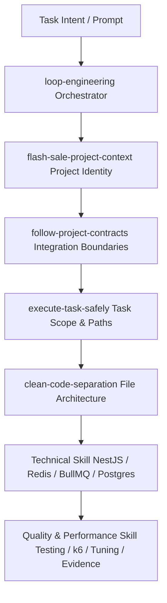

# คู่มือการใช้งาน Agent Skills — FlashSaleSystem

เอกสารฉบับนี้เป็นคู่มือสรุปวิธีใช้งานระบบ **Agent Skills** ทั้งหมด 17 ตัวภายในโปรเจกต์ `FlashSaleSystem` เพื่อให้พัฒนาซอฟต์แวร์ ทีมงาน และ AI Coding Agent สามารถเลือกใช้ บล็อกงาน และสร้าง Prompt ได้อย่างถูกต้อง ปลอดภัย และมีประสิทธิภาพสูงสุด

---

## 1. Skill System คืออะไร

**Agent Skills** คือชุดคำสั่งและข้อกำหนดพฤติกรรมการทำงาน (Operational Guidelines) สำหรับ AI Coding Agent ที่ประดิษฐ์ขึ้นภายใต้ไดเรกทอรี `.agent/skills/` โดยแบ่งออกเป็น 3 หมวดหมู่หลัก ได้แก่:
1. **Core Governance Skills (5 Skills):** ควบคุมกระบวนการคิด สัญญา กรอบงาน ความปลอดภัย และโครงสร้างโค้ด
2. **Technical Skills (6 Skills):** ควบคุมสถาปัตยกรรมเฉพาะ Layer (NestJS API, Nginx, Docker Compose, Redis, BullMQ, PostgreSQL)
3. **Quality & Performance Skills (6 Skills):** ควบคุมการสังเกตการณ์ การทดสอบ การวัดโหลด การปรับแต่งประสิทธิภาพ การเก็บหลักฐาน และ Git Workflow

### หลักการสำคัญ: Skills are Composable
Skills ถูกออกแบบมาให้ **ใช้งานร่วมกันเป็นชุด (Skill Composition)** ไม่ควรเลือกใช้เพียงตัวใดตัวหนึ่งเดี่ยวๆ โดยมีลำดับชั้นมาตรฐานดังนี้:



---

## 2. Core Skills ที่ควรใช้เกือบทุก Implementation Task

ในการสั่งงาน AI ให้เขียนโค้ด แก้ไขบั๊ก หรือปรับแต่งระบบ **ควรใส่ Core Skills 5 ตัวนี้ติดไว้เสมอ**:

1. **`loop-engineering`**  
   *ใช้เป็น:* วงจรควบคุมการพัฒนาระบบ (`Intent → Context → Skill → Action → Observation → Gate → State → Persistence`)
2. **`flash-sale-project-context`**  
   *ใช้เป็น:* บริบทเป้าหมายโปรเจกต์ ข้อจำกัด VM 4 vCPU / 6 GB RAM และ Invariants หลัก (`remainingStock >= 0`, `limit 1 order per user/product`)
3. **`follow-project-contracts`**  
   *ใช้เป็น:* ยึดสัญญาเชื่อมต่อใน `doc/contracts/` อย่างเคร่งครัด ห้ามแอบเปลี่ยน payload หรือ endpoint เอง
4. **`execute-task-safely`**  
   *ใช้เป็น:* จำกัดขอบเขตการแก้ไขโค้ดเฉพาะ Allowed Paths ตาม Task ใน `doc/task/` และป้องกันคำสั่ง Git ทำลายล้าง
5. **`clean-code-separation`**  
   *ใช้เป็น:* บังคับทำ Single Responsibility แยกไฟล์ Controllers, Services, DTOs, Producers, Consumers, Repositories ป้องกันการเกิด God Files

---

## 3. Classifications: หมวดหมู่ของ Skills ทั้ง 17 ตัว

### หมวดที่ 1: Core Governance (5 Skills)
- `loop-engineering`: Orchestration framework สำหรับวงจรการทำงานแบบเป้าหมาย สังเกตการณ์ และผ่าน Quality Gates
- `flash-sale-project-context`: ภาพรวมเป้าหมาย สถาปัตยกรรม VM constraints และ invariants ของ Flash Sale System
- `follow-project-contracts`: ปกป้องสัญญาเชื่อมต่อใน `doc/contracts/` (API, Queue, Redis, Database)
- `execute-task-safely`: ควบคุม Task scoping, Allowed Paths, Forbidden Paths และ Git Safety
- `clean-code-separation`: ป้องกัน God Files และบังคับทำ Separation of Concerns ระหว่าง Layers

### หมวดที่ 2: Technical Domain Skills (6 Skills)
- `nestjs-api-development`: ควบคุม NestJS API, JWT Auth, Products Cache-Aside และ Async Orders Admission (`202 Accepted`)
- `nginx-load-balancing`: ควบคุม Nginx Reverse Proxy, Load Balancing (3+ API instances) และ `X-Request-ID` forwarding
- `docker-compose-integration`: ควบคุม Docker Compose topology (4 vCPU/6GB RAM), readiness healthchecks และ migration race prevention
- `redis-cache-and-dedup`: ควบคุม Versioned Cache-Aside, Single-Flight, Cache Epoch/Outbox Recovery และ Atomic `SET NX` Claim Guard
- `bullmq-queue-processing`: ควบคุม BullMQ Queue `orders`, Job Payload schema, Producer/Consumer separation และ retry idempotency
- `postgres-typeorm-concurrency`: ควบคุม `place_order_batch`, `SELECT FOR UPDATE`, Result Ledger, Transactional Outbox และ DB constraints

### หมวดที่ 3: Quality, Performance & Workflow (6 Skills)
- `flash-sale-observability`: ควบคุม Structured Logging (`requestId`/`jobId`), Low-Cardinality Prometheus Metrics และ Bull Board UI
- `flash-sale-testing`: ควบคุมการทดสอบ Unit, Integration, Concurrency (Stock=1 และ Stock=50 Correctness Gates) และ Data Integrity
- `k6-performance-testing`: ควบคุมการยิง k6 จากเครื่องภายนอก, Read/Write scenarios, Queue Drain Sync และ Median Policy
- `performance-tuning`: ควบคุมการปรับแต่งประสิทธิภาพแบบ Single-Variable Loop, Bottleneck Analysis และ Fastest Safe Rule (`KEEP`/`REVERT`)
- `benchmark-evidence-collection`: ควบคุมการเก็บหลักฐาน `EVD-001..EVD-020`, Raw vs Derived Data, Secret Redaction และ Evidence Checklist
- `git-team-collaboration`: ควบคุม Git Workflow, Team Ownership Matrix (Member 1, 2, 3), Review Rotation Chain และ Pull Request Governance

---

## 4. Skill Catalog (สรุปการใช้งานราย Skill)

### Core Governance Skills

#### `loop-engineering`
- **ใช้เมื่อ:** เริ่มต้นงานพัฒนา แก้ไขบั๊ก ทดสอบ หรือปรับแต่งประสิทธิภาพทุกครั้ง
- **หน้าที่หลัก:** ขับเคลื่อนวงจรการทำงานแบบเป้าหมาย สังเกตการณ์ ผ่าน Gate และสะสมสถานะ
- **มักใช้ร่วมกับ:** `flash-sale-project-context`, `execute-task-safely`, `clean-code-separation`
- **ตัวอย่าง Prompt:** `Use skills: loop-engineering, flash-sale-project-context...`

#### `flash-sale-project-context`
- **ใช้เมื่อ:** ต้องการให้ AI เข้าใจสเปกระบบ Invariants (สต็อกไม่ติดลบ, สั่งซื้อได้สูงสุด 1 ชิ้น/สินค้า) และสเปก VM 4 vCPU/6GB RAM
- **หน้าที่หลัก:** ให้บริบทภาพรวมและกำหนดว่าหากโค้ดกับเอกสารขัดกัน ให้หยุดและรายงานทันที
- **มักใช้ร่วมกับ:** Core Governance Skills ทั้งหมด
- **ตัวอย่าง Prompt:** `Use skills: flash-sale-project-context, follow-project-contracts...`

#### `follow-project-contracts`
- **ใช้เมื่อ:** งานที่ทำแตะต้องจุดเชื่อมต่อข้ามโมดูล (API, Queue, Redis, Database)
- **หน้าที่หลัก:** บังคับให้ AI อ่านเอกสารใน `doc/contracts/` และห้ามแอบเปลี่ยน payload/endpoint เอง
- **มักใช้ร่วมกับ:** `nestjs-api-development`, `bullmq-queue-processing`, `redis-cache-and-dedup`, `postgres-typeorm-concurrency`
- **ตัวอย่าง Prompt:** `Use follow-project-contracts. Strictly adhere to doc/contracts/api-contract.md`

#### `execute-task-safely`
- **ใช้เมื่อ:** สั่งงาน AI ให้ทำ Task จาก `doc/task/dayX/<task>.md`
- **หน้าที่หลัก:** จำกัดขอบเขตการแก้ไขโค้ดเฉพาะ Allowed Paths และห้ามรันคำสั่ง Git ทำลายล้าง (`git reset --hard`)
- **มักใช้ร่วมกับ:** `git-team-collaboration`, `clean-code-separation`
- **ตัวอย่าง Prompt:** `Use execute-task-safely. Implement doc/task/day2/orders-api.md within allowed paths.`

#### `clean-code-separation`
- **ใช้เมื่อ:** เขียนโค้ดใหม่ สร้างไฟล์ใหม่ หรือ Refactor โค้ด
- **หน้าที่หลัก:** บังคับทำ Single Responsibility ป้องกัน God Files (แยก Controller, Service, DTO, Producer, Consumer, Repository)
- **มักใช้ร่วมกับ:** Technical Domain Skills ทุกตัว
- **ตัวอย่าง Prompt:** `Use clean-code-separation. Keep Controller, Service, and Queue Producer in separate files.`

---

### Technical Domain Skills

#### `nestjs-api-development`
- **ใช้เมื่อ:** พัฒนา NestJS API, JWT Auth, Products Read Path หรือ Async Orders Admission
- **หน้าที่หลัก:** ควบคุม Stateless API Layer, JWT validation, Products Cache-Aside และคืน HTTP `202 Accepted`
- **มักใช้ร่วมกับ:** `redis-cache-and-dedup`, `bullmq-queue-processing`
- **ตัวอย่าง Prompt:** `Use nestjs-api-development. Implement POST /api/v1/orders admission endpoint.`

#### `nginx-load-balancing`
- **ใช้เมื่อ:** แก้ไขคอนฟิก Nginx ใน `infra/nginx/` หรือจัดการการกระจายโหลดไปยัง API 3+ Instances
- **หน้าที่หลัก:** ควบคุม Nginx Reverse Proxy, Upstream load balancing (`round_robin`/`least_conn`), Header Forwarding (`X-Request-ID`)
- **มักใช้ร่วมกับ:** `docker-compose-integration`, `flash-sale-observability`
- **ตัวอย่าง Prompt:** `Use nginx-load-balancing. Configure proxy headers and upstream load balancing for 3 API replicas.`

#### `docker-compose-integration`
- **ใช้เมื่อ:** แก้ไข `compose.yaml` จัดวาง Topology บริการ เครือข่าย หรือ Healthchecks
- **หน้าที่หลัก:** ควบคุมคอนฟิก Docker Compose ให้อยู่ในงบประมาณ 4 vCPU / 6 GB RAM และป้องกัน Migration race condition
- **มักใช้ร่วมกับ:** `nginx-load-balancing`, `git-team-collaboration`
- **ตัวอย่าง Prompt:** `Use docker-compose-integration. Add healthchecks and internal network wiring to compose.yaml.`

#### `redis-cache-and-dedup`
- **ใช้เมื่อ:** พัฒนา Product Cache-Aside, Invalidation หรือ Atomic Claim Guard (`SET NX`)
- **หน้าที่หลัก:** แยก Redis Ops/Cache, ใช้ Versioned Key + Single-Flight และทำ Post-Commit Epoch Invalidation พร้อม Outbox Retry
- **มักใช้ร่วมกับ:** `nestjs-api-development`, `postgres-typeorm-concurrency`
- **ตัวอย่าง Prompt:** `Use redis-cache-and-dedup. Implement atomic SET NX claim guard for order admission.`

#### `bullmq-queue-processing`
- **ใช้เมื่อ:** พัฒนา Queue Producer ใน API หรือ Worker Consumer ใน Worker
- **หน้าที่หลัก:** ควบคุม Queue `orders`, Payload schema (`userId`, `productId`, `requestId`, `jobId`) และ Retry idempotency
- **มักใช้ร่วมกับ:** `redis-cache-and-dedup`, `postgres-typeorm-concurrency`
- **ตัวอย่าง Prompt:** `Use bullmq-queue-processing. Implement OrderQueueProducer and OrderQueueConsumer.`

#### `postgres-typeorm-concurrency`
- **ใช้เมื่อ:** พัฒนา DB Entities, Migrations, Repositories, หรือ Worker Transaction (`SELECT FOR UPDATE`)
- **หน้าที่หลัก:** ปกป้อง PostgreSQL Source of Truth ด้วย Batch Transaction, Durable Results, Outbox, `CHECK`/`UNIQUE` และ Concurrency Gates
- **มักใช้ร่วมกับ:** `bullmq-queue-processing`, `flash-sale-testing`
- **ตัวอย่าง Prompt:** `Use postgres-typeorm-concurrency. Implement pessimistic row lock stock reduction transaction.`

---

### Quality, Performance & Workflow Skills

#### `flash-sale-observability`
- **ใช้เมื่อ:** เพิ่ม Structured Logs, Prometheus Metrics หรือตั้งค่า Bull Board UI Dashboard
- **หน้าที่หลัก:** ทำ Request Correlation (`requestId` & `jobId`), ควบคุม Low-Cardinality metrics และบล็อกการ log secrets
- **มักใช้ร่วมกับ:** `nestjs-api-development`, `bullmq-queue-processing`, `benchmark-evidence-collection`
- **ตัวอย่าง Prompt:** `Use flash-sale-observability. Add requestId correlation logging and Prometheus metrics.`

#### `flash-sale-testing`
- **ใช้เมื่อ:** เขียนหรือรัน Unit, Integration, Concurrency (Stock=1 & Stock=50 Gates) หรือ Data Integrity tests
- **หน้าที่หลัก:** บังคับใช้ Real PostgreSQL/Redis/BullMQ สำหรับการทดสอบ Concurrency และตรวจสอบเกณฑ์ความถูกต้อง
- **มักใช้ร่วมกับ:** `postgres-typeorm-concurrency`, `k6-performance-testing`
- **ตัวอย่าง Prompt:** `Use flash-sale-testing. Run Stock=1 race test and verify zero negative stock.`

#### `k6-performance-testing`
- **ใช้เมื่อ:** เขียนหรือรัน k6 Load Benchmark (Read-Heavy หรือ Hot-Product Write)
- **หน้าที่หลัก:** ยิง k6 จากเครื่องภายนอก VM, ซิงค์ Queue Drain และรัน 3 รอบหาค่ากลาง (Median Policy)
- **มักใช้ร่วมกับ:** `flash-sale-observability`, `performance-tuning`, `benchmark-evidence-collection`
- **ตัวอย่าง Prompt:** `Use k6-performance-testing. Execute hot-product write load test from external machine.`

#### `performance-tuning`
- **ใช้เมื่อ:** วางแผน ทดสอบ หรือประเมินผลการปรับแต่งประสิทธิภาพใน Phase 5
- **หน้าที่หลัก:** ควบคุม Single-Variable Experiment Loop, บังคับใช้ "Fastest Safe Rule" และบันทึกสถานะ `KEEP`/`REVERT`
- **มักใช้ร่วมกับ:** `k6-performance-testing`, `flash-sale-observability`, `benchmark-evidence-collection`
- **ตัวอย่าง Prompt:** `Use performance-tuning. Benchmark API instances 3 vs 4 as a single variable experiment.`

#### `benchmark-evidence-collection`
- **ใช้เมื่อ:** รวบรวม ตรวจสอบ หรือเบลอข้อมูลลับในหลักฐาน `EVD-001..EVD-020` สำหรับรายงาน Final Report
- **หน้าที่หลัก:** ตรวจสอบความถูกต้องของหลักฐาน ห้ามสร้างหลักฐานเท็จ และเซนเซอร์รหัสผ่าน/ secrets 100%
- **มักใช้ร่วมกับ:** `k6-performance-testing`, `flash-sale-observability`, `git-team-collaboration`
- **ตัวอย่าง Prompt:** `Use benchmark-evidence-collection. Collect raw k6 JSON and SQL integrity output for EVD-008.`

#### `git-team-collaboration`
- **ใช้เมื่อ:** สั่งงาน AI เตรียมความพร้อมก่อนทำ Pull Request, ตรวจสอบ `git status` หรือแก้ไขไฟล์ส่วนกลาง
- **หน้าที่หลัก:** บังคับใช้ Team Ownership Matrix, Review Rotation Chain และห้ามรันคำสั่ง Git ทำลายล้าง
- **มักใช้ร่วมกับ:** `execute-task-safely`, Core Governance Skills
- **ตัวอย่าง Prompt:** `Use git-team-collaboration. Verify allowed paths and prepare git diff summary for PR review.`

---

## 5. Prompt Template มาตรฐาน

### Template แบบเต็ม (Standard Prompt Template)
```text
Use these repository skills:
- loop-engineering
- flash-sale-project-context
- follow-project-contracts
- execute-task-safely
- clean-code-separation
- <technical-skill-1>
- <technical-skill-2>

Task:
Implement <task_name> as specified in doc/task/dayX/<task_file>.md.

Before implementation:
1. Inspect git status --short.
2. Read assigned task document doc/task/dayX/<task_file>.md.
3. Read referenced contracts in doc/contracts/.
4. Read referenced architecture in doc/architecture/.
5. Inspect existing code in allowed paths.

Rules:
- Modify files strictly within task Allowed Paths.
- Do not modify frozen contract files.
- Keep responsibilities cleanly separated into separate files (Single Responsibility).
- Do not perform destructive git reset or restore commands.
- Do not commit or push unless explicitly instructed.

Verification:
- Run relevant test commands specified in the task.
- Inspect git status --short and git diff.
- Verify acceptance criteria and DoD gates pass 100%.
- Report completed files and any blockers.
```

### Template แบบสั้น (Short Daily Prompt Template)
```text
Use skills:
loop-engineering, flash-sale-project-context, follow-project-contracts, execute-task-safely, clean-code-separation, <technical-skill>.

Implement: doc/task/dayX/<task_file>.md

Follow task Allowed Paths and frozen contracts strictly.
Run relevant tests and inspect git diff before handoff.
Do not commit or push.
```

---

## 6. Task-Document-First & File-Referencing Pattern

เนื่องจากโปรเจกต์นี้มีเอกสาร Execution Plan รายวันเตรียมไว้ล่วงหน้าอย่างสมบูรณ์ใน `doc/task/dayX/*.md` รวมถึงสัญญาใน `doc/contracts/` **ข้อแนะนำที่ดีที่สุดคือ การอ้างอิงไฟล์โดยตรงแทนการ Copy ข้อความลงใน Prompt**

### รูปแบบการอ้างอิงไฟล์ใน Prompt (File Reference Syntax)
เมื่อต้องการสั่งให้ AI อ่านไฟล์เอกสาร สัญญา หรือ Task สามารถระบุพาธไฟล์ได้ 2 รูปแบบหลัก:
1. **รูปแบบ `@` Tag:** `@[path/to/file]` หรือ `@[/absolute/path/to/file]`  
   *ตัวอย่าง:* `@[doc/task/day2/orders-api.md]` หรือ `@[/home/netiwut/Documents/shareproject/FlashSaleSystem/doc/contracts/api-contract.md]`
2. **รูปแบบ `/` Relative Path:** `/doc/task/day2/orders-api.md` หรือ `doc/task/day2/orders-api.md`

การระบุด้วย `@[file]` หรือ `/path/to/file` จะช่วยให้ IDE ดึงบริบทเนื้อหาของไฟล์เข้าสู่บทสนทนาได้ทันที AI จะอ่านข้อกำหนดทั้งหมดในไฟล์นั้นโดยอัตโนมัติ

```text
# GOOD PRACTICE (แนะนำ):
Use skills: loop-engineering, flash-sale-project-context, follow-project-contracts, execute-task-safely, clean-code-separation, nestjs-api-development.
Implement: @[doc/task/day2/orders-api.md]

# BAD PRACTICE (ไม่แนะนำ):
Copy ข้อความ 300 บรรทัดจาก orders-api.md มาแปะลงใน chat prompt
```

---


## 7. Skill Bundles ตามบทบาทสมาชิกในทีม

### Member 1 — Edge / API / Nginx / k6 Lead
**ไฟล์ที่รับผิดชอบ:** `apps/api/**`, `infra/nginx/**`, `k6/**`

```text
# Standard Member 1 Skill Stack:
loop-engineering
flash-sale-project-context
follow-project-contracts
execute-task-safely
clean-code-separation
nestjs-api-development
nginx-load-balancing
docker-compose-integration
```

- ** Authentication API:**  
  `Use skills: loop-engineering, flash-sale-project-context, follow-project-contracts, execute-task-safely, clean-code-separation, nestjs-api-development.`  
  `Implement: doc/task/day2/authentication.md`

- ** Products API (Cache-Aside):**  
  `Use skills: loop-engineering, flash-sale-project-context, follow-project-contracts, execute-task-safely, clean-code-separation, nestjs-api-development, redis-cache-and-dedup.`  
  `Implement: doc/task/day2/products-api.md`

- ** Orders API Admission:**  
  `Use skills: loop-engineering, flash-sale-project-context, follow-project-contracts, execute-task-safely, clean-code-separation, nestjs-api-development, redis-cache-and-dedup, bullmq-queue-processing.`  
  `Implement: doc/task/day2/orders-api.md`

- ** Nginx Load Balancing:**  
  `Use skills: loop-engineering, flash-sale-project-context, execute-task-safely, clean-code-separation, nginx-load-balancing, docker-compose-integration.`  
  `Implement: doc/task/day1/api-nginx.md`

- ** k6 Load Benchmark:**  
  `Use skills: loop-engineering, flash-sale-project-context, execute-task-safely, flash-sale-testing, k6-performance-testing, flash-sale-observability, benchmark-evidence-collection.`  
  `Implement: doc/task/day4/k6-load-test.md`

---

### Member 2 — Queue / Redis / Cache / Observability Lead
**ไฟล์ที่รับผิดชอบ:** `packages/queue/**`, `packages/cache/**`, `observability/**`

```text
# Standard Member 2 Skill Stack:
loop-engineering
flash-sale-project-context
follow-project-contracts
execute-task-safely
clean-code-separation
redis-cache-and-dedup
bullmq-queue-processing
flash-sale-observability
docker-compose-integration
```

- ** Queue & Redis Bootstrap:**  
  `Use skills: loop-engineering, flash-sale-project-context, follow-project-contracts, execute-task-safely, clean-code-separation, redis-cache-and-dedup, bullmq-queue-processing, docker-compose-integration.`  
  `Implement: doc/task/day1/queue-redis.md`

- ** Cache-Aside Package:**  
  `Use skills: loop-engineering, flash-sale-project-context, follow-project-contracts, execute-task-safely, clean-code-separation, redis-cache-and-dedup, flash-sale-testing.`  
  `Implement: doc/task/day3/caching.md`

- ** Bull Board UI Setup:**  
  `Use skills: loop-engineering, flash-sale-project-context, execute-task-safely, clean-code-separation, bullmq-queue-processing, flash-sale-observability.`  
  `Implement: doc/task/day3/bull-board.md`

- ** Metrics & Observability Logging:**  
  `Use skills: loop-engineering, flash-sale-project-context, execute-task-safely, clean-code-separation, flash-sale-observability, benchmark-evidence-collection.`  
  `Implement: doc/task/day3/metrics-and-logging.md`

---

### Member 3 — Worker / Database Lead
**ไฟล์ที่รับผิดชอบ:** `apps/worker/**`, `database/**`

```text
# Standard Member 3 Skill Stack:
loop-engineering
flash-sale-project-context
follow-project-contracts
execute-task-safely
clean-code-separation
bullmq-queue-processing
postgres-typeorm-concurrency
flash-sale-testing
```

- ** Worker & Database Bootstrap:**  
  `Use skills: loop-engineering, flash-sale-project-context, follow-project-contracts, execute-task-safely, clean-code-separation, postgres-typeorm-concurrency, bullmq-queue-processing, docker-compose-integration.`  
  `Implement: doc/task/day1/worker-database.md`

- ** Order Processing Worker Transaction:**  
  `Use skills: loop-engineering, flash-sale-project-context, follow-project-contracts, execute-task-safely, clean-code-separation, bullmq-queue-processing, postgres-typeorm-concurrency, redis-cache-and-dedup, flash-sale-testing.`  
  `Implement: doc/task/day2/order-processing.md`

- ** Correctness Test Verification:**  
  `Use skills: loop-engineering, flash-sale-project-context, follow-project-contracts, execute-task-safely, clean-code-separation, postgres-typeorm-concurrency, flash-sale-testing, benchmark-evidence-collection.`  
  `Implement: doc/task/day4/correctness-test.md`

---

## 8. Skill Bundles ตามประเภทงาน (Task-Specific Quick Bundles)

| ประเภทงาน (Task Type) | Skills ที่ต้องโหลด |
| --- | --- |
| **API / JWT Auth** | Core + `nestjs-api-development` |
| **Products Read API** | Core + `nestjs-api-development` + `redis-cache-and-dedup` |
| **Orders Async Admission** | Core + `nestjs-api-development` + `redis-cache-and-dedup` + `bullmq-queue-processing` |
| **Nginx Config / LB** | Core + `nginx-load-balancing` + `docker-compose-integration` |
| **Docker Compose Integration** | Core + `docker-compose-integration` + `git-team-collaboration` |
| **Redis Cache-Aside & Claim** | Core + `redis-cache-and-dedup` + `flash-sale-testing` |
| **BullMQ Queue Infrastructure**| Core + `bullmq-queue-processing` + `redis-cache-and-dedup` + `flash-sale-testing` |
| **Worker DB Transaction** | Core + `bullmq-queue-processing` + `postgres-typeorm-concurrency` + `redis-cache-and-dedup` + `flash-sale-testing` |
| **Race Condition / Concurrency Bug**| Core + `bullmq-queue-processing` + `redis-cache-and-dedup` + `postgres-typeorm-concurrency` + `flash-sale-testing` + `flash-sale-observability` |
| **Observability / Metrics** | Core + `flash-sale-observability` + `<affected-technical-skill>` |
| **k6 Load Benchmark** | Core + `flash-sale-testing` + `k6-performance-testing` + `flash-sale-observability` + `benchmark-evidence-collection` |
| **Performance Tuning** | Core + `performance-tuning` + `k6-performance-testing` + `flash-sale-observability` + `<affected-technical-skill>` + `benchmark-evidence-collection` |
| **Evidence Collection** | Core + `benchmark-evidence-collection` + `flash-sale-observability` |
| **Git / PR / Integration Review**| `loop-engineering` + `execute-task-safely` + `git-team-collaboration` + `<affected-technical-skill>` |

---

## 9. ตัวอย่าง Prompt สำเร็จรูป (Copy-Ready Prompt Examples)

### ตัวอย่างที่ 1: การพัฒนา Orders API (`doc/task/day2/orders-api.md`)
```text
Use skills:
- loop-engineering
- flash-sale-project-context
- follow-project-contracts
- execute-task-safely
- clean-code-separation
- nestjs-api-development
- redis-cache-and-dedup
- bullmq-queue-processing
- flash-sale-testing

Task:
Implement doc/task/day2/orders-api.md.

Before implementation:
- Inspect git status --short.
- Read doc/task/day2/orders-api.md allowed paths.
- Read doc/contracts/api-contract.md, queue-contract.md, and redis-contract.md.

Requirements:
- Extract userId strictly from JWT context (never trust userId from request body).
- Implement atomic SET NX claim guard using Redis key fs:claim:order:{userId}:{productId}.
- Enqueue valid jobs to BullMQ queue 'orders' matching queue contract payload.
- On a won Claim, await queue.add and return 202 immediately; do not call queue.getJob on the normal path.
- Call queue.getJob only after a lost Claim to verify the existing deterministic Job before an idempotent 202 response.
- Return HTTP 202 Accepted with camelCase orderJobId envelope.
- Keep Controller, Service, and Queue Producer separated into clean single-responsibility files.

Verification:
- Run pnpm --filter api build and pnpm --filter api test.
- Inspect git status --short and git diff.
- Do not commit or push.
```

### ตัวอย่างที่ 2: การแก้ไขบั๊ก Concurrency / Negative Stock Race Condition
```text
Use skills:
- loop-engineering
- flash-sale-project-context
- follow-project-contracts
- execute-task-safely
- clean-code-separation
- bullmq-queue-processing
- postgres-typeorm-concurrency
- flash-sale-testing
- flash-sale-observability

Task:
Investigate and fix negative stock race condition bug in Worker order processing.

Workflow:
1. DO NOT fix blindly. Reproduce the defect first using real PostgreSQL and Redis in integration test.
2. Trace requestId and jobId logs across queue and worker transaction.
3. Check PostgreSQL SELECT FOR UPDATE row locking scope in OrderProcessorService.
4. Ensure CHECK (remaining_stock >= 0) and UNIQUE (user_id, product_id) constraints are properly enforced.
5. Add a regression test for Stock=1 race gate.
6. Verify SQL query SELECT COUNT(*) FROM products WHERE remaining_stock < 0 returns 0 rows.

Do not edit files outside allowed paths apps/worker/ or database/.
Do not commit or push.
```

### ตัวอย่างที่ 3: การรัน k6 Load Benchmark (`doc/task/day4/k6-load-test.md`)
```text
Use skills:
- loop-engineering
- flash-sale-project-context
- execute-task-safely
- flash-sale-testing
- k6-performance-testing
- flash-sale-observability
- benchmark-evidence-collection

Task:
Execute hot-product write load test specified in doc/task/day4/k6-load-test.md.

Rules:
- Execute k6 scenario from EXTERNAL load generator machine targeting backend VM IP.
- Ensure 500 user JWT tokens are pre-generated.
- After k6 run finishes, poll BullMQ queue waiting and active counts until 0 (queue drain sync).
- Run SQL data integrity verification query to confirm zero negative stock and zero duplicates.
- Perform 3 runs and calculate median metrics for RPS, Latency p95, and Queue Drain Time.
- Save raw k6 JSON summary output to output/evidence/ for EVD-008.

Do not execute k6 inside the backend VM.
Do not commit or push.
```

### ตัวอย่างที่ 4: การทดสอบปรับแต่งประสิทธิภาพแบบ Single Variable Experiment
```text
Use skills:
- loop-engineering
- flash-sale-project-context
- follow-project-contracts
- execute-task-safely
- performance-tuning
- k6-performance-testing
- flash-sale-observability
- postgres-typeorm-concurrency
- benchmark-evidence-collection

Task:
Execute performance tuning experiment PERF-003: Worker Concurrency (10 -> 20).

Experiment Rules:
- Primary Variable: Change ONLY BullMQ Worker Concurrency from 10 to 20 in apps/worker/src/config.ts.
- Keep all other variables (API count, DB pool, Nginx keepalive) CONSTANT.
- Run identical k6 hot-product write benchmark from external machine (3 runs -> Median).
- Evaluate Correctness Gate: If negative stock or duplicate orders occur, mark DECISION: REVERT.
- If correctness passes and RPS improves, mark DECISION: KEEP and record in doc/performance/tuning-results.md.

Do not modify multiple independent variables in one run.
Do not commit or push.
```

### ตัวอย่างที่ 5: การเตรียมความพร้อมและตรวจสอบ Git PR Review
```text
Use skills:
- loop-engineering
- execute-task-safely
- git-team-collaboration
- nestjs-api-development

Task:
Audit working tree changes and prepare git status summary for Member 1 Orders API task PR review.

Workflow:
1. Run git status --short. Confirm modified files are strictly within apps/api/**.
2. Run git diff. Verify no unauthorized edits were made to doc/contracts/ or compose.yaml.
3. Run pnpm typecheck and pnpm test. Ensure 100% build and test pass.
4. Verify reviewer assignment according to review chain (Member 1 -> Member 2).
5. Output PR diff summary and highlight cross-component risks if any.

Do not execute git commit or git push.
```

---

## 10. Quick Lookup Table (ตารางค้นหา Skill แบบเร่งด่วน)

| คำถาม / โจทย์งาน | Skills ที่ต้องเปิดใช้งาน |
| --- | --- |
| **กำลังจะทำ Auth Token API ต้องใช้ Skill ไหน?** | Core + `nestjs-api-development` |
| **กำลังจะทำ Products API (Cache-Aside) ต้องใช้ Skill ไหน?** | Core + `nestjs-api-development` + `redis-cache-and-dedup` |
| **กำลังจะทำ Orders Admission API ต้องใช้ Skill ไหน?** | Core + `nestjs-api-development` + `redis-cache-and-dedup` + `bullmq-queue-processing` |
| **กำลังแก้ Nginx Proxy / Load Balancer ต้องใช้ Skill ไหน?** | Core + `nginx-load-balancing` + `docker-compose-integration` |
| **กำลังแก้ Docker Compose Topology ต้องใช้ Skill ไหน?** | Core + `docker-compose-integration` + `git-team-collaboration` |
| **กำลังทำ Redis Cache-Aside & Invalidation ต้องใช้ Skill ไหน?** | Core + `redis-cache-and-dedup` + `flash-sale-testing` |
| **กำลังทำ BullMQ Queue Producer / Consumer ต้องใช้ Skill ไหน?** | Core + `bullmq-queue-processing` + `redis-cache-and-dedup` + `flash-sale-testing` |
| **กำลังเขียน Worker DB Transaction (`SELECT FOR UPDATE`) ต้องใช้ Skill ไหน?** | Core + `bullmq-queue-processing` + `postgres-typeorm-concurrency` + `flash-sale-testing` |
| **กำลังแก้บั๊ก Race Condition / Overselling ต้องใช้ Skill ไหน?** | Core + `bullmq-queue-processing` + `redis-cache-and-dedup` + `postgres-typeorm-concurrency` + `flash-sale-testing` + `flash-sale-observability` |
| **กำลังทำ Logging (`requestId`/`jobId`) หรือ Metrics ต้องใช้ Skill ไหน?** | Core + `flash-sale-observability` + `<affected-technical-skill>` |
| **กำลังยิง k6 Benchmark ต้องใช้ Skill ไหน?** | Core + `flash-sale-testing` + `k6-performance-testing` + `flash-sale-observability` + `benchmark-evidence-collection` |
| **กำลังทำการทดลอง Performance Tuning ต้องใช้ Skill ไหน?** | Core + `performance-tuning` + `k6-performance-testing` + `flash-sale-observability` + `<affected-technical-skill>` + `benchmark-evidence-collection` |
| **กำลังรวบรวมหลักฐาน EVD-001..EVD-020 ต้องใช้ Skill ไหน?** | Core + `benchmark-evidence-collection` + `flash-sale-observability` |
| **กำลังเตรียม PR / ตรวจสอบความถูกต้องก่อน Commit ต้องใช้ Skill ไหน?** | `loop-engineering` + `execute-task-safely` + `git-team-collaboration` + `<affected-technical-skill>` |

---

## 11. สิ่งที่ไม่ควรทำ (What NOT to Do)

1. **ห้ามโหลด Skills ทั้ง 17 ตัวยัดใส่ทุก Prompt โดยไม่จำเป็น:**  
   ให้ใช้เฉพาะ Core Skills 5 ตัว + Technical Skills ที่ตรงกับ Layer ของงานเท่านั้น การใส่ Skill ที่ไม่เกี่ยวข้องมากเกินไปจะส่งผลให้ AI หลอกลืมสโคปหลัก
2. **ห้ามปล่อยให้ AI แก้ไขไฟล์สัญญาใน `doc/contracts/` เอง:**  
   หากพบว่าโค้ดกับสัญญาไม่ตรงกัน ให้สั่ง AI หยุดงานและรายงานเป็น `BLOCKED — CONTRACT REVIEW REQUIRED`
3. **ห้ามยิง k6 Load Benchmark ภายใน VM เครื่องเดียวกับระบบ Backend:**  
   การยิง k6 ใน VM เดียวกันจะแย่ง CPU/RAM ทำลายความแม่นยำของผลการวัด
4. **ห้ามถือว่า HTTP Status 202 Accepted คือหลักฐานการสั่งซื้อสำเร็จ:**  
   202 หมายถึง "ส่งเข้า Queue สำเร็จ" การตรวจสอบคำสั่งซื้อที่สำเร็จจริงต้องคิวรีจาก PostgreSQL หลัง Queue Drain เท่านั้น
5. **ห้ามให้ AI เปลี่ยนตัวแปรปรับแต่งประสิทธิภาพพร้อมกันหลายตัว:**  
   การทำ Performance Tuning ต้องยึดหลัก Single Variable Experiment เปลี่ยนทีละ 1 ตัวแปรเท่านั้น
6. **ห้ามลบ DB Constraints (`CHECK`, `UNIQUE`) เพื่อแลกกับความเร็ว:**  
   ผลการทดสอบประสิทธิภาพที่เกิดการ overselling หรือสต็อกติดลบ ถือเป็น **INVALID RESULT** ทันที
7. **ห้ามรันคำสั่ง Git ทำลายล้าง (`git reset --hard`, `git restore .`):**  
   เพราะอาจทำลายงานที่ยังไม่ได้ commit ของเพื่อนร่วมทีม
8. **ห้ามสร้างหลักฐานเท็จ (No Evidence Fabrication):**  
   หากยังไม่มีผลการทดสอบจริง ให้คงสถานะหลักฐานเป็น `PENDING` เสมอ ห้ามเมคตัวเลขหรือสร้างกราฟหลอกขึ้นมาเด็ดขาด

---

## 12. สรุปขั้นตอนการเลือกใช้ Skill (Skill Selection Flowchart)

```text
1. ระบุเป้าหมายของงาน (Task Intent)
        ↓
2. โหลด Core Governance Skills 5 ตัวเสมอ (loop-engineering, project-context, contracts, task-safely, clean-code)
        ↓
3. ระบุ Layer ของโค้ดที่จะแก้ไข (API / Nginx / Compose / Redis / Queue / DB)
        ↓
4. โหลด Technical Domain Skill(s) ที่ตรงกับ Layer นั้น
        ↓
5. หากงานมีการเปลี่ยน Logic/State → โหลด flash-sale-testing
        ↓
6. หากงานเกี่ยวข้องกับคิว/ล็อก/บั๊ก → โหลด flash-sale-observability
        ↓
7. หากงานเกี่ยวข้องกับ Load/Performance/Evidence → โหลด k6-performance-testing, performance-tuning, benchmark-evidence-collection
        ↓
8. หากงานเกี่ยวข้องกับ PR/Shared Files → โหลด git-team-collaboration
```
