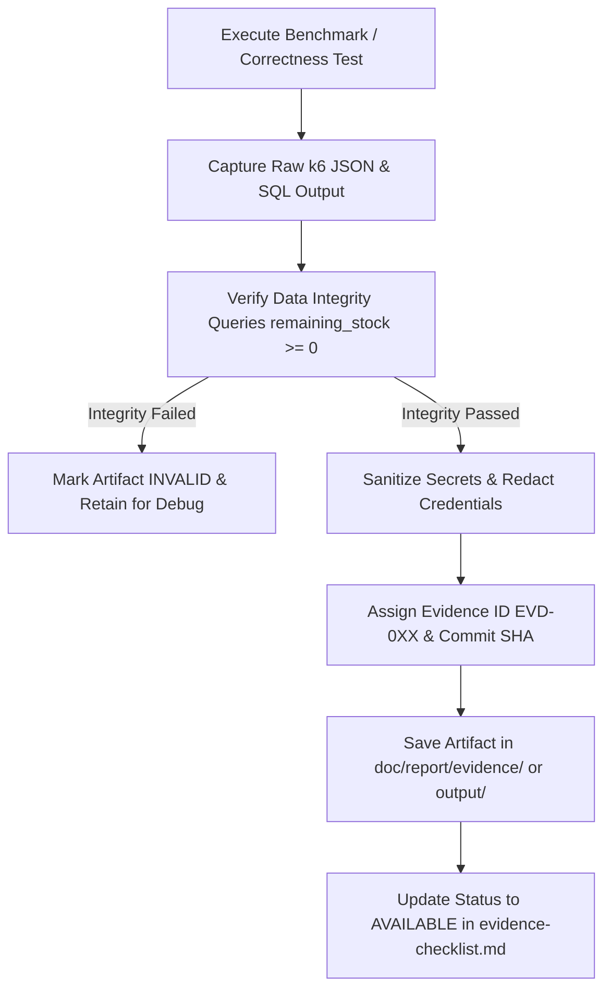

# Skill: Benchmark Evidence Collection

## Purpose
Guide AI coding agents in capturing, organizing, verifying, and redacting benchmark, correctness, architecture, and system evidence for the Flash Sale System. This skill ensures all evidence mapped to `doc/report/evidence-checklist.md` (`EVD-001` to `EVD-020`) is audit-ready, reproducible, and strictly free of secret leaks.

## When to Use
Activate this skill whenever:
- Collecting benchmark logs, k6 JSON outputs, terminal outputs, or SQL integrity query results.
- Capturing screenshots of Grafana dashboards, Bull Board UI, or Docker container states.
- Mapping evidence items to `doc/report/evidence-checklist.md` or `doc/report/final-report-outline.md`.
- Reviewing evidence for secret redaction prior to repository submission.

## Required Context
Evidence collection is governed by Phase 6 (`doc/report/`). Every technical claim made in the final report (e.g., "Peak Throughput 1,500 RPS", "Zero Overselling", "Cache Hit Ratio 95%") MUST be backed by verifiable raw evidence stored in the repository.

> [!IMPORTANT]
> **No Fabrication Rule:**  
> AI agents MUST NEVER invent, hallucinate, or fabricate fake benchmark numbers, fake screenshots, or fake competitor comparison metrics. If evidence has not yet been collected from an actual test run, mark its status as `PENDING` or `NOT YET MEASURED`.

## Authoritative References
- **Evidence Checklist Source of Truth:** [doc/report/evidence-checklist.md](file:///FlashSaleSystem/doc/report/evidence-checklist.md)
- **Final Report Outline:** [doc/report/final-report-outline.md](file:///FlashSaleSystem/doc/report/final-report-outline.md)
- **Baseline Specification:** [doc/performance/baseline.md](file:///FlashSaleSystem/doc/performance/baseline.md)
- **Final Results Specification:** [doc/performance/final-results.md](file:///FlashSaleSystem/doc/performance/final-results.md)

## Preconditions
1. Confirm target evidence ID in `doc/report/evidence-checklist.md` (e.g., `EVD-005: Read-Heavy k6 Raw Output`).
2. Verify that test run executed on clean, valid code with git commit SHA recorded.

## Responsibilities
- **Evidence Provenance Tracking:** Associate every evidence artifact with metadata (`run_id`, `timestamp`, `commit_sha`, `scenario`, `environment`, `correctness_status`).
- **Raw & Derived Artifact Management:** Store raw source files (k6 JSON summaries, SQL output text files) alongside summary markdown tables.
- **Secret Redaction:** Scan and redact passwords, JWT secrets, full tokens, and `.env` files from captured evidence artifacts.
- **Checklist State Maintenance:** Update evidence status (`AVAILABLE`, `PENDING`, `INVALID`, `UNVERIFIED`) in `doc/report/evidence-checklist.md`.

## Non-Responsibilities
- **DO NOT** edit or alter raw k6 output JSON files to manipulate reported RPS or latency numbers.
- **DO NOT** use evidence generated from a test run where data integrity checks failed (`remaining_stock < 0`).

---

## Core Rules

### 1. Evidence Quality & Provenance Matrix

| Evidence ID | Category | Primary Source Artifact | Required Provenance Metadata |
| --- | --- | --- | --- |
| **EVD-001** | System Topology | `compose.yaml` + `docker compose ps` output | Host specs (4 vCPU/6GB RAM), container status |
| **EVD-005** | Read Benchmark | Raw k6 JSON summary + Grafana graph | RPS, p95 latency, Cache Hit Ratio %, Git SHA |
| **EVD-008** | Write Benchmark | Raw k6 JSON summary + Bull Board snapshot | Admission RPS, Queue Drain Time (s), Git SHA |
| **EVD-012** | Stock Integrity | SQL Query Output (`remaining_stock = 0`) | `remaining_stock`, `successful_orders`, Git SHA |
| **EVD-014** | Zero Duplicates | SQL Query Output (`COUNT(*) HAVING > 1`) | Duplicate pair count = `0`, Git SHA |

### 2. Mandatory Secret Redaction Rule
Before committing any screenshot, terminal log, or evidence file, inspect and redact sensitive values:
- **REDACT:** `JWT_SECRET`, database passwords (`POSTGRES_PASSWORD`), Redis auth strings, private SSH keys, `.env` file contents, Authorization headers (`Bearer eyJ...`).
- **ALLOWED:** Obfuscated strings (`JWT_SECRET=***REDACTED***`), public endpoint paths, container names.

### 3. Invalid Evidence Handling
If a benchmark run experiences a data integrity failure (e.g., negative stock):
- Mark the evidence artifact as `INVALID`.
- Retain the raw output in `output/logs/` for debugging purposes ONLY.
- **NEVER** present invalid run evidence in the Final Competition Report.

---

## Recommended Workflow

1. **Step 1 — Evidence Target Identification:** Locate target Evidence ID in `doc/report/evidence-checklist.md`.
2. **Step 2 — Execution & Capture:** Run test scenario and export raw output:
   `k6 run --out json=output/evidence/EVD-005-raw.json k6/scenarios/read-heavy.js`
3. **Step 3 — Secret Audit:** Scan captured artifact for credentials.
4. **Step 4 — Metadata Mapping:** Append header with timestamp, Git SHA, and test parameters.
5. **Step 5 — Checklist Status Update:** Update status in `doc/report/evidence-checklist.md`.

## Verification
- Verify raw evidence file exists: `ls -la output/evidence/EVD-005-raw.json`.
- Scan for leaked secrets: `grep -E "(JWT_SECRET|PASSWORD|Bearer)" output/evidence/*.txt` (MUST return zero hits).
- Verify `doc/report/evidence-checklist.md` status table reflects updated evidence item.

## Performance Considerations
- **File Storage:** Store large raw k6 JSON outputs in `output/evidence/`; keep summary tables concise in markdown files.
- **Screenshot Compression:** Compress PNG screenshots before embedding in markdown walkthroughs.

## Common Anti-Patterns to Avoid
- **Anti-Pattern 1:** Uploading uncropped screenshots displaying `.env` passwords or API secret keys.
- **Anti-Pattern 2:** Copying benchmark numbers into markdown tables without linking to the raw source file.
- **Anti-Pattern 3:** Deleting raw evidence files after writing the summary report.
- **Anti-Pattern 4:** Inventing placeholder benchmark graphs in Photoshop or Excalidraw and labeling them "measured data".

## Stop Conditions
- Stop immediately if raw evidence indicates data integrity failure. Correct the defect before collecting final evidence.
- Stop if secret redaction scan detects unredacted passwords or JWT secrets in staged evidence files.

## Forbidden Actions
- DO NOT edit k6 JSON summaries or SQL query outputs to alter reported metrics.
- DO NOT commit real secrets or `.env` files to Git under the guise of evidence.
- DO NOT mark evidence status as `AVAILABLE` if the underlying artifact file is missing.

## Related Skills
- `loop-engineering` — Orchestrates evidence collection steps.
- `flash-sale-project-context` — Provides project goals and architecture context.
- `flash-sale-testing` — Generates test correctness evidence.
- `k6-performance-testing` — Generates load benchmark raw outputs.
- `performance-tuning` — Uses evidence to record experiment decisions (`KEEP`/`REVERT`).

## Completion / Handoff
Confirm raw evidence files exist, secret redaction audit passed 100%, provenance metadata (Git SHA, timestamp) is attached, and `doc/report/evidence-checklist.md` status is updated.
