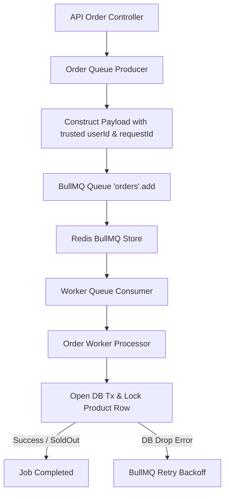

# Skill: BullMQ Queue Processing

## Purpose
Guide AI agents in implementing asynchronous order queueing, job payload generation, and worker consumer processing using BullMQ. This skill maintains clean separation between Queue Producers, Queue Infrastructure, and Worker Processors while ensuring job payload compliance and retry safety.

## When to Use
Activate this skill whenever:
- Implementing BullMQ queue producers in `apps/api/` or `packages/queue/`.
- Developing BullMQ worker consumers or job processors in `apps/worker/`.
- Configuring queue retry strategies, backoff policies, or retention settings.
- Integrating Bull Board UI dashboard or debugging queue backlog issues.

## Required Context
BullMQ queue infrastructure is owned by **Member 2 (Queue / Redis / Cache Lead)**.
- **Queue Producer Boundary (API / Member 1):** Enqueues job payload upon valid request and returns HTTP `202 Accepted`.
- **Queue Consumer Boundary (Worker / Member 3):** Consumes job payload, opens PostgreSQL transaction, locks product row, and updates stock.

> [!IMPORTANT]
> **Queue Infrastructure vs. Business Outcome Rule:** BullMQ job states (`waiting`, `active`, `completed`, `failed`) describe *queue processing state*, NOT final business outcome. A BullMQ job ending in `completed` state simply means the worker finished processing (which could be a confirmed order OR a valid business rejection such as `SOLD_OUT`).

## Authoritative References
- **Queue Contract:** [doc/contracts/queue-contract.md](file:///FlashSaleSystem/doc/contracts/queue-contract.md)
- **API Contract:** [doc/contracts/api-contract.md](file:///FlashSaleSystem/doc/contracts/api-contract.md)
- **Database Contract:** [doc/contracts/database-contract.md](file:///FlashSaleSystem/doc/contracts/database-contract.md)
- **Order Flow Architecture:** [doc/architecture/order-flow.md](file:///FlashSaleSystem/doc/architecture/order-flow.md)
- **Observability Architecture:** [doc/architecture/observability.md](file:///FlashSaleSystem/doc/architecture/observability.md)

## Preconditions
1. Confirm allowed task paths (e.g., `packages/queue/**`, `apps/api/src/orders/`, or `apps/worker/src/`).
2. Inspect exact queue name (`orders`) and job payload DTO in `doc/contracts/queue-contract.md`.

## Responsibilities
- **Queue Name Compliance:** Use frozen queue name `orders`.
- **Job Payload Construction:** Build the exact payload containing `jobId`, trusted `userId`, validated `productId`, `requestId`, and ISO `createdAt`.
- **Producer-Consumer Separation:** Keep Queue Producer (`order-queue.producer.ts`) separate from Worker Processor (`order-processor.service.ts`).
- **Transient Retry Safety:** Configure backoff retries for transient infrastructure errors (e.g., DB connection drops) while ensuring worker processing remains idempotent.

## Non-Responsibilities
- **DO NOT** execute PostgreSQL transaction logic or TypeORM queries directly inside Queue Producer files.
- **DO NOT** use BullMQ as the sole mechanism for business duplicate prevention (final duplicate guard is PostgreSQL `UNIQUE(user_id, product_id)`).

---

## Core Rules

### 1. Job Payload Schema Contract
Job payload passed to BullMQ MUST strictly match `queue-contract.md`:
```json
{
  "jobId": "ord-6f4d8f0f-example-sha256",
  "userId": "user-001",
  "productId": "p-1001",
  "requestId": "req-abc-123-xyz",
  "createdAt": "2026-08-26T11:30:00.000Z"
}
```
- **SECURITY GUARDRAIL:** `userId` MUST originate from the verified JWT context, NEVER from untrusted client request bodies.

### 2. Request ID vs. Job ID Semantics
- **`requestId`:** Unique identifier generated per HTTP request for end-to-end tracing.
- **`jobId`:** Frozen as `ord-<lowercase SHA256(userId|productId)>`; it MUST NOT contain `:` or consist only of digits.

### 2.1 Producer Enqueue Confirmation
- On the Redis Claim-winner path, `await queue.add(...)` resolving successfully is the enqueue confirmation required before returning HTTP 202.
- Do not call `queue.getJob()` after a successful `queue.add()`; that redundant Redis read increases normal-path latency without adding correctness.
- Use `queue.getJob(deterministicJobId)` only when `SET NX` loses, to determine whether an existing Job can safely be returned as the idempotent 202 response.
- If `queue.add()` throws, do not return 202. Release only the matching Claim token through Lua compare-and-delete and map the failure to the frozen dependency error.

### 3. Business Rejection vs. Transient Infrastructure Failure
- **Transient Infrastructure Failure (Retryable):** DB connection timeout, Redis socket drop. BullMQ SHOULD retry job with exponential backoff.
- **Business Rejections (Non-Retryable):** `SOLD_OUT`, `DUPLICATE_ORDER`, `FLASH_SALE_INACTIVE`. Worker MUST handle business rejections gracefully, record outcome, and complete job WITHOUT throwing uncaught exceptions that cause endless retry loops.

### 4. Queue Drain Condition for Performance Testing
In Write Heavy Load Tests, test execution is complete ONLY when the queue reaches terminal state:
```text
Queue Drain Terminal Gate:
waiting_jobs == 0 AND active_jobs == 0
AND all accepted jobs processed within bounded timeout (< 30s)
```

### 5. Winning Micro-batch and Retention Rules
- Start with batch size `16`, maximum wait `1 ms`, and Worker concurrency `8`; benchmark against batch `32` and concurrency `12/16` one variable at a time.
- A batch MUST call `place_order_batch(jsonb)` once and map one durable result back to every distinct BullMQ Job.
- Configure `attempts: 3`, exponential backoff `100 ms`, completed retention `age=86400,count=10000`, and failed retention `age=259200,count=5000`.
- Job retention is an optimization only. Permanent idempotency MUST come from `order_results.job_id`.

---

## Recommended Workflow



1. **Step 1 — Producer Module:** Implement `OrderQueueProducer` in `apps/api/src/orders/` or `packages/queue/`.
2. **Step 2 — Consumer Module:** Implement `OrderQueueConsumer` in `apps/worker/src/`.
3. **Step 3 — Processor Integration:** Inject Worker Service to execute DB transaction.
4. **Step 4 — Bull Board Setup:** Register `orders` queue with Bull Board UI adapter in `apps/api/` or `observability/`.

## Verification
- Run `pnpm test:integration` with a running Redis/BullMQ instance.
- Verify using Bull Board UI (`http://localhost/admin/queues`) that enqueued jobs appear in `orders` queue with status progressing `waiting → active → completed`.
- Verify that transient worker errors trigger retries according to configured backoff settings.

## Performance Considerations
- **Worker Concurrency Tuning:** Compare 8/12/16 and record DB lock wait plus queue drain time.
- **Job Retention:** Use the exact bounded age/count policy in `queue-contract.md`; never remove completed jobs immediately during the benchmark window.
- **Producer Fast Path:** Preserve `SET NX → queue.add → 202` with no `getJob()` read on successful first admission.

## Common Anti-Patterns to Avoid
- **Anti-Pattern 1:** Mixing Producer and Consumer code in a single god file (`queue.ts`).
- **Anti-Pattern 2:** Throwing uncaught exceptions on `SOLD_OUT` status, causing BullMQ to retry sold-out orders 10 times.
- **Anti-Pattern 3:** Relying on `sleep 10` in test scripts instead of polling BullMQ waiting/active counts to 0.
- **Anti-Pattern 4:** Assuming a BullMQ `completed` status automatically means the user bought the product successfully.

## Stop Conditions
- Stop immediately if queue payload fields conflict with `queue-contract.md`.
- Stop if implementing a queue producer/consumer requires modifying PostgreSQL schemas outside allowed task paths.

## Forbidden Actions
- DO NOT change queue name from `orders` to a custom string without team contract review.
- DO NOT pass raw DB entity models in job payloads; pass clean JSON primitives (`userId`, `productId`, `requestId`).
- DO NOT manipulate raw Redis keys owned by BullMQ (`bull:orders:*`) directly via Redis CLI scripts.

## Related Skills
- `loop-engineering` — Orchestrates iterative testing and queue monitoring.
- `flash-sale-project-context` — Provides business invariants.
- `follow-project-contracts` — Protects `queue-contract.md` boundaries.
- `nestjs-api-development` — Integrates API Controller with Queue Producer.
- `postgres-typeorm-concurrency` — Governs Worker DB transaction processing.

## Completion / Handoff
Confirm job payloads match `queue-contract.md`, Producer and Consumer modules reside in separate files, real BullMQ integration tests pass, and Bull Board UI displays queue status correctly.
