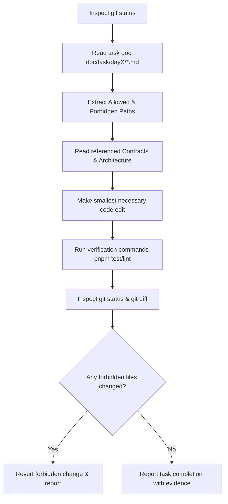

# Skill: Execute Task Safely

## Purpose
Guide AI coding agents to execute assigned repository tasks safely, strictly adhering to task scoping, allowed file paths, forbidden paths, and git safety rules without causing collateral code changes or scope drift.

## When to Use
Activate this skill whenever receiving a task from `doc/task/dayX/<task>.md` or executing any code modification, feature addition, or bug fix in the codebase.

## Required Context
Each task document under `doc/task/` defines the explicit boundary of work for a team member. Agents must strictly operate within the allowed file paths of the assigned task and avoid modifying shared infrastructure or another member's code without permission.

## Authoritative References
- **Task Plan Directory:** [doc/task/](file:///home/netiwut/Documents/shareproject/FlashSaleSystem/doc/task/day1/day1-overview.md)
- **Team Ownership Matrix:** [doc/planning/team-ownership.md](file:///home/netiwut/Documents/shareproject/FlashSaleSystem/doc/planning/team-ownership.md)
- **Git & Workflow Guidelines:** [CONTRIBUTING.md](file:///home/netiwut/Documents/shareproject/FlashSaleSystem/CONTRIBUTING.md)

## Preconditions
Before modifying any files:
1. Run `git status` to inspect current working directory state.
2. Read the assigned task document (`doc/task/dayX/<task>.md`) completely.
3. Extract the following 12 key metadata items from the task document:
   - **Intent / Goal:** Main objective of the task.
   - **Owner:** Assigned team member (Member 1, 2, or 3).
   - **Reviewer:** Assigned reviewer.
   - **Priority:** P0, P1, or P2.
   - **Dependencies:** Hard and soft dependencies.
   - **Allowed Paths:** Specific directories allowed for modification.
   - **Forbidden Paths:** Directories explicitly forbidden to modify.
   - **Contracts Used:** Relevant contract files in `doc/contracts/`.
   - **Acceptance Criteria:** Specific functional/technical requirements.
   - **Verification Commands:** Automated/manual verification steps.
   - **Definition of Done (DoD):** Conditions for task completion.
   - **Evidence Requirements:** Proof needed for verification.

## Core Rules

### 1. Strict Path Enforcement
- **Allowed Paths:** Modify code ONLY within the directory paths specified in the task document.
- **Forbidden Paths:** DO NOT modify files in forbidden paths under any circumstances.
- **Shared Files:** Files such as `compose.yaml`, `package.json`, `pnpm-workspace.yaml`, `.env.example`, and `doc/contracts/**` are controlled by the Integration Captain. Do not modify shared files unless explicitly assigned in the task.

### 2. Dependency Management
- **Hard Dependencies:** Must be completed before starting the task.
- **Soft Dependencies:** If an unfinished soft dependency exists, use interfaces, mocks, stubs, or test fixtures to continue work without blocking.

### 3. Safe Git Behavior
- **NEVER** run destructive git commands such as `git reset --hard`, `git restore .`, or `git checkout .` across the repository unless explicitly authorized.
- **NEVER** execute `git commit`, `git push`, or `git merge` unless explicitly requested by the user.
- Always check `git status --short` after editing to ensure no collateral files were modified.

## Workflow

1. **Step 1 — Environment Inspection:** Run `git status` and check working branch.
2. **Step 2 — Scoping:** Read task metadata, confirm Allowed Paths vs Forbidden Paths.
3. **Step 3 — Minimal Implementation:** Write the minimum required code to satisfy Acceptance Criteria.
4. **Step 4 — Verification:** Run lint, typecheck, and test commands specified in the task.
5. **Step 5 — Diff Audit:** Run `git status --short` to verify that edits are strictly confined to Allowed Paths.
6. **Step 6 — Reporting:** Present completion report with verification evidence.

## Verification
- Run task-specific verification commands (e.g., `pnpm test`, `pnpm --filter <app> build`).
- Verify that `git status --short` shows modifications ONLY inside Allowed Paths.

## Stop Conditions
- Stop immediately if completing the task requires editing files in Forbidden Paths or another member's module.
- Stop if a hard dependency is missing or incomplete.
- Stop if test commands fail and cannot be resolved within Allowed Paths.

## Forbidden Actions
- DO NOT opportunistically refactor unrelated modules or fix unrelated warnings across the repository.
- DO NOT rename shared contracts or DTO properties used by other team members.
- DO NOT modify Docker Compose files or database migrations outside the task's assigned scope.
- DO NOT execute destructive git reset or restore commands.

## Related Skills
- `flash-sale-project-context` — Provides project goals and architecture context.
- `follow-project-contracts` — Guarantees contract boundary adherence.
- `clean-code-separation` — Ensures modular code structure within allowed paths.
- `loop-engineering` — Provides the iterative engineering execution framework.

## Handoff / Completion
Summarize the changes made, output the `git status --short` verification result, and confirm that all Acceptance Criteria and Definition of Done gates are satisfied.
