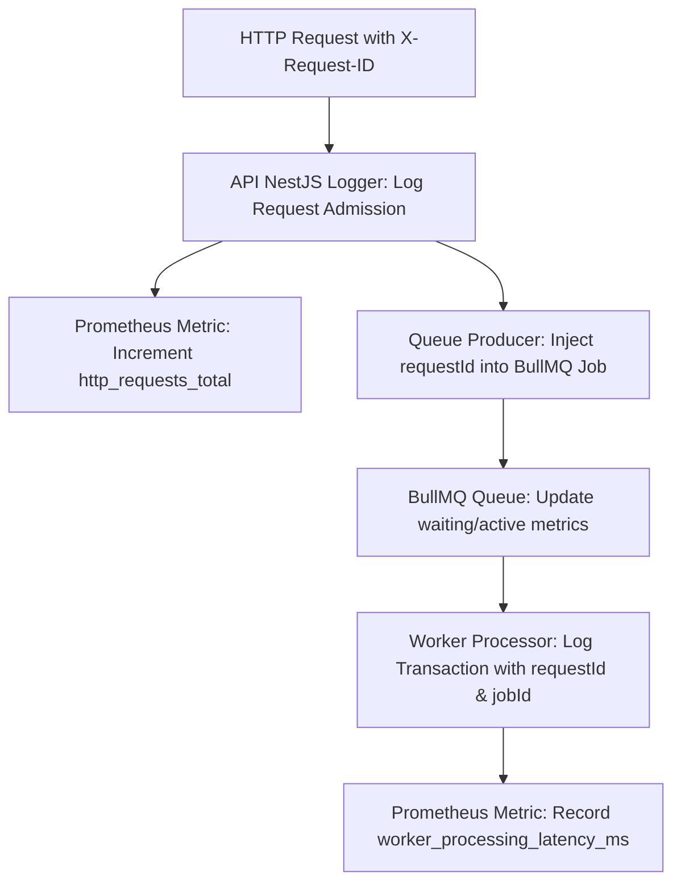

# Skill: Flash Sale Observability

## Purpose
Guide AI agents in implementing, configuring, and utilizing observability signals (Structured Logs, Low-Cardinality Metrics, Operational Dashboards) for debugging, request correlation, correctness validation, bottleneck analysis, and report evidence generation across the Flash Sale System.

## When to Use
Activate this skill whenever:
- Adding or updating loggers, Prometheus metrics, or tracing identifiers in `apps/api/`, `apps/worker/`, or `packages/`.
- Configuring Bull Board dashboard or Grafana monitoring panels.
- Diagnosing HTTP admission errors, BullQueue backlogs, worker transaction latencies, or database lock contention.
- Gathering metric graphs or log trace evidence for performance tuning and report preparation.

## Required Context
Observability is primarily owned by **Member 2 (Queue / Cache / Observability Lead)**, with instrumentation contributed by Member 1 (API/Nginx) and Member 3 (Worker/DB). Observability must run efficiently within the **4 vCPU / 6 GB RAM** VM budget without imposing high CPU or memory overhead.

## Authoritative References
- **Observability Architecture:** [doc/architecture/observability.md](file:///home/netiwut/Documents/shareproject/FlashSaleSystem/doc/architecture/observability.md)
- **API Flow Architecture:** [doc/architecture/api-flow.md](file:///home/netiwut/Documents/shareproject/FlashSaleSystem/doc/architecture/api-flow.md)
- **Order Flow Architecture:** [doc/architecture/order-flow.md](file:///home/netiwut/Documents/shareproject/FlashSaleSystem/doc/architecture/order-flow.md)
- **Public API Contract:** [doc/contracts/api-contract.md](file:///home/netiwut/Documents/shareproject/FlashSaleSystem/doc/contracts/api-contract.md)
- **Queue Payload Contract:** [doc/contracts/queue-contract.md](file:///home/netiwut/Documents/shareproject/FlashSaleSystem/doc/contracts/queue-contract.md)
- **Evidence Checklist:** [doc/report/evidence-checklist.md](file:///home/netiwut/Documents/shareproject/FlashSaleSystem/doc/report/evidence-checklist.md)

## Preconditions
1. Confirm allowed task paths (e.g., `observability/**`, `apps/api/`, `apps/worker/`, or `packages/`).
2. Read `doc/architecture/observability.md` for standard log field definitions and metric naming conventions.

## Responsibilities
- **Request & Job Correlation:** Propagate `requestId` (from HTTP header) and `jobId` (BullMQ job ID) through logs and queue payloads for end-to-end tracing.
- **Structured JSON Logging:** Emit structured JSON logs with standard keys (`timestamp`, `level`, `service`, `event`, `requestId`, `jobId`, `productId`, `durationMs`, `outcome`).
- **Low-Cardinality Prometheus Metrics:** Expose HTTP counters/histograms, Cache hit/miss rates, BullMQ queue depths, and Worker processing latencies.
- **Operational Views:** Integrate Bull Board UI (`/admin/queues`) to monitor `waiting`, `active`, `completed`, and `failed` queue states.

## Non-Responsibilities
- **DO NOT** build a heavy distributed tracing system (e.g., Jaeger/Zipkin) that consumes excessive CPU/RAM.
- **DO NOT** use high-cardinality metric labels in Prometheus.

---

## Core Rules

### 1. The Three Observability Signals

```text
1. Structured Logs (JSON)
   → Correlation & Deep Debugging (requestId, jobId, outcome, error stack).

2. Low-Cardinality Metrics (Prometheus)
   → Real-Time Aggregates (RPS, Latency p95, Error Rate, Queue Depth, Cache Hit Ratio).

3. Operational Views (Bull Board / Grafana)
   → Visual Monitoring & System Health Verification.
```

### 2. High-Cardinality Metric Warning
> [!CAUTION]
> **Prometheus Metric Label Guardrail**  
> NEVER include high-cardinality identifiers as Prometheus metric labels.
> - **FORBIDDEN Labels:** `userId`, `requestId`, `jobId`, `jwtToken`, or raw URLs containing dynamic IDs (`/api/v1/orders/12345`).
> - **ALLOWED Labels:** `method="POST"`, `route="/api/v1/orders"`, `status="202"`, `service="api"`, `outcome="CONFIRMED"`.
> 
> High-cardinality labels create millions of time series, causing Prometheus to exhaust host RAM and crash the VM.

### 3. Absolute Secret Redaction Rule
NEVER output sensitive data in logs, metric labels, or dashboard titles:
- **FORBIDDEN Log Fields:** Plaintext passwords, `JWT_SECRET`, full JWT access tokens, SSH keys, `.env` file contents, or database connection strings.

### 4. Correlation Field Mapping

| Component Boundary | Inbound Header / ID | Log & Context Field | Propagation Target |
| --- | --- | --- | --- |
| **Nginx → API** | `X-Request-ID` | `requestId` | Injected into NestJS `req.id` context |
| **API → BullMQ** | `req.id` + DTO input | `requestId`, `jobId`, `productId` | Enqueued into BullMQ Job Payload |
| **Worker → DB** | BullMQ Job Payload | `jobId`, `userId`, `productId` | Logged in Worker transaction context |

---

## Recommended Workflow



1. **Step 1 — Logger Context Setup:** Inject correlation middleware to capture `X-Request-ID`.
2. **Step 2 — Metric Definition:** Register standard counters and histograms using low-cardinality labels.
3. **Step 3 — Structured Event Logging:** Emit JSON log entries at key decision points (`ORDER_ENQUEUED`, `STOCK_DECREMENTED`, `ORDER_REJECTED_SOLD_OUT`).
4. **Step 4 — Verification:** Send test HTTP requests and verify that `requestId` appears in API logs, BullMQ payload, and Worker logs.

## Verification
- Verify structured logs format: `docker compose logs api | grep requestId`.
- Verify Prometheus endpoint: `curl -s http://localhost:3000/metrics | grep http_requests_total`.
- Verify Bull Board UI loads at `http://localhost/admin/queues` showing active queue metrics.

## Performance Considerations
- **Log Overhead:** Disable verbose `debug` logs during heavy k6 load tests to prevent host disk I/O bottlenecks.
- **Scrape Interval:** Set Prometheus scrape interval to `5s` or `10s` to limit CPU utilization on 4 vCPU VM.

## Common Anti-Patterns to Avoid
- **Anti-Pattern 1:** Adding `userId` or `jobId` as Prometheus metric labels.
- **Anti-Pattern 2:** Printing raw JWT Bearer tokens in console output logs (`Authorization: Bearer eyJ...`).
- **Anti-Pattern 3:** Relying on Bull Board UI as the single proof of database purchase correctness.
- **Anti-Pattern 4:** Logging entire request/response JSON bodies on every HTTP 200 request during load tests.

## Stop Conditions
- Stop immediately if adding metric labels causes Prometheus memory usage to spike.
- Stop if implementing observability requires modifying contract schemas or forbidden application paths.

## Forbidden Actions
- DO NOT log sensitive passwords, secrets, or JWT tokens.
- DO NOT invent custom correlation headers that conflict with `X-Request-ID`.
- DO NOT disable structured JSON logging in production/competition environment.

## Related Skills
- `loop-engineering` — Orchestrates evidence-driven observation loops.
- `flash-sale-project-context` — Provides VM resource boundaries.
- `execute-task-safely` — Controls task file modification boundaries.
- `nestjs-api-development` — Governs API request tracing middleware.
- `benchmark-evidence-collection` — Uses metrics and dashboard screenshots for report evidence.

## Completion / Handoff
Confirm `X-Request-ID` propagates from API to Worker, Prometheus metrics endpoint returns low-cardinality metrics, no secrets are exposed in logs, and no unauthorized files were modified.
