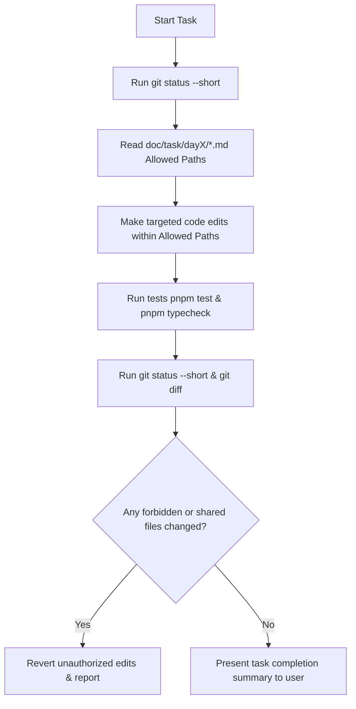

# Skill: Git Team Collaboration

## Purpose
Guide AI coding agents in collaborating safely across a 3-member development team on the Flash Sale System. This skill enforces Git workflow discipline, team file ownership boundaries, Pull Request review chains, shared file governance, and strict protection against destructive Git operations or unauthorized contract drift.

## When to Use
Activate this skill whenever:
- Inspecting git working tree status (`git status`) or checking out feature branches.
- Modifying files near team module boundaries (`apps/api/`, `apps/worker/`, `packages/`, `database/`, `infra/`).
- Preparing Pull Requests, resolving merge conflicts, or committing task changes.
- Interacting with shared files (`compose.yaml`, `package.json`, `.env.example`, `doc/contracts/**`).

## Required Context
Team ownership and workflow governance are defined in `CONTRIBUTING.md` and Phase 5 (`doc/planning/`).
- **Member 1 (Edge / API Lead):** Owns `apps/api/**`, `infra/nginx/**`, `k6/**`. Reviewed by Member 2.
- **Member 2 (Queue / Cache / Observability Lead):** Owns `packages/queue/**`, `packages/cache/**`, `observability/**`. Reviewed by Member 3.
- **Member 3 (Worker / Database Lead):** Owns `apps/worker/**`, `database/**`. Reviewed by Member 1.
- **Integration Captain (Rotated Daily):** Coordinates shared files (`compose.yaml`, `package.json`, `pnpm-workspace.yaml`, `.env.example`, `doc/contracts/**`).

## Authoritative References
- **Contributing Guidelines:** [CONTRIBUTING.md](file:///home/netiwut/Documents/shareproject/FlashSaleSystem/CONTRIBUTING.md)
- **Team Ownership Matrix:** [doc/planning/team-ownership.md](file:///home/netiwut/Documents/shareproject/FlashSaleSystem/doc/planning/team-ownership.md)
- **Master Plan & Milestones:** [doc/planning/master-plan.md](file:///home/netiwut/Documents/shareproject/FlashSaleSystem/doc/planning/master-plan.md)
- **Pull Request Template:** [.github/pull_request_template.md](file:///home/netiwut/Documents/shareproject/FlashSaleSystem/.github/pull_request_template.md)

## Preconditions
1. Run `git status --short` before touching any files.
2. Confirm assigned task Allowed Paths in `doc/task/dayX/<task>.md`.

## Responsibilities
- **Safe Working Tree Inspection:** Inspect dirty files before starting work; NEVER overwrite or reset pre-existing uncommitted work.
- **Ownership Boundary Enforcement:** Work strictly within assigned Allowed Paths; request cross-review before modifying another member's module.
- **Shared File Governance:** Modify shared integration files (`compose.yaml`, `package.json`, `doc/contracts/**`) ONLY when authorized by explicit task instructions or Integration Captain role.
- **PR Review Chain Adherence:** Follow designated review chain (Member 1 → Member 2 → Member 3 → Member 1).

## Non-Responsibilities
- **DO NOT** execute destructive Git reset or clean commands (`git reset --hard`, `git restore .`, `git clean -fd`).
- **DO NOT** execute `git commit`, `git push`, or `git merge` unless explicitly requested by the user.

---

## Core Rules

### 1. The 3-Member Ownership & Review Matrix

```text
┌────────────────────────────────────────────────────────────────────────┐
│                        3-MEMBER REVIEW CHAIN                           │
│                                                                        │
│   Member 1 (API / Nginx)  ──────►  Reviewed by Member 2 (Queue/Cache) │
│            ▲                                      │                    │
│            │                                      ▼                    │
│   Reviewed by Member 1  ◄──────  Member 3 (Worker / Database)          │
└────────────────────────────────────────────────────────────────────────┘
```

### 2. Forbidden Destructive Git Operations
> [!CAUTION]
> **Git Safety Guardrail**  
> AI agents are STRICTLY FORBIDDEN from running destructive Git commands that discard working tree changes or force-push history:
> - **FORBIDDEN Commands:** `git reset --hard`, `git restore .`, `git checkout .`, `git clean -fd`, `git push --force`.
> 
> Running these commands can wipe out a team member's uncommitted work or destroy shared branch history.

### 3. Shared File & Contract Governance
- **Shared Files:** `compose.yaml`, `docker-compose.yml`, `package.json`, `pnpm-workspace.yaml`, `.env.example`, `doc/contracts/**`.
- **Contract Change Guardrail:** AI agents MUST NOT unilaterally change frozen contract files in `doc/contracts/` during feature execution. If a contract mismatch occurs:
  1. STOP execution immediately.
  2. Report affected Producer and Consumer components.
  3. Signal `BLOCKED — CONTRACT / ARCHITECTURE REVIEW REQUIRED`.

---

## Recommended Workflow



1. **Step 1 — Working Tree Audit:** Run `git status --short`. Inspect existing modified files.
2. **Step 2 — Scoping Check:** Cross-reference edit locations against task Allowed Paths.
3. **Step 3 — Minimal Modification:** Implement smallest necessary code changes.
4. **Step 4 — Verification:** Run automated test scripts (`pnpm test`, `pnpm typecheck`).
5. **Step 5 — Diff Audit:** Inspect `git diff` to verify zero unrelated files were modified.

## Verification
- Run `git status --short` and verify that output lists modifications strictly within Allowed Paths.
- Verify TypeScript types pass (`pnpm typecheck`) without introducing broken imports across module boundaries.

## Performance Considerations
- **Clean Commits:** Keep commits focused and atomic per task boundary when explicit commit instructions are provided by the user.

## Common Anti-Patterns to Avoid
- **Anti-Pattern 1:** Running `git restore .` to clear working tree without checking if uncommitted files belong to the user.
- **Anti-Pattern 2:** Editing `apps/worker/` while assigned to an API task in `apps/api/` without cross-team approval.
- **Anti-Pattern 3:** Pushing directly to `main` branch when repository policy requires Pull Request review.
- **Anti-Pattern 4:** Resolving merge conflicts on shared contracts by picking `--ours` blindly.

## Stop Conditions
- Stop immediately if completing a task requires modifying files in another member's primary module without authorization.
- Stop if a merge conflict occurs in `doc/contracts/` or `compose.yaml` that cannot be resolved safely.

## Forbidden Actions
- DO NOT execute `git reset --hard`, `git restore .`, or `git clean -fd`.
- DO NOT execute `git commit`, `git push`, or `git merge` without explicit user instruction.
- DO NOT bypass the designated Pull Request review chain.

## Related Skills
- `loop-engineering` — Orchestrates iterative development loops.
- `flash-sale-project-context` — Defines team ownership roles.
- `follow-project-contracts` — Protects shared contract files.
- `execute-task-safely` — Enforces path boundaries and allowed paths.
- `clean-code-separation` — Preserves clean module boundaries.

## Completion / Handoff
Confirm `git status --short` shows modifications strictly inside Allowed Paths, tests pass 100%, no destructive commands were executed, and no unauthorized commits/pushes were performed.
