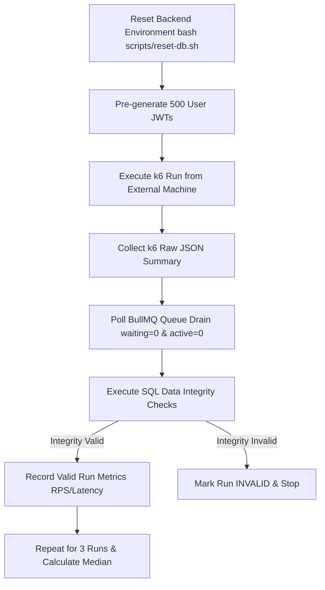

# Skill: k6 Performance Testing

## Purpose
Guide AI agents in implementing, configuring, executing, and interpreting Grafana k6 load test scenarios for the Flash Sale System. This skill ensures load tests are executed consistently, safely, reproducibly, and fairly from an external load generator without distorting backend VM performance.

## When to Use
Activate this skill whenever:
- Modifying or running k6 load test scripts in `k6/`.
- Executing Read-Heavy (`GET /products`) or Write-Heavy (`POST /orders`) benchmark scenarios.
- Measuring system baseline metrics (RPS, Latency p50/p95/p99, HTTP Error Rate).
- Conducting cross-team benchmark comparisons or competition load runs.

## Required Context
k6 performance testing is primarily owned by **Member 1 (Edge / API Lead)**. Load tests evaluate the full system path (`Nginx → API x3 → Redis → BullMQ → Worker → PostgreSQL`).

> [!CAUTION]
> **External Load Generator Rule**  
> All benchmark load test runs MUST be executed from an **EXTERNAL machine** outside the backend VM. Running k6 inside the same VM as the backend applications will consume host CPU, RAM, and network I/O, severely distorting benchmark metrics.

## Authoritative References
- **Load Testing Specification:** [doc/testing/load-testing.md](file:///home/netiwut/Documents/shareproject/FlashSaleSystem/doc/testing/load-testing.md)
- **Baseline Benchmark Specification:** [doc/performance/baseline.md](file:///home/netiwut/Documents/shareproject/FlashSaleSystem/doc/performance/baseline.md)
- **Final Performance Results:** [doc/performance/final-results.md](file:///home/netiwut/Documents/shareproject/FlashSaleSystem/doc/performance/final-results.md)
- **GitHub Workflow Load Test:** [.github/workflows/load-test.yml](file:///home/netiwut/Documents/shareproject/FlashSaleSystem/.github/workflows/load-test.yml)

## Preconditions
1. Confirm backend VM is running cleanly via Docker Compose on target IP.
2. Confirm P0/P1 correctness tests (`flash-sale-testing`) have passed 100%.
3. Pre-generate JWT tokens for 500 unique users before initiating write-heavy benchmark runs.

## Responsibilities
- **Scenario Profile Management:** Maintain standard k6 scenarios (`smoke`, `read-heavy`, `hot-product`, `competition`).
- **External Execution:** Execute k6 load scripts targeting public IP Port 80 (Nginx Proxy).
- **Queue Drain Synchronization:** Poll BullMQ queue depth until `waiting=0` and `active=0` before recording final integrity metrics.
- **Metric Extraction:** Extract RPS, Latency (p50, p95, p99), and HTTP Status distribution from k6 JSON summaries.
- **Median Policy Enforcement:** Execute 3 runs per test configuration and record the median result according to `baseline.md`.

## Non-Responsibilities
- **DO NOT** run k6 load tests directly on the single backend VM during official benchmark runs.
- **DO NOT** treat HTTP 202 Accepted counts in k6 output as proof of confirmed PostgreSQL purchases.

---

## Core Rules

### 1. Standard Benchmark Scenarios

| Scenario Name | Target Endpoint | Concurrent Load | Focus Metrics |
| --- | --- | --- | --- |
| **Smoke Test** | `GET /products`, `POST /orders` | 1–5 VUs | Endpoint reachability, 202 Accepted verification |
| **Read-Heavy** | `GET /api/v1/products?page=1` | 1,000 VUs | RPS, Latency p95, Cache Hit Ratio |
| **Hot-Product Write** | `POST /api/v1/orders` (`p-1001`, stock 50) | 500 Unique Users | Admission RPS, Latency p95, Async Queue Drain Time |
| **Competition Burst** | `POST /api/v1/orders` | 500 Users (2–3 Duplicate Requests) | Atomic Claim Dedup, Zero Overselling, Zero Duplicates |

### 2. JWT Pre-Generation Rule
- Write-heavy benchmarks MUST use pre-generated JWT access tokens representing 500 distinct users (`user-001` to `user-500`).
- Token generation overhead MUST NOT be included in the timed `POST /orders` admission window.

### 3. Invalid Run Criteria
A k6 benchmark run MUST be marked **INVALID** if:
1. PostgreSQL data integrity checks reveal negative stock (`remaining_stock < 0`) or duplicate orders.
2. Database state was not reset (`bash scripts/reset-db.sh`) prior to the run.
3. Queue was not fully drained before database integrity query was executed.
4. Load generator machine CPU reached 100% saturation during the run.

---

## Recommended Workflow



1. **Step 1 — Reset Environment:** Run `bash scripts/reset-db.sh` on backend target VM.
2. **Step 2 — Scenario Invocation:** Run k6 command from external machine:
   ```bash
   k6 run --out json=output/k6-run-001.json \
     -e TARGET_URL=http://<BACKEND_VM_IP> \
     -e VUS=500 -e DURATION=30s k6/scenarios/hot-product.js
   ```
3. **Step 3 — Queue Drain Verification:** Monitor queue depth until zero backlog remains.
4. **Step 4 — Integrity Verification:** Run verification SQL queries on PostgreSQL.
5. **Step 5 — Median Calculation:** Execute 3 runs per candidate configuration and record the median metrics in `tuning-results.md`.

## Verification
- Verify k6 summary output contains 0% network error rate.
- Run `bash scripts/verify-integrity.sh` and confirm zero stock or duplicate violations.

## Performance Considerations
- **Cold vs. Warm Cache:** Clearly label whether Read-Heavy runs were conducted under cold cache (fresh startup) or warm cache (pre-populated).
- **Log Suppression:** Ensure backend log level is set to `warn` or `error` during high-VU benchmark runs.

## Common Anti-Patterns to Avoid
- **Anti-Pattern 1:** Running k6 on the backend VM localhost (`http://localhost:80`).
- **Anti-Pattern 2:** Cherry-picking the single best k6 run out of 10 and ignoring the median.
- **Anti-Pattern 3:** Declaring a benchmark "successful" while 200 jobs are still pending in the BullMQ queue.
- **Anti-Pattern 4:** Generating new JWT tokens synchronously inside the timed k6 `POST /orders` request loop.

## Stop Conditions
- Stop immediately if k6 host CPU or network saturates, invalidating load measurement.
- Stop if backend API containers start crash-looping during the run.

## Forbidden Actions
- DO NOT execute load tests against unauthorized external IP addresses.
- DO NOT report k6 results without verifying PostgreSQL data integrity.
- DO NOT hard-code JWT secrets or production passwords in k6 script files.

## Related Skills
- `loop-engineering` — Orchestrates iterative benchmark execution.
- `flash-sale-project-context` — Provides target architecture context.
- `flash-sale-testing` — Guarantees correctness gates pass before load testing.
- `performance-tuning` — Uses k6 results to guide configuration tuning.
- `benchmark-evidence-collection` — Stores raw k6 JSON summaries for report evidence.

## Completion / Handoff
Confirm k6 load test ran from external machine, queue drained cleanly, SQL integrity checks passed 100%, median metrics were calculated across 3 runs, and raw JSON evidence was saved.
