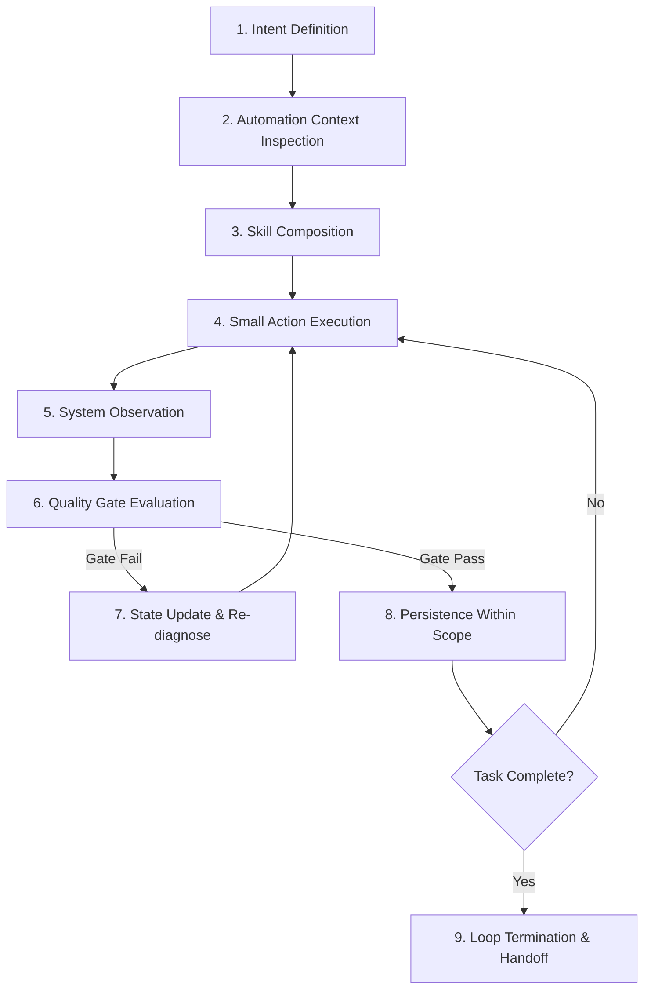

# Skill: Loop Engineering

## Purpose
Orchestrate the master engineering execution loop for all AI coding agent activities in the Flash Sale System repository. This skill provides a repeatable, goal-driven workflow (Intent → Automation Context → Skill → Action → Observation → Gate → State → Persistence → Next Iteration) to ensure safe, empirical, evidence-based development, debugging, testing, and performance tuning.

## When to Use
Activate this skill at the start of any engineering task, feature implementation, bug fix, integration test, or performance tuning session.

## The Engineering Loop Architecture



---

## The 9 Stages of Loop Engineering

### Stage 1: Intent Definition
Before taking any action, establish clear intent:
- What exact outcome is required?
- Extract task metadata: Goal, Acceptance Criteria, Allowed Paths, Forbidden Paths, Expected Evidence, Definition of Done (DoD).
- *Rule:* If intent is ambiguous and cannot be resolved by repository docs, STOP and request clarification.

### Stage 2: Automation Context Inspection
Inspect the current system state before editing code:
- Check git status (`git status --short`) and active branch.
- Read authoritative contracts in `doc/contracts/` and architecture in `doc/architecture/`.
- Inspect existing implementation and test availability.
- *Rule:* Never assume files, libraries, or scripts exist without inspecting first.

### Stage 3: Skill Composition
Select and compose the relevant repository skills required for the task.  
The mandatory skill composition hierarchy is:
```text
loop-engineering (Orchestrator)
    ↓
flash-sale-project-context (Project Goals & Invariants)
    ↓
follow-project-contracts (Frozen Integration Boundaries)
    ↓
execute-task-safely (Task Scoping & Path Boundaries)
    ↓
clean-code-separation (Modular Layer Architecture)
    ↓
<Domain Technical Skill> (e.g., nestjs-api-development, postgres-typeorm-concurrency)
```

### Stage 4: Action Execution
Perform the **smallest meaningful action** that advances the task toward its next gate.
- Implement one endpoint, add one DTO, modify one service method, or change one performance parameter.
- *Rule:* Avoid speculative large batches of unrelated changes.

### Stage 5: System Observation
Gather empirical evidence after every action. Do NOT assume an action worked because the code "looks correct".
- Run compiler/typecheck (`pnpm typecheck`).
- Run test commands (`pnpm test`, `pnpm test:integration`).
- Inspect logs, HTTP response status codes, BullMQ queue state, or PostgreSQL DB query results.
- Run `git status --short` and `git diff` to observe file changes.

### Stage 6: Quality Gate Evaluation
Evaluate the action against relevant Quality Gates:
- **Build Gate:** Does the code compile without TypeScript/linter errors?
- **Contract Gate:** Does the payload match frozen schemas in `doc/contracts/`?
- **Correctness Gate:** Are all 5 Inviolable Business Invariants preserved (stock >= 0, limit 1 per user/product)?
- **Scope Gate:** Were modifications strictly restricted to Allowed Paths?
- **Performance Gate:** Did performance improve without data integrity regression?

### Stage 7: State Tracking
Track current engineering state explicitly:
- Task State: `NOT STARTED`, `IN PROGRESS`, `BLOCKED`, `DONE`.
- Performance State: `KEEP`, `REVERT`, `RETEST`.
- Maintain a list of passing tests, failing tests, modified files, and rejected hypotheses.

### Stage 8: Persistence Within Scope
Persist durable engineering artifacts ONLY within allowed task paths:
- Save source code files, unit/integration tests, and task evidence logs.
- *Rule:* Do not modify shared files, contracts, or architecture documentation unless explicitly authorized in the task.

### Stage 9: Loop Termination & Handoff
Terminate the engineering loop when:
- **A. All Definition of Done gates pass:** All tests pass, git diff is clean within allowed paths, evidence is gathered.
- **B. A Blocker is encountered:** A contract conflict or hard dependency failure requires human/team decision.
- **C. Scope Boundary Limit Reached:** Further progress requires touching forbidden paths.

---

## Specialized Loop Variants

### 1. Debugging Loop (Evidence-Driven Bug Fixing)
1. **Intent:** Define expected behavior vs. actual error log traceback.
2. **Context:** Reproduce error environment.
3. **Action:** Formulate one hypothesis and make minimal targeted fix.
4. **Observation:** Observe traceback / system logs.
5. **Gate:** Is the bug resolved without symptom patching?
6. **Persistence:** Add regression test and persist fix.

### 2. Performance Tuning Loop (Single Variable Optimization)
1. **Intent:** Improve specific target metric (e.g., POST Latency p95).
2. **Context:** Record Baseline configuration and verify initial stock reset (`scripts/reset-db.sh`).
3. **Action:** Change ONE primary variable (e.g., BullMQ Concurrency from 10 to 20).
4. **Observation:** Run k6 Load Benchmark scenario under identical load script.
5. **Gate:** Evaluate Data Integrity Gate (Stock = 0, Orders = 50). If Integrity FAILS -> Decision = `REVERT`.
6. **State:** Log experiment result in `tuning-results.md` (`KEEP` / `REVERT`).

---

## Loop Safety Rules
- **No Endlessly Repeating Failing Actions:** Never repeat the exact same broken shell command or speculative fix without diagnosing root cause evidence.
- **No Masking Failures:** Never comment out broken assertions, swallow exceptions silently, or weaken correctness gates to make tests pass.
- **No Scope Expansion:** Never widen task scope or edit unrelated modules during a debugging or implementation loop.

## Related Skills
- `flash-sale-project-context` — Provides project invariants for the Intent stage.
- `follow-project-contracts` — Provides contract boundary requirements for the Gate stage.
- `execute-task-safely` — Controls the Action and Scope Gate stages.
- `clean-code-separation` — Controls code structure during the Action stage.

## Handoff / Completion
State the final loop state (`DONE`), list verified gates, summarize changes made, and output `git status --short`.
