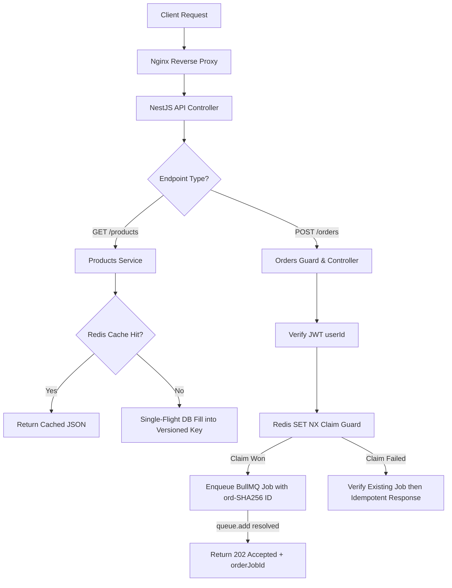

# Skill: NestJS API Development

## Purpose
Govern the design, implementation, and integration of the NestJS API layer. This skill ensures that the public HTTP boundary is stateless, horizontally scalable behind Nginx, contract-compliant, and optimized for high-throughput Flash Sale traffic.

## When to Use
Activate this skill whenever:
- Developing or modifying HTTP Controllers, Services, DTOs, Guards, Interceptors, or Validation Pipes in `apps/api/`.
- Implementing Authentication, Products Read, or Orders Admission endpoints.
- Integrating the API layer with Redis (Cache-Aside, Atomic Claim) or BullMQ (Order Queue Producer).

## Required Context
The API layer is primarily owned by **Member 1 (Edge / API Lead)**. It acts as an **admission and query layer**, NOT the final order transaction processor. All API instances must remain 100% stateless so that any request can be routed to any NestJS container without session loss.

## Authoritative References
Before modifying any API behavior, inspect the following authoritative documents:
- **Public HTTP API Contract:** [doc/contracts/api-contract.md](file:///FlashSaleSystem/doc/contracts/api-contract.md)
- **Queue Payload Contract:** [doc/contracts/queue-contract.md](file:///FlashSaleSystem/doc/contracts/queue-contract.md)
- **Redis Key & Claim Contract:** [doc/contracts/redis-contract.md](file:///FlashSaleSystem/doc/contracts/redis-contract.md)
- **API Flow Architecture:** [doc/architecture/api-flow.md](file:///FlashSaleSystem/doc/architecture/api-flow.md)
- **Order Admission Flow:** [doc/architecture/order-flow.md](file:///FlashSaleSystem/doc/architecture/order-flow.md)
- **Observability Architecture:** [doc/architecture/observability.md](file:///FlashSaleSystem/doc/architecture/observability.md)

## Preconditions
1. Confirm task allowed paths include `apps/api/**`.
2. Inspect `doc/contracts/api-contract.md` for endpoint schemas and HTTP status codes.

## Responsibilities
- **HTTP Routing & Validation:** Parse HTTP requests, validate DTO schemas, and enforce JWT Authentication Guards.
- **Cache-Aside Read Path:** Serve paginated products (`GET /products`) from Redis Cache-Aside; fallback to PostgreSQL on cache miss.
- **Async Order Admission:** Enqueue valid order requests (`POST /orders`) into BullMQ queue `orders` and return HTTP `202 Accepted`.
- **Request Tracing:** Extract `X-Request-ID` from Nginx headers and propagate `requestId` into BullMQ job payloads.

## Non-Responsibilities
- **DO NOT** execute synchronous database stock decrement (`UPDATE products SET remaining_stock...`) inside API controllers.
- **DO NOT** process BullMQ queue jobs in the API app (Worker processing belongs to `apps/worker/`).
- **DO NOT** manage PostgreSQL migrations or seed script execution in API lifecycle handlers.

---

## Core Rules

### 1. Mandatory Endpoints & Contract Alignment

```text
POST /api/v1/auth/token       → Issuance of JWT Access Token
GET  /api/v1/products         → Paginated Product List (Read-heavy Cache-Aside)
POST /api/v1/orders           → Flash Sale Order Admission (Async 202 Accepted)
```

- **Casing:** API requests and responses MUST use `camelCase` for all JSON properties.
- **Response Envelopes:** Error responses MUST follow the standard envelope specified in `api-contract.md`:
  `{ "status": "error", "code": "INVALID_PAYLOAD", "message": "...", "requestId": "req-..." }`

### 2. Stateless JWT Authentication Rules
- `POST /auth/token` accepts valid user authentication requests and issues a signed JWT containing `userId`.
- Protected endpoints (`POST /orders`) MUST extract and verify `userId` from the verified JWT payload (`req.user.userId`).
- **SECURITY GUARDRAIL:** `POST /orders` MUST NOT trust or accept `userId` from the HTTP request body. Any client attempt to pass `userId` in the body MUST be ignored or rejected.
- **SECRET SECURITY:** JWT secret MUST be loaded from environment variables (`JWT_SECRET`). NEVER hard-code secrets or log full JWT tokens in output logs.

### 3. Asynchronous Order Admission Rules (`POST /orders`)
- `POST /orders` is an **Admission Endpoint**. Its flow is:
  `Validate DTO → Verify JWT → SET NX Token → ord-SHA256 Job ID → queue.add → Return 202`
- HTTP `202 Accepted` means **"Order request accepted for queue processing"**. It does NOT mean purchase is confirmed.
- The API controller MUST NOT wait for the BullMQ Worker to finish DB stock processing before returning 202.
- On the Claim-winner path, the successful awaited result of `queue.add()` is the enqueue confirmation. Return 202 immediately; DO NOT call `queue.getJob()` again on this normal path.
- On a duplicate Claim, return 202 with the same ID only after `queue.getJob(jobId)` confirms the Job exists; otherwise return the frozen in-progress error. Never emit a false 202.
- If enqueue fails after winning the Claim, release only the matching token through Lua compare-and-delete.

### 4. Clean Architecture & Separation
Do NOT create "God Controllers". Keep responsibilities cleanly separated:
```text
apps/api/src/orders/
├── orders.controller.ts        # HTTP Routing & DTO mapping ONLY
├── orders.service.ts           # Business orchestration ONLY
├── orders.dto.ts               # Input validation schemas ONLY
├── order-claim.service.ts      # Redis SET NX claim adapter ONLY
└── order-queue.producer.ts     # BullMQ Job Enqueueing ONLY
```

---

## Recommended Workflow



1. **Step 1 — DTO & Pipe Definition:** Create DTOs using `class-validator` and `class-transformer`.
2. **Step 2 — Controller Routing:** Implement Controller routes matching `api-contract.md`.
3. **Step 3 — Service Delegation:** Inject dedicated services for Redis Cache, Atomic Claim, and Queue Producer.
4. **Step 4 — Error Mapping:** Throw NestJS Built-in HTTP Exceptions (`BadRequestException`, `UnauthorizedException`, `ConflictException`).

## Verification
- Run `pnpm --filter api build` and `pnpm --filter api test`.
- Verify using `curl` or Postman that `POST /orders` returns HTTP 202 with `orderJobId` in `camelCase`.
- Verify that calling `POST /orders` without a Bearer JWT returns HTTP 401.

## Performance Considerations
- **No Heavy Operations in Event Loop:** Keep controller execution path minimal (< 5ms admission latency).
- **No Redundant Queue Read:** Never add `queue.getJob()` after a successful `queue.add()`; reserve it for the duplicate-Claim branch only.
- **Stateless Scaling:** Ensure API Containers do not store any local in-memory session arrays.
- **HTTP Adapter:** Adapter selection (Express vs Fastify) is a project-level architecture decision. Do not switch adapters unilaterally during feature implementation.

## Common Anti-Patterns to Avoid
- **Anti-Pattern 1:** Executing TypeORM `repository.save()` or DB stock decrement directly inside `orders.controller.ts`.
- **Anti-Pattern 2:** Storing logged-in users in a local `Map` or `Array` inside API memory.
- **Anti-Pattern 3:** Hard-coding `JWT_SECRET = 'secret123'` in source files.
- **Anti-Pattern 4:** Returning HTTP 200 with fake completed purchase data before queue processing.

## Stop Conditions
- Stop and report if API contract specifications contradict task instructions.
- Stop if implementing an API requirement requires modifying Database migrations or Worker processor files in forbidden paths.

## Forbidden Actions
- DO NOT alter public HTTP response schemas specified in `api-contract.md`.
- DO NOT trust `userId` supplied in the request body for order placement.
- DO NOT log sensitive JWT tokens, passwords, or secrets.

## Related Skills
- `loop-engineering` — Orchestrates the iterative development loop.
- `flash-sale-project-context` — Provides overarching invariants and architecture context.
- `follow-project-contracts` — Protects frozen API contract boundaries.
- `execute-task-safely` — Enforces path boundaries and allowed paths.
- `clean-code-separation` — Guarantees modular separation between controllers, services, and producers.

## Completion / Handoff
Confirm that all endpoints match `api-contract.md`, validation pipes pass, `pnpm typecheck` succeeds, and no files outside `apps/api/` were modified.
