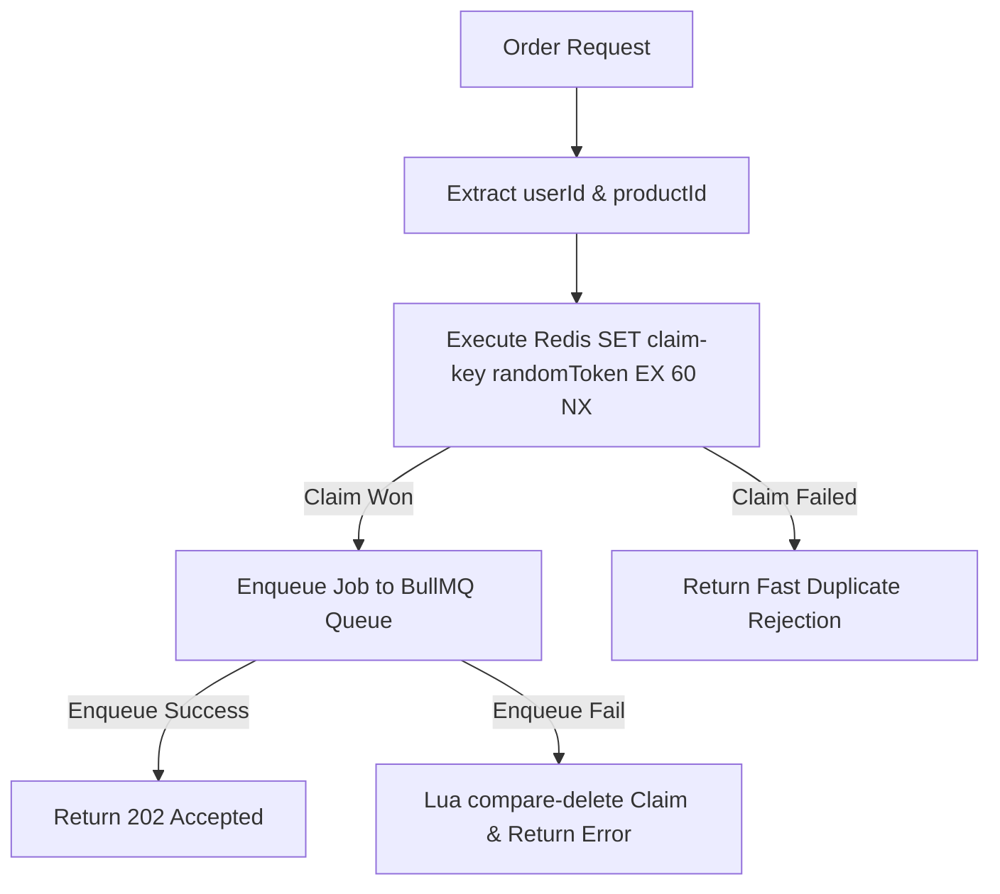

# Skill: Redis Cache and Duplicate Admission Protection

## Purpose
Guide AI agents in implementing Redis data access patterns for Product Read Caching, Atomic Duplicate Admission Protection, and Queue Infrastructure Support. This skill ensures Redis operations remain fast, atomic, and logically separated while preserving PostgreSQL as the single persistent source of truth.

## When to Use
Activate this skill whenever:
- Developing or modifying Product Cache-Aside handlers or invalidation triggers.
- Implementing API-side atomic claim guards (`SET ... NX`) for duplicate order protection.
- Configuring Redis connection clients, TTL policies, or key namespaces.
- Debugging Cache Hit/Miss behavior or Redis connection issues.

## Required Context
Redis operations are primarily owned by **Member 2 (Queue / Redis / Cache Lead)**. Redis serves two distinct logical roles:
1. **Read Performance Layer:** Cache-Aside store for `GET /products` queries to reduce DB load.
2. **Fast-Path Concurrency Guard:** Atomic claim mechanism to reject duplicate HTTP admission requests quickly before hitting BullMQ or PostgreSQL.

> [!IMPORTANT]
> **PostgreSQL Authority Rule:** Redis is a fast-path cache and admission guard; it is NOT the persistent source of truth. The existence of a Redis claim or cache entry does NOT constitute proof of a confirmed purchase. Final purchase authority resides exclusively in PostgreSQL.

## Authoritative References
- **Redis Contract:** [doc/contracts/redis-contract.md](file:///home/netiwut/Documents/shareproject/FlashSaleSystem/doc/contracts/redis-contract.md)
- **API Contract:** [doc/contracts/api-contract.md](file:///home/netiwut/Documents/shareproject/FlashSaleSystem/doc/contracts/api-contract.md)
- **Queue Payload Contract:** [doc/contracts/queue-contract.md](file:///home/netiwut/Documents/shareproject/FlashSaleSystem/doc/contracts/queue-contract.md)
- **Cache Strategy Architecture:** [doc/architecture/cache-strategy.md](file:///home/netiwut/Documents/shareproject/FlashSaleSystem/doc/architecture/cache-strategy.md)
- **Concurrency & Idempotency Architecture:** [doc/architecture/concurrency-and-idempotency.md](file:///home/netiwut/Documents/shareproject/FlashSaleSystem/doc/architecture/concurrency-and-idempotency.md)

## Preconditions
1. Confirm allowed task paths (e.g., `packages/cache/**`, `apps/api/src/products/`, or `apps/api/src/orders/`).
2. Inspect exact Redis key formats and TTL specifications in `doc/contracts/redis-contract.md`.

## Responsibilities
- **Logical Domain Separation:** Keep Cache keys (`fs:cache:products:*`), Claim keys (`fs:claim:order:*`), and BullMQ keys in separate namespaces.
- **Versioned Product Cache-Aside:** Use preloaded Lua `EVALSHA` to read Epoch + versioned value in one Redis round-trip; fallback to PostgreSQL on miss.
- **Single-Flight Fill:** Allow one DB fill per missing versioned key and keep followers off PostgreSQL.
- **Post-Commit Invalidation:** Issue `INCR fs:cache:products:epoch` only after commit; repair failures through Transactional Outbox.
- **Atomic Claim Guard:** Execute `SET claim-key randomToken EX 60 NX` during admission.

## Non-Responsibilities
- **DO NOT** use Redis to store permanent order history or authoritative stock counts.
- **DO NOT** manually modify or delete BullMQ internal keys (`bull:orders:*`) directly unless using BullMQ API methods.
- **DO NOT** implement non-atomic `GET` followed by `SET` for concurrency-sensitive duplicate checking.

---

## Core Rules

### 1. Distinct Logical Redis Key Namespaces

| Domain / Role | Key Pattern | TTL Policy | Atomic Operation |
| --- | --- | --- | --- |
| **Cache Epoch** | `fs:cache:products:epoch` | Persistent | `GET` / `INCR` |
| **Product Cache** | `fs:cache:products:v={epoch}:page={page}:limit={limit}` | `60s` (±5s Jitter) | `GET` / `SETEX` |
| **Duplicate Claim** | `fs:claim:order:{userId}:{productId}` | `60s` | `SET ... EX 60 NX` (Atomic) |
| **BullMQ Internal** | `bull:orders:*` | BullMQ Managed | Managed via `@bull-board` / BullMQ SDK |

### 2. Atomic Duplicate Claim Rules (`SET NX`)
- **Uniqueness Domain:** Claim keys MUST cover the tuple `(userId, productId)`.
  - `userId` alone is NOT sufficient (user can buy different products).
  - `productId` alone is NOT sufficient (different users can buy the same product).
- **Atomic Semantics:** ALWAYS use atomic `SET key value EX TTL NX`.
  - **Claim Won (`OK`):** Proceed to enqueue job in BullMQ.
  - **Claim Failed (`null`):** Return fast duplicate admission rejection.
- **Claim + Enqueue Failure Safety:** If `queue.add()` fails, use Lua compare-and-delete with the request token. Never blindly `DEL` a claim.

### 3. Cache Invalidation Sequence
- Invalidation sequence MUST follow:
  `DB Commit (including Outbox) → INCR Cache Epoch → mark Outbox published`
- **Invalidation Failure Resiliency:** If Redis invalidation fails, database state remains authoritative. Log the invalidation failure; do NOT rollback an already committed DB order transaction.

---

## Recommended Workflow

1. **Step 1 — Key Formatting:** Use helper methods to format exact contract keys.
2. **Step 2 — Client Connection Reuse:** Use a shared Redis client instance via NestJS module. Do NOT create `new Redis()` connections per HTTP request.
3. **Step 3 — Operations Execution:** Perform Redis operations using typed wrappers.
4. **Step 4 — Logging & Metrics:** Record cache hits, misses, and claim failures in metrics helpers.

## Verification
- Run real Redis integration tests (`pnpm test:integration`). Do NOT mock Redis for concurrency atomicity tests.
- Verify that `SET ... NX` correctly returns `null` on duplicate requests for the same `(userId, productId)`.
- Verify that the Epoch increases only after DB commit and the next GET uses a new cache generation.
- Stop Redis after commit, restore it, and verify the Outbox Relay repairs invalidation.

## Performance Considerations
- **Connection Pool:** Reuse Redis connection pool across API handlers.
- **Serialization:** Store JSON-compatible stringified DTO objects in cache; avoid storing complex class instances.
- **Key Expiry Jitter:** Include ±5s jitter on cache TTL to prevent Cache Stampede.
- **One-Hop Hit Path:** Preload the read script, handle `NOSCRIPT` by reloading once, and never use `KEYS` on the request path.

## Common Anti-Patterns to Avoid
- **Anti-Pattern 1:** Writing non-atomic check-then-set logic (`if (!await redis.get(key)) await redis.set(key, 1)`).
- **Anti-Pattern 2:** Using key pattern `fs:claim:user:{userId}` (blocks user from buying different products).
- **Anti-Pattern 3:** Executing `FLUSHALL` or `FLUSHDB` in non-test operational scripts.
- **Anti-Pattern 4:** Assuming a Redis claim key's existence means the order is guaranteed to be in the database.

## Stop Conditions
- Stop immediately if Redis key formats or claim lifecycle rules conflict with `doc/contracts/redis-contract.md`.
- Stop if implementing a Redis feature requires modifying database migrations or worker processor code in forbidden paths.

## Forbidden Actions
- DO NOT use Redis as the primary stock counter without PostgreSQL row lock transaction backing.
- DO NOT hard-code Redis connection passwords in source files.
- DO NOT store JWT secrets or user passwords in Redis keys.

## Related Skills
- `loop-engineering` — Orchestrates iterative testing and tuning.
- `flash-sale-project-context` — Defines system invariants and role separation.
- `follow-project-contracts` — Guarantees alignment with `redis-contract.md`.
- `nestjs-api-development` — Integrates API admission with Redis claim guard.
- `postgres-typeorm-concurrency` — Governs DB transaction authority and post-commit invalidation.

## Completion / Handoff
Confirm that all Redis keys match `redis-contract.md`, `SET ... NX` atomicity is tested with real Redis, and cache hit/miss behavior functions correctly.
