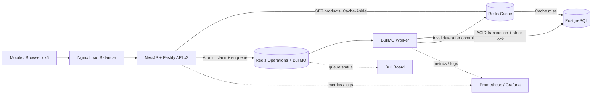

# Flash Sale System

ระบบ Backend สำหรับการแข่งขัน Flash Sale ที่ออกแบบให้รับคำขอพร้อมกันจำนวนมากบน VM เครื่องเดียว โดยให้ความสำคัญตามลำดับคือ **ข้อมูลถูกต้อง → ตรงตาม Requirement → ตอบกลับเร็ว → วัดผลได้ → ปรับแต่งจาก Benchmark**

> **สถานะปัจจุบัน:** Winning Fastest-Safe Architecture และ Shared Contracts ถูก Freeze แล้ว อยู่ระหว่างเริ่ม Implementation; ตัวเลขประสิทธิภาพยังต้องยืนยันบน VM จริง

## เป้าหมายหลัก

- ผู้ใช้หนึ่งคนซื้อสินค้าแต่ละรหัสได้สูงสุดหนึ่งชิ้น
- สต็อกใน PostgreSQL ต้องไม่ติดลบและห้ามขายเกินจำนวน
- รองรับคำขอซ้ำและคำขอพร้อมกันโดยไม่สร้าง Order ซ้ำ
- ตอบรับคำสั่งซื้ออย่างรวดเร็วด้วย Queue แบบ Asynchronous
- รองรับ Read-heavy traffic ด้วย Redis Cache
- รันบริการทั้งหมดด้วย Docker Compose บน VM ขนาด 4 vCPU และ RAM 6 GB

## Architecture Overview



ระบบใช้ API แบบ Stateless จำนวน 3 Instance หลัง Nginx เพื่อกระจายโหลด ส่วน Redis มีบทบาททางตรรกะแยกกันระหว่าง Queue/Admission และ Product Cache โดย PostgreSQL เป็นแหล่งข้อมูลจริงเพียงแห่งเดียวสำหรับ Order และ Stock

## Request Flows

### อ่านรายการสินค้า

```text
Client → Nginx → API → Redis Cache
                         └─ Cache miss → PostgreSQL → เติม Cache → Response
```

ใช้ Cache-Aside เพื่อลดภาระ PostgreSQL สำหรับ `GET /api/v1/products` หาก Cache ใช้งานไม่ได้ API ต้องอ่านจาก PostgreSQL ได้โดยไม่ทำให้ข้อมูลธุรกิจผิดพลาด

### สั่งซื้อสินค้า

```text
Client → Nginx → API
→ ตรวจ JWT และ Request
→ Atomic `SET NX EX` claim ด้วย request token
→ สร้าง `ord-<SHA256(userId|productId)>` ซึ่งไม่มี `:`
→ เพิ่ม Job เข้า BullMQ
→ ตอบ 202 Accepted

BullMQ → Worker
→ รวม Micro-batch 10–32 Jobs (เริ่ม 16 / รอสูงสุด 1 ms)
→ PostgreSQL `place_order_batch(jsonb)` Transaction
→ ตรวจ Durable Result, ล็อก Product Row, เลือกผู้ชนะไม่เกิน Stock
→ Bulk Insert Order + Result Ledger + Transactional Outbox
→ Commit
→ `INCR` Versioned Product Cache Epoch; Outbox Retry หาก Redis ล่ม
```

`202 Accepted` หมายถึงระบบรับงานเข้าคิวสำเร็จเท่านั้น ไม่ได้หมายความว่าผู้ใช้ได้สินค้าแล้ว ผลถาวรต้องตัดสินจาก Transaction ใน PostgreSQL

## Correctness and Concurrency

ระบบป้องกันความผิดพลาดหลายชั้น:

1. **API admission:** ใช้ Redis Atomic Operation เช่น `SET ... NX` ป้องกันผู้ใช้ส่งคำขอเดิมพร้อมกันหลายครั้ง
2. **Queue idempotency:** ใช้ Deterministic Job ID จาก `userId` และ `productId` เพื่อลดโอกาสสร้าง Job ซ้ำ
3. **Database transaction:** Worker ตรวจและลด Stock ภายใน Transaction พร้อม Row Lock หรือ Atomic Conditional Update
4. **Unique constraint:** PostgreSQL บังคับ `UNIQUE(user_id, product_id)` เป็นด่านสุดท้ายของกฎหนึ่งคนต่อหนึ่งสินค้า
5. **Durable idempotency:** ใช้ `order_results(job_id PRIMARY KEY)` ทำให้ Worker Retry โดยไม่ลด Stock ซ้ำ
6. **Cache invalidation:** เปลี่ยน Cache Epoch หลัง Database Commit เท่านั้น และมี Transactional Outbox ซ่อม Invalidation

Redis ช่วยให้ตัดสินใจเร็วในเส้นทางรับคำขอ แต่ไม่ใช่ Source of Truth หากข้อมูล Redis กับ PostgreSQL ไม่ตรงกัน ต้องยึด PostgreSQL เสมอ

## API Surface

| Method | Endpoint | หน้าที่ |
| --- | --- | --- |
| `POST` | `/api/v1/auth/token` | ออก JWT จาก `userId` |
| `GET` | `/api/v1/products` | อ่านรายการสินค้าแบบ Pagination ผ่าน Cache-Aside |
| `POST` | `/api/v1/orders` | รับคำขอสั่งซื้อเข้า Queue และตอบ `202 Accepted` |

รายละเอียด Request, Response และ Error Code อยู่ใน [API Contract](doc/contracts/api-contract.md)

## Technology Stack

| ส่วน | เทคโนโลยี |
| --- | --- |
| Edge / Load Balancing | Nginx |
| API | NestJS, Fastify, JWT |
| Queue / Admission | BullMQ, Redis Atomic Operations |
| Cache | Redis Cache-Aside |
| Worker | NestJS/BullMQ Worker |
| Durable Storage | PostgreSQL, ACID Transaction, Constraints |
| Runtime | Docker Compose บน Single VM |
| Observability | Structured Logs, Prometheus, Grafana, Bull Board |
| Performance Testing | k6 จากเครื่องภายนอก VM |

## Winning Fastest-Safe Defaults

- แยก Redis Operations (`noeviction`, AOF) ออกจาก Redis Cache (`allkeys-lru`)
- ใช้ Versioned Cache + Single-Flight ป้องกัน Cache Stampede
- ใช้ Worker Micro-batching และ PostgreSQL batch function เพื่อลด DB Round-trip
- ใช้ Durable Result Ledger และ Transactional Outbox ป้องกัน Retry/Cache failure
- ปรับ batch size, worker concurrency และ DB pool ด้วย k6 ทีละตัวแปร; ห้ามอ้างว่าเร็วที่สุดจนกว่าจะมีผลจริง 3 รอบและผ่าน SQL Correctness Gate

## Branch Flow

```text
feat/* → develop → main
```

สมาชิกสร้าง Branch ตามงานจาก `develop` แล้วเปิด Pull Request กลับเข้า `develop` เมื่อระบบรวมพร้อมจึงเปิด Pull Request จาก `develop` เข้า `main` รายละเอียดอยู่ใน [CONTRIBUTING.md](CONTRIBUTING.md)
