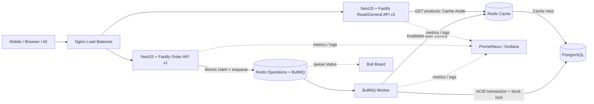

# Flash Sale System

ระบบ Backend สำหรับการแข่งขัน Flash Sale ที่ออกแบบให้รับคำขอพร้อมกันจำนวนมากบน VM เครื่องเดียว โดยให้ความสำคัญตามลำดับคือ **ข้อมูลถูกต้อง → ตรงตาม Requirement → ตอบกลับเร็ว → วัดผลได้ → ปรับแต่งจาก Benchmark**

> **สถานะปัจจุบัน (29 สิงหาคม 2026):** ระบบถูกพัฒนาและตรวจสอบบน Target VM 4 vCPU / RAM 6 GB / Disk 50 GB แล้ว การทดสอบจากเครื่องยิงโหลดภายนอกผ่าน HTTP error = 0%, checks = 100% และ SQL correctness gates ทุกข้อ หลักฐานจริงอยู่ใน `artifacts/day4/` ส่วนคำว่า “เร็วที่สุด” ให้ใช้เฉพาะเมื่อเทียบภายใต้ workload และเครื่องยิงเดียวกันเท่านั้น

## เป้าหมายหลัก

- ผู้ใช้หนึ่งคนซื้อสินค้าแต่ละรหัสได้สูงสุดหนึ่งชิ้น
- สต็อกใน PostgreSQL ต้องไม่ติดลบและห้ามขายเกินจำนวน
- รองรับคำขอซ้ำและคำขอพร้อมกันโดยไม่สร้าง Order ซ้ำ
- ตอบรับคำสั่งซื้ออย่างรวดเร็วด้วย Queue แบบ Asynchronous
- รองรับ Read-heavy traffic ด้วย Redis Cache
- รันบริการทั้งหมดด้วย Docker Compose บน VM ขนาด 4 vCPU และ RAM 6 GB

## Architecture Overview



ระบบใช้ API แบบ Stateless จำนวน 4 Instance หลัง Nginx โดยแยก 3 Instance สำหรับ Read/General Traffic และสงวน 1 Instance สำหรับ Order Admission เพื่อไม่ให้ Read Flood ทำให้คำสั่งซื้อ timeout หาก Order Instance ล่ม Nginx จะ fail over ไปยัง Read Instance โดยการ retry ยังคงปลอดภัยด้วย Redis Claim และ deterministic Job ID ส่วน Redis แยกบทบาทระหว่าง Queue/Admission และ Product Cache และ PostgreSQL เป็นแหล่งข้อมูลจริงเพียงแห่งเดียวสำหรับ Order และ Stock

## Request Flows

### อ่านรายการสินค้า

```text
Client → Nginx → API → Redis Cache
                         └─ Cache miss → PostgreSQL → เติม Cache → Response
```

ใช้ Cache-Aside เพื่อลดภาระ PostgreSQL สำหรับ `GET /api/v1/products` หาก Cache ใช้งานไม่ได้ API ต้องอ่านจาก PostgreSQL ได้โดยไม่ทำให้ข้อมูลธุรกิจผิดพลาด

### สั่งซื้อสินค้า

```text
Client → Nginx → API
→ ตรวจ JWT และ Request
→ Atomic `SET NX EX` claim ด้วย request token
→ สร้าง `ord-<SHA256(userId|productId)>` ซึ่งไม่มี `:`
→ เพิ่ม Job เข้า BullMQ
→ ตอบ 202 Accepted

BullMQ → Worker
→ รวม Micro-batch 10–32 Jobs (เริ่ม 16 / รอสูงสุด 1 ms)
→ PostgreSQL `place_order_batch(jsonb)` Transaction
→ ตรวจ Durable Result, ล็อก Product Row, เลือกผู้ชนะไม่เกิน Stock
→ Bulk Insert Order + Result Ledger + Transactional Outbox
→ Commit
→ `INCR` Versioned Product Cache Epoch; Outbox Retry หาก Redis ล่ม
```

`202 Accepted` หมายถึงระบบรับงานเข้าคิวสำเร็จเท่านั้น ไม่ได้หมายความว่าผู้ใช้ได้สินค้าแล้ว ผลถาวรต้องตัดสินจาก Transaction ใน PostgreSQL

## Correctness and Concurrency

ระบบป้องกันความผิดพลาดหลายชั้น:

1. **API admission:** ใช้ Redis Atomic Operation เช่น `SET ... NX` ป้องกันผู้ใช้ส่งคำขอเดิมพร้อมกันหลายครั้ง
2. **Queue idempotency:** ใช้ Deterministic Job ID จาก `userId` และ `productId` เพื่อลดโอกาสสร้าง Job ซ้ำ
3. **Database transaction:** Worker ตรวจและลด Stock ภายใน Transaction พร้อม Row Lock หรือ Atomic Conditional Update
4. **Unique constraint:** PostgreSQL บังคับ `UNIQUE(user_id, product_id)` เป็นด่านสุดท้ายของกฎหนึ่งคนต่อหนึ่งสินค้า
5. **Durable idempotency:** ใช้ `order_results(job_id PRIMARY KEY)` ทำให้ Worker Retry โดยไม่ลด Stock ซ้ำ
6. **Cache invalidation:** เปลี่ยน Cache Epoch หลัง Database Commit เท่านั้น และมี Transactional Outbox ซ่อม Invalidation

Redis ช่วยให้ตัดสินใจเร็วในเส้นทางรับคำขอ แต่ไม่ใช่ Source of Truth หากข้อมูล Redis กับ PostgreSQL ไม่ตรงกัน ต้องยึด PostgreSQL เสมอ

## Quick Start — รันระบบด้วย Docker

### สิ่งที่ต้องมีก่อน (Prerequisites)

| เครื่องมือ | เวอร์ชันขั้นต่ำ | คำสั่งตรวจสอบ |
| --- | --- | --- |
| **Docker Engine** | 24.0+ | `docker --version` |
| **Docker Compose** | v2.20+ (Compose v2 CLI) | `docker compose version` |
| **Git** | 2.x | `git --version` |

> [!TIP]
> ติดตั้ง Docker Desktop (macOS/Windows) หรือ Docker Engine + Compose Plugin (Linux) ดูขั้นตอนได้ที่ [docs.docker.com](https://docs.docker.com/get-docker/)

---

### ขั้นตอนที่ 1 — Clone โปรเจกต์

```bash
git clone https://github.com/sanpipop/FlashSaleSystem.git
cd FlashSaleSystem
```

---

### ขั้นตอนที่ 2 — ตั้งค่าไฟล์ Environment

คัดลอก `.env.example` เป็น `.env` แล้วแก้ค่า Secret ก่อนรัน:

```bash
cp .env.example .env
```

เปิดไฟล์ `.env` และแก้ไขค่าที่จำเป็น:

```dotenv
# ===== Security (แก้ก่อนรันทุกครั้ง) =====
JWT_SECRET=your-long-random-secret-here        # เปลี่ยนทุกครั้ง
POSTGRES_PASSWORD=your-strong-db-password      # เปลี่ยนทุกครั้ง

# ===== Database =====
POSTGRES_DB=flashsale
POSTGRES_USER=flashsale

# ===== ค่าที่เหลือปล่อย default ได้สำหรับการ develop =====
```

> [!CAUTION]
> **ห้าม commit ไฟล์ `.env` จริงขึ้น Git เด็ดขาด** ไฟล์นี้ถูก ignore ไว้ใน `.gitignore` แล้ว

---

### ขั้นตอนที่ 3 — Build และรัน Docker Compose

```bash
# Build Image ทั้งหมดและรัน Containers ทั้งระบบใน Background
docker compose up --build -d
```

ระบบจะทำลำดับขั้นตอนอัตโนมัติดังนี้:

```text
1. postgres       → รอ PostgreSQL พร้อม (Healthy)
2. migrate        → รัน Database Migration สร้างตาราง
3. seed           → เพิ่มสินค้าตัวอย่าง 20 รายการ (p-1001 สต็อก 50)
4. redis-ops      → Redis สำหรับ BullMQ Queue (AOF, noeviction)
5. redis-cache    → Redis สำหรับ Product Cache (allkeys-lru)
6. api-1/2/3/4    → NestJS API x4 Instances รอ Healthy (3 Read/General + 1 Order)
7. worker         → BullMQ Worker Consumer
8. nginx          → Nginx Load Balancer เปิดรับ Traffic ที่ port 80
```

รอจนทุก Container เป็น `healthy` ประมาณ 30–60 วินาที

---

### ขั้นตอนที่ 4 — ตรวจสอบสถานะระบบ

```bash
# ดูสถานะ Container ทั้งหมด
docker compose ps

# ทดสอบ Health Endpoint ผ่าน Nginx (ต้องได้ 200 OK)
curl http://localhost/health

# ดู Log แบบ Real-time ของทุก Service
docker compose logs -f

# ดู Log เฉพาะ Service ที่ต้องการ
docker compose logs -f api-1
docker compose logs -f worker
```

ถ้าระบบพร้อม `curl http://localhost/health` จะตอบกลับ:

```json
{ "status": "ok", "instance": "api-1" }
```

---

### Endpoints ที่ใช้งานได้หลังจากรัน

| URL | คำอธิบาย |
| --- | --- |
| `http://localhost/health` | Health Check ผ่าน Nginx |
| `http://localhost/api/v1/auth/token` | ออก JWT Token |
| `http://localhost/api/v1/products` | อ่านรายการสินค้า |
| `http://localhost/api/v1/orders` | สั่งซื้อสินค้า (ต้องมี JWT) |
| `http://localhost/admin/queues` | Bull Board — ดูสถานะ Queue |

---

### คำสั่งที่ใช้บ่อย

```bash
# หยุดระบบทั้งหมด (เก็บ Volume ข้อมูลไว้)
docker compose down

# หยุดและลบ Volume ข้อมูลทั้งหมด (Reset สมบูรณ์)
docker compose down -v

# รีสตาร์ท Service เฉพาะตัว
docker compose restart api-1

# ดู Resource Usage (CPU/RAM ของแต่ละ Container)
docker stats

# เข้า Shell ของ Container (เพื่อ Debug)
docker compose exec postgres psql -U flashsale -d flashsale
docker compose exec redis-ops redis-cli
```

---

### ทดสอบ API เบื้องต้นด้วย curl

```bash
# 1. ขอ JWT Token
curl -s -X POST http://localhost/api/v1/auth/token \
  -H "Content-Type: application/json" \
  -d '{"userId": "user-001"}' | jq .

# 2. ดึงรายการสินค้า (เก็บ Token จากขั้นตอนที่ 1 ไว้ที่ $TOKEN)
TOKEN="<paste_token_here>"
curl -s "http://localhost/api/v1/products?page=1&limit=10" \
  -H "Authorization: Bearer $TOKEN" | jq .

# 3. สั่งซื้อสินค้า (ต้องได้ 202 Accepted)
curl -s -X POST http://localhost/api/v1/orders \
  -H "Authorization: Bearer $TOKEN" \
  -H "Content-Type: application/json" \
  -d '{"productId": "p-1001"}' | jq .
```

---

### แก้ไขปัญหาที่พบบ่อย (Troubleshooting)

| อาการ | สาเหตุ / วิธีแก้ |
| --- | --- |
| Container `migrate` หรือ `seed` ล้มเหลว | `postgres` ยังไม่ Healthy — รอสักครู่แล้วรัน `docker compose up -d` อีกครั้ง |
| `curl /health` ตอบ `Connection refused` | `nginx` ยังไม่ขึ้น — รัน `docker compose ps` ตรวจว่า `api-1/2/3/4` ทุกตัว Healthy แล้ว |
| สถานะ Container เป็น `Restarting` | ดู log ด้วย `docker compose logs <service-name>` หาสาเหตุ |
| Port 80 ถูกใช้งานอยู่ | หยุด service อื่นที่ใช้ Port 80 หรือแก้ `ports: "8080:80"` ใน `compose.yaml` ชั่วคราว |
| ต้องการล้างข้อมูลและเริ่มใหม่ทั้งหมด | `docker compose down -v && docker compose up --build -d` |

---

## API Surface

| Method | Endpoint | หน้าที่ |
| --- | --- | --- |
| `POST` | `/api/v1/auth/token` | ออก JWT จาก `userId` |
| `GET` | `/api/v1/products` | อ่านรายการสินค้าแบบ Pagination ผ่าน Cache-Aside |
| `POST` | `/api/v1/orders` | รับคำขอสั่งซื้อเข้า Queue และตอบ `202 Accepted` |

รายละเอียด Request, Response และ Error Code อยู่ใน [API Contract](doc/contracts/api-contract.md)

## Technology Stack

| ส่วน | เทคโนโลยี |
| --- | --- |
| Edge / Load Balancing | Nginx |
| API | NestJS, Fastify, JWT |
| Queue / Admission | BullMQ, Redis Atomic Operations |
| Cache | Redis Cache-Aside |
| Worker | NestJS/BullMQ Worker |
| Durable Storage | PostgreSQL, ACID Transaction, Constraints |
| Runtime | Docker Compose บน Single VM |
| Observability | Structured Logs, Prometheus, Grafana, Bull Board |
| Performance Testing | k6 จากเครื่องภายนอก VM |

## Winning Fastest-Safe Defaults

- แยก Redis Operations (`noeviction`, AOF) ออกจาก Redis Cache (`allkeys-lru`)
- ใช้ Versioned Cache + Single-Flight ป้องกัน Cache Stampede
- ใช้ Worker Micro-batching และ PostgreSQL batch function เพื่อลด DB Round-trip
- ใช้ Durable Result Ledger และ Transactional Outbox ป้องกัน Retry/Cache failure
- ปรับ batch size, worker concurrency และ DB pool ด้วย k6 ทีละตัวแปร; ห้ามอ้างว่าเร็วที่สุดจนกว่าจะมีผลจริง 3 รอบและผ่าน SQL Correctness Gate

## Branch Flow

```text
feat/* → develop → main
```

สมาชิกสร้าง Branch ตามงานจาก `develop` แล้วเปิด Pull Request กลับเข้า `develop` เมื่อระบบรวมพร้อมจึงเปิด Pull Request จาก `develop` เข้า `main` รายละเอียดอยู่ใน [CONTRIBUTING.md](CONTRIBUTING.md)
