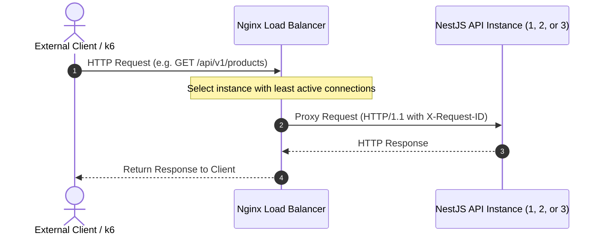
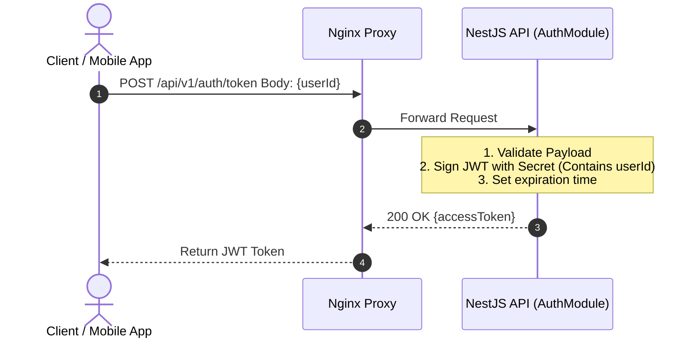
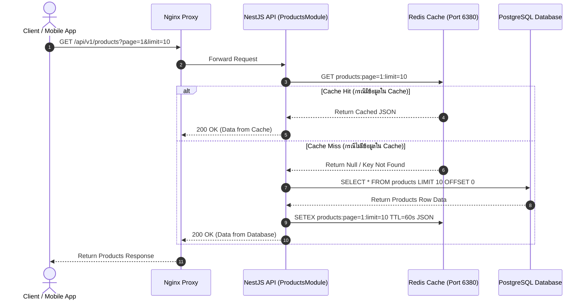

# การไหลของข้อมูลและวงจรคำขอฝั่ง API (API Request Flow & Admission Architecture)

**วันที่อัปเดต:** 26 สิงหาคม 2026  
**สถานะ:** FROZEN WINNING FASTEST-SAFE Architecture (Phase 1)
**ขอบเขตโปรเจกต์:** ขอบเขตการทำงานของ Member 1 (API / Nginx / Auth / Endpoints)

---

## 1. จุดเข้าถึงระบบสาธารณะ (Public Entry Point)

ในการใช้งานจริงและสภาพแวดล้อมการแข่งขัน (Production / Competition Deployment) คำขอจากภายนอกทั้งหมด (External Clients / Mobile Apps / k6 Load Generator) **ถูกห้ามไม่ให้ส่งตรงไปยัง Container ของ NestJS API โดยเด็ดขาด**

Traffic ทั้งหมดต้องวิ่งผ่าน **Nginx Reverse Proxy** บน Port 80/443 เท่านั้น เพื่อทำหน้าที่เป็นด่านหน้าในการควบคุม Traffic, ป้องกันการเปิดเผย Internal IP/Port ของ API Containers และบริการจัดการ Load Balancing

---

## 2. การกระจายภาระงาน (Load Balancing Flow)

Nginx ทำหน้าที่กระจาย HTTP Request ไปยัง NestJS API Containers อย่างน้อย 3 Instances (`api-1`, `api-2`, `api-3`) โดยใช้อัลกอริทึมการกระจายภาระงานแบบ **Least Connections** (หรือ Round Robin เป็น Baseline)



---

## 3. วงจรการยืนยันตัวตน (Authentication Flow)

ระบบใช้ **Stateless JWT (JSON Web Token)** ในการยืนยันตัวตน เพื่อรองรับสถาปัตยกรรมแบบ Horizontal Scaling โดย API ไม่จำเป็นต้องจัดเก็บ Session สภาพแวดล้อมไว้ในหน่วยความจำ

### Endpoint หลัก: `POST /api/v1/auth/token`

- **Request Body:**
  ```json
  {
    "userId": "user-999"
  }
  ```
- **Response `200 OK`:**
  ```json
  {
    "accessToken": "eyJhbGciOiJIUzI1NiIsInR5cCI6..."
  }
  ```

### ลำดับขั้นตอนการทำงาน (Sequence Diagram):



---

## 4. วงจรการดึงข้อมูลสินค้า (Products Request Flow - Read Heavy)

Endpoint สำหรับดึงรายการสินค้าออกแบบมาเพื่อรองรับ Traffic อ่านปริมาณสูงมาก (`GET /api/v1/products?page=1&limit=10`) โดยใช้กลยุทธ์ **Cache-Aside Pattern** ร่วมกับ Redis Cache

### ลำดับขั้นตอนการทำงาน (Sequence Diagram):



---

## 5. วงจรการอนุมัติคำสั่งซื้อ (Orders API Admission Flow - Write Heavy)

Endpoint สั่งซื้อสินค้า (`POST /api/v1/orders`) เป็นส่วนที่ต้องตอบสนองรวดเร็วที่สุดโดยไม่รอการตัดสต็อกใน Database (Non-blocking I/O)

### เงื่อนไขบังคับของ Request:
- **Header:** `Authorization: Bearer <JWT_ACCESS_TOKEN>`
- **Request Body:**
  ```json
  {
    "productId": "p-1001"
  }
  ```
- **Quantity Control:** ปริมาณสินค้าถูกบังคับให้เป็น **1 ชิ้น** เสมอ

### ลำดับขั้นตอนการทำงาน (Sequence Diagram):

```mermaid
sequenceDiagram
    autonumber
    actor Client as Client / Mobile App
    participant Nginx as Nginx Proxy
    participant API as NestJS API (OrdersModule)
    participant RedisOps as Redis Operations / BullMQ
    
    Client->>Nginx: POST /api/v1/orders Header: Bearer JWT Body: {productId}
    Nginx->>API: Forward Request (with X-Request-ID)
    
    Note over API: 1. Verify JWT & Extract userId<br/>2. Validate productId & forced quantity=1<br/>3. Compute Duplicate Protection Key / Job ID
    
    API->>RedisOps: SET claim-key randomToken NX EX 60
    
    alt Claim Won / First Admission
        RedisOps-->>API: OK
        API->>RedisOps: await queue.add with ord-SHA256 Job ID
        RedisOps-->>API: queue.add resolved (enqueue confirmed)
        Note over API,RedisOps: Fast path ไม่เรียก queue.getJob ซ้ำ
        API-->>Nginx: 202 Accepted { status: "ACCEPTED", jobId: "..." }
    else Claim Failed / Duplicate Admission
        RedisOps-->>API: nil
        API->>RedisOps: queue.getJob(deterministic jobId)
        RedisOps-->>API: Existing Job or not-yet-visible
        API-->>Nginx: 202 with same ID if Job exists; otherwise bounded recheck then 409
    end
    
    Nginx-->>Client: Return API Response
```

---

## 6. การส่งต่อ Request ID (Request ID Propagation)

เพื่อให้สามารถสืบค้น Log ข้ามส่วนได้ (End-to-End Traceability):
1. **Nginx** สร้าง หรือรับ `X-Request-ID` จาก HTTP Header แล้วแนบส่งให้ API Container
2. **NestJS API** ดึง `X-Request-ID` ไปใส่ใน Context Logger และแนบเป็น Metadata ไปพร้อมกับ Job ที่ส่งเข้า BullMQ Queue
3. **Worker** อ่าน `X-Request-ID` จาก Job Payload ไปใส่ใน Log ทุกครั้งที่บันทึกการประมวลผลลง PostgreSQL

---

## 7. ขอบเขตและพฤติกรรมเมื่อเกิดข้อผิดพลาด (Error Boundaries)

| สถานการณ์ข้อผิดพลาด | HTTP Status | พฤติกรรมของ API |
| --- | --- | --- |
| **Invalid JWT / Missing Token** | `401 Unauthorized` | ตัดการทำงานทันที ไม่ส่งงานเข้า Queue |
| **Invalid Payload / Missing productId** | `400 Bad Request` | คืน Validation Error JSON |
| **Duplicate Concurrent Request** | `409 Conflict` หรือ `202 Accepted` | ป้องกันการสร้าง Job ซ้ำเข้า Queue |
| **Redis / Queue Service Unavailable** | `503 Service Unavailable` | Log Critical Alert คืน Error ไม่ให้ตกค้าง |
| **Internal Server Error** | `500 Internal Server Error` | Catch Unhandled Exception และ บันทึก Log |
