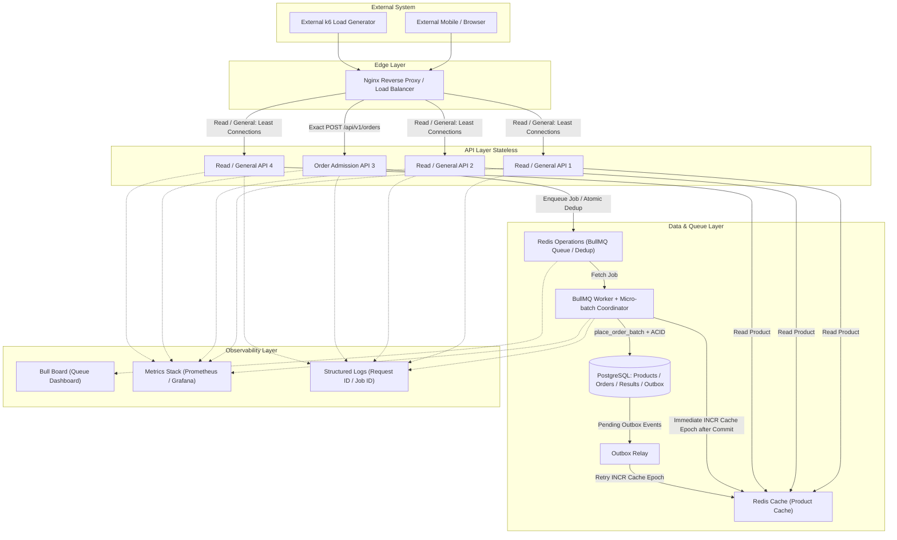

# สถาปัตยกรรมรวมของระบบ Flash Sale (High-Level Architecture Overview)

**วันที่อัปเดต:** 26 สิงหาคม 2026  
**สถานะ:** FROZEN WINNING FASTEST-SAFE Architecture (Phase 1)
**ขอบเขตโปรเจกต์:** Flash Sale Backend System สำหรับ Mobile Application (ทีมพัฒนา 3 คน)

---

## 1. วัตถุประสงค์ของเอกสาร (Purpose)

เอกสารฉบับนี้เป็น **Source of Truth หลักด้านสถาปัตยกรรมระบบ (Architecture Overview)** สำหรับโปรเจกต์ **FlashSaleSystem** จัดทำขึ้นก่อนเริ่มกระบวนการลงมือเขียนโค้ด (Implementation Phase) เพื่อให้สมาชิกในทีมทั้ง 3 คนมีภาพจำและความเข้าใจตรงกัน ลดปัญหาการติดขัดระหว่างเชื่อมต่อระบบ (Integration Blocker) และมั่นใจได้ว่าระบบสามารถรองรับปริมาณคำสั่งซื้อจำนวนมาก (High Concurrency Traffic) ได้อย่างถูกต้อง เที่ยงตรง และมีประสิทธิภาพสูงสุดภายใต้ทรัพยากรที่จำกัด

---

## 2. เป้าหมายทางสถาปัตยกรรม (Architecture Goals)

การออกแบบสถาปัตยกรรมระบบยึดหลักการสำคัญ 5 ประการตามลำดับความสำคัญ (Core Priority):

> **Correctness First → Complete Requirements → Observable → Benchmark → Optimize**

1. **ความถูกต้องของข้อมูลและสต็อก (Data Integrity & Zero Overselling):** ห้ามเกิดกรณี สต็อกติดลบ (`remainingStock < 0`) หรือผู้ใช้คนเดียวกันซื้อสินค้าชิ้นเดียวกันเกิน 1 ชิ้น (`Limit 1 per User per Product`) โดยเด็ดขาด
2. **การรองรับปริมาณคำขอสูง (High Throughput & Low Latency):** ระบบต้องตอบรับคำสั่งซื้อ (API Admission) ได้รวดเร็ว โดยเฉลี่ยไม่เกินระดับ p95 latency ที่กำหนด และสามารถแยกกระบวนการตัดสต็อกที่ใช้เวลานานออกไปทำแบบ Asynchronous
3. **การป้องกันคำขอซ้ำ (Idempotency & Duplicate Protection):** รองรับกรณีผู้ใช้ส่ง Request ซ้ำพร้อมกันหลายครั้ง (Concurrent Duplicate Requests) โดยระบบต้องรับและประมวลผลคำสั่งซื้อที่ถูกต้องเพียงรายการเดียว
4. **ความสามารถในการขยายระบบแนวระนาบ (Horizontal Scalability & Stateless API):** ส่วนประมวลผลหน้าบ้าน (API Instances) ต้องเป็น Stateless 100% ไม่พึ่งพา In-Memory Session บนเครื่อง เพิ่ม/ลด Container ได้อิสระ
5. **ความพร้อมในการติดตามและวัดผล (Observability & Auditability):** สามารถวัดค่า RPS, Latency, Cache Hit Ratio, Queue Backlog และแสดงหลักฐานความถูกต้องของข้อมูลหลังการทดสอบได้อย่างชัดเจน

---

## 3. ข้อจำกัดของโครงสร้างพื้นฐานและทรัพยากร (System Constraints)

โปรเจกต์นี้ถูกออกแบบและติดตั้งบน Virtual Machine (VM) สำหรับการแข่งขัน โดยมีข้อจำกัดทรัพยากรที่ต้องจัดสรร (Resource Budget Awareness) ดังนี้:

| ทรัพยากร | ข้อจำกัด / ขนาด | ผลกระทบต่อการออกแบบสถาปัตยกรรม |
| --- | --- | --- |
| **CPU** | 4 vCPU | ห้ามสร้าง Microservices หรือ Container ย่อยมากเกินไป ต้องประหยัด CPU Context Switch |
| **RAM** | 6 GB | ต้องควบคุมขนาด Connection Pool, Redis Memory และ Node.js Heap Size |
| **Disk** | 50 GB | ใช้สำหรับ Docker Images, Database Storage และ Log Files |
| **Environment** | 1 Single VM | บริการทั้งหมดรันผ่าน **Docker Compose** ภายใน VM เครื่องเดียวกัน |
| **Load Testing** | External Machine | เครื่องมือทดสอบโหลด (เช่น k6) ต้องยิงมาจากภายนอก VM เพื่อไม่ให้แย่ง CPU/RAM ระบบ |
| **Team Size** | 3 คน | แบ่งขอบเขตความรับผิดชอบชัดเจน (API/Nginx, Queue/Redis, Worker/DB) ไม่บล็อกงานกัน |

---

## 4. องค์ประกอบหลักของระบบ (System Components)

สถาปัตยกรรมแบ่งออกเป็น 11 องค์ประกอบหลัก โดยแต่ละส่วนมีหน้าที่เฉพาะเจาะจง:

### หน้าที่และข้อห้ามของแต่ละ Component (Component Responsibilities & Boundaries)

1. **Nginx Reverse Proxy:**
   - **หน้าที่:** เป็น Public Entry Point รับ HTTP Traffic ทั้งหมด, กระจาย Load ไปยัง NestJS API ด้วย Least Connections หรือ Round Robin, จัดการ SSL/TLS Termination (ถ้ามี)
   - **ข้อห้าม:** ห้ามประมวลผล Business Logic หรือตรวจสอบ JWT Authentication ใน Nginx

2. **NestJS API Instances (ใช้ 4 Container จากผล Benchmark):**
   - **หน้าที่:** ตรวจสอบความถูกต้องของ JWT Token, รับและตรวจสอบ Request Format, ดึงข้อมูลสินค้าจาก Redis Cache ( Cache-Aside), คำนวณ Atomic Deduplication และ Enqueue งานไปยัง BullMQ ก่อนตอบกลับ `202 Accepted`
   - **ข้อห้าม:** **ห้ามเปิด Database Transaction เพื่อตัดสต็อกโดยตรง**, ห้ามเก็บ In-Memory Session หรือ Local State ที่ทำให้ระบบไม่เป็น Stateless

3. **Redis Cache (Product Listing & Read Cache):**
   - **หน้าที่:** เก็บแคชข้อมูลรายการสินค้า และข้อมูลแบ่งหน้า (Pagination) เพื่อรับ Read-Heavy Load (`GET /api/v1/products`)
   - **ข้อห้าม:** **ห้ามใช้ Redis Cache เป็น Persistent Source of Truth ของ Order หรือ Remaining Stock**

4. **Redis Operations / BullMQ:**
   - **หน้าที่:** เก็บ Queue Job ของ BullMQ และทำหน้าที่เป็น Atomic Protection ในระดับ Admission
   - **ข้อห้าม:** ห้ามใช้เป็นที่เก็บข้อมูลถาวร (Persistent Storage) ระยะยาว

5. **BullMQ Worker:**
   - **หน้าที่:** ดึง Job คำสั่งซื้อจาก Queue มาเปิด Database Transaction ทำการล็อกแถวสินค้า (Row-level locking), ตรวจสอบเงื่อนไขการซื้อ, บันทึก Order, ตัดสต็อกลง PostgreSQL และล้าง Cache เมื่อสำเร็จ
   - **ข้อห้าม:** ห้ามตอบกลับ HTTP Response ตรงไปยัง Client

6. **PostgreSQL (Database):**
   - **หน้าที่:** เป็น **Persistent Source of Truth สัมบูรณ์** สำหรับข้อมูลสินค้า, สต็อกสินค้าคงเหลือ, ประวัติการสั่งซื้อ และ UNIQUE Constraints (`user_id`, `product_id`)
   - **ข้อห้าม:** ห้ามใช้เป็น Read Cache สำหรับ High-Frequency Read Traffic โดยไม่ผ่าน Redis Cache

7. **Bull Board / Metrics / Logs:**
   - **หน้าที่:** ติดตามสถานะ Queue, ประสิทธิภาพ HTTP, อัตรา Cache Hit Ratio, ทรัพยากร VM และประสาน Traceability ผ่าน Request ID / Job ID

---

## 5. ความเป็นเจ้าของข้อมูล (Data Ownership Matrix)

| ประเภทข้อมูล | Storage / Location หลัก | ผู้เขียนข้อมูล (Write Owner) | ผู้อ่านข้อมูล (Read Owner) | บทบาททางสถาปัตยกรรม |
| --- | --- | --- | --- | --- |
| **Product Information & Stock Truth** | PostgreSQL | PostgreSQL Migration / Admin | BullMQ Worker / API | **Persistent Source of Truth** |
| **Order Record & Purchase Result** | PostgreSQL | BullMQ Worker | API / Database | **Persistent Source of Truth** |
| **Product Read Cache** | Redis Cache | API (Cache-Aside) / Worker (Invalidation) | NestJS API | Volatile Read Replica |
| **Pending Order Queue & Job State** | Redis Operations | NestJS API (Producer) | BullMQ Worker (Consumer) | Temporary Processing Queue |
| **User Authentication / Claims** | Client Side (JWT) | Auth Endpoint (`POST /auth/token`) | NestJS API (JWT Guard) | Stateless Credential |

---

## 6. รูปแบบการสื่อสารภายในระบบ (Communication Patterns)

1. **Synchronous Path (เน้นความเร็วในการอ่านข้อมูลและตอบรับ):**
   - `Client → Nginx → NestJS API` (HTTP RESTful)
   - `NestJS API → Redis Cache` (Redis Protocol - Single Round-trip)
   - Response: `200 OK` สำหรับ Auth/Products หรือ `202 Accepted` สำหรับ Order Admission
2. **Asynchronous Path (เน้นความถูกต้องและความทนทานของข้อมูล):**
   - `NestJS API → Redis Operations / BullMQ` (Enqueue Job)
   - `BullMQ Queue → BullMQ Worker` (Job Event Consumption)
   - `BullMQ Worker → PostgreSQL` (TCP / Connection Pool w/ ACID Transaction)
   - `BullMQ Worker → Redis Cache` (Post-commit Invalidation Signal)

---

## 7. แบบโมเดลการขยายระบบและการจัดการทรัพยากร (Scaling Model & Resource Budget)

- **Stateless API Scaling:** Requirement บังคับอย่างน้อย 3 Instances; ผล Mixed Stress บน Target VM เลือก 4 Instances โดย 3 ตัวรับ Read/General และ 1 ตัวรับ Order Admission เพื่อทำ Bulkhead Isolation
- **Worker Scaling:** Hot Product เดียวไม่ควรเพิ่ม Concurrency สูงแบบสุ่ม เพราะทุก Transaction แย่ง Row Lock เดียวกัน ให้ลด DB Round-trip ด้วย Micro-batch แล้วค่อยปรับ Concurrency 8/12/16
- **Connection Budget:** PostgreSQL `max_connections` เริ่ม 35–40; API 4 ตัวใช้ไม่เกิน 4 ต่อ Instance, Worker 12, และเผื่อ Migration/Admin/Monitoring โดย Pool รวมต้องไม่เกิน Budget
- **Resource Allocation Target (Container RSS รวมไม่เกินประมาณ 4.4 GB):**

| Component | CPU Budget | RAM Limit Target |
| --- | ---: | ---: |
| Nginx | 0.80 vCPU | 128 MB |
| NestJS API x4 | 0.85 vCPU ต่อ Instance | 320 MB ต่อ Instance |
| Worker + Outbox Relay | 1.25 vCPU | 640 MB |
| Redis Operations | 0.75 vCPU | 384 MB |
| Redis Cache | 0.40 vCPU | 256 MB |
| PostgreSQL | 1.25 vCPU | 1,400 MB |
| Prometheus + Grafana + Node Exporter | 0.18 vCPU | 576 MB |

CPU limit เป็นเพดาน ไม่ใช่การจอง CPU จึงสามารถ Oversubscribe ได้และให้ Linux scheduler แบ่ง 4 vCPU ตามโหลดจริง ส่วน RAM limit รวมยังอยู่ภายใน 6 GB โดยเหลือพื้นที่ให้ OS/Docker/page cache; Disk 50 GB ใช้ Docker log rotation และจำกัด Prometheus retention 2–3 วัน

---

## 8. Winning Fastest-Safe Architecture

### 8.1 โครงสร้างบังคับที่ต้อง Implement

- **LB & API:** Nginx Bulkhead แยก 3 Read/General APIs แบบ Least Connections และ 1 Order Admission API สำหรับ exact `POST /api/v1/orders`
- **Auth:** Stateless JWT Authentication
- **Products API:** Versioned Cache-Aside + Single-Flight ด้วย Redis Cache Instance แยก
- **Orders API:** รับคำสั่งซื้อ อนุมัติผ่าน Queue และตอบ `202 Accepted` ทันที
- **Queue System:** Explicit `SET NX EX` Claim ตาม Requirement + BullMQ deterministic Job ID ที่ไม่มี `:` + Retention แบบจำกัด
- **Worker:** Micro-batch เริ่ม 16 Jobs / สูงสุดรอ 1 ms แล้วเรียก `place_order_batch(jsonb)`
- **Database Safety:** `SELECT ... FOR UPDATE`, `CHECK`, `UNIQUE`, `order_results(job_id)` และ Transactional Outbox
- **Cache Invalidation:** `INCR fs:cache:products:epoch` หลัง Commit และ Outbox Relay Retry จนสำเร็จ
- **Redis Isolation:** Queue Redis ใช้ `noeviction` + AOF; Cache Redis ใช้ `allkeys-lru`

### 8.2 ค่าที่ยังต้องเลือกด้วย Benchmark

> [!NOTE]
> เทคนิคหลักด้าน Correctness ถูก Freeze แล้ว แต่ค่าตัวเลขต้องเลือกจากผล k6 3 รอบและ SQL Gate เท่านั้น:

1. **Micro-batch Size:** 16 เทียบ 32 Jobs และ max wait 0.5–1 ms
2. **Worker Concurrency:** 8 เทียบ 12 เทียบ 16; เลือกค่าที่ Queue Drain เร็วสุดโดย DB lock wait ไม่พุ่ง
3. **API Instances:** 3 เทียบ 4 โดย Requirement ขั้นต่ำยังคง 3
4. **DB Pool รวม:** 24 เทียบ 28 เทียบ 32 ภายใต้ `max_connections` 35–40
5. **Queue Lane Sharding:** ไม่เปิดเป็นค่าเริ่มต้นสำหรับการทดสอบ `p-1001` เพราะทุกคำขอเป็น Product เดียวและจะลง Lane เดียว; ทดลองเฉพาะเมื่อ Test มีหลาย Hot Products

---

## 9. หลักการสำคัญทางสถาปัตยกรรม (Architecture Principles)

1. **Single Source of Truth:** PostgreSQL เป็นคำตอบสุดท้ายของสต็อกและคำสั่งซื้อเสมอ
2. **Fail-Safe Cache:** หาก Redis Cache ขัดข้อง ระบบต้องสามารถ Fallback ไปอ่าน PostgreSQL ได้โดยไม่ทำให้สต็อกผิดพลาด
3. **No In-Memory Authority:** ห้ามใช้ In-Memory State ของ API Instance ในการตัดสินผลทางธุรกิจ
4. **Traceable Operations:** ทุกคำขอต้องมี Request ID และ Job ID สำหรับการสืบค้นย้อนหลัง
