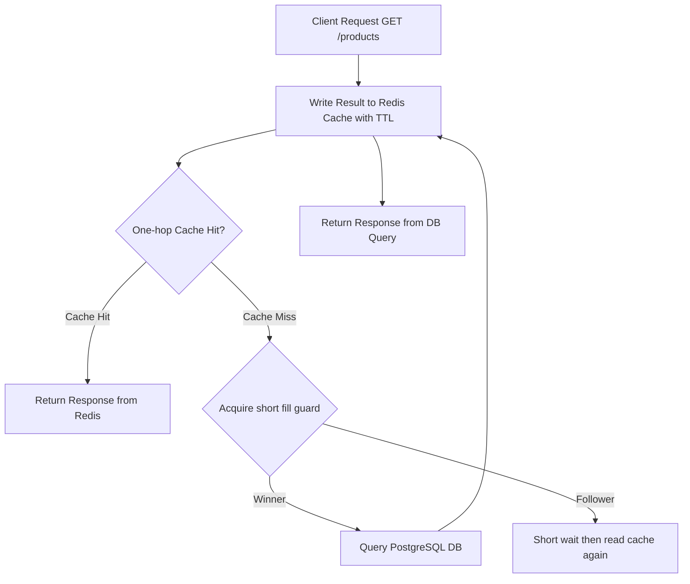

# กลยุทธ์การทำระบบแคช (Cache Strategy Architecture)

**วันที่อัปเดต:** 26 สิงหาคม 2026  
**สถานะ:** FROZEN WINNING FASTEST-SAFE Architecture (Phase 1)
**ขอบเขตโปรเจกต์:** การจัดการ Redis Cache สำหรับ Read-Heavy Traffic (ขอบเขต Member 2)

---

## 1. เหตุผลการมีอยู่ของ Cache (Why Cache Exists)

ในเทศกาล Flash Sale การเข้าชมรายการสินค้า (`GET /api/v1/products?page=1&limit=10`) มีปริมาณมากกว่าคำสั่งซื้อ (Write Orders) หลายสิบเท่า (ประมาณ Read 1,000 Concurrent Users ต่อ Write 500 Concurrent Requests)

หากคำขออ่านทั้งหมดวิ่งตรงไปยัง PostgreSQL Database จะทำให้เกิดคอขวดด้าน Connection Pool และ CPU Exhaustion ส่งผลกระทบทำให้การประมวลผลการตัดสต็อกของ Worker ช้าลงอย่างมาก ดังนั้นการทำ Cache จึงมีเป้าหมายเพื่อ:
1. ป้องกัน PostgreSQL จาก Read Traffic ปริมาณมหาศาล
2. ลด Latency การดึงข้อมูลรายการสินค้าให้อยู่ในระดับต่ำกว่า 5 ms
3. รองรับการยิงอ่านพร้อมกัน (High Concurrent Read Load)

---

## 2. ข้อมูลที่อนุญาตและห้ามอยู่ใน Cache (Cache Data Boundaries)

### 2.1 ข้อมูลที่อนุญาตให้เก็บใน Cache (What Is Cached)
- รายการสินค้าสำหรับหน้าแรกและ Pagination (`products:page=X:limit=Y`)
- ข้อมูลรายละเอียดสินค้าทั่วไป (ราคา, ชื่อ, คำอธิบาย, รูปภาพ)
- ข้อมูลสต็อกที่มาจาก Database Commit หรือ DB-confirmed Read Projection เท่านั้น

### 2.2 ข้อมูลที่ห้ามใช้ Cache เป็นความจริงสัมบูรณ์ (What Must NOT Be Authoritative Cache Data)
- **ห้ามใช้ Redis Cache เป็นคำตอบสุดท้ายของการตัดสต็อก (Remaining Stock Truth)**
- **ห้ามใช้ Redis Cache ตัดสินผลการสั่งซื้อสำเร็จหรือล้มเหลว**

---

## 3. รูปแบบการทำงาน Cache-Aside Pattern

ระบบเลือกใช้ **Versioned Cache-Aside + Single-Flight** เป็นโครงสร้างหลัก:



---

## 4. หลักการออกแบบ Cache Key และ Pagination Impact

- **Epoch Key:** `fs:cache:products:epoch`
- **รูปแบบโครงสร้าง Data Key:**
  `fs:cache:products:v={epoch}:page={page}:limit={limit}`
- **ตัวอย่าง:**
  `fs:cache:products:v=15:page=1:limit=10`
  `fs:cache:products:v=15:page=2:limit=10`
- **การผลกระทบจาก Pagination:**
  เมื่อ Stock เปลี่ยนให้ `INCR fs:cache:products:epoch` ครั้งเดียว ทุก Pagination จะอ้าง Generation ใหม่ทันที ส่วน Key รุ่นเก่าหมดอายุตาม TTL
  เส้นทาง Cache Hit ใช้ Lua `EVALSHA` อ่าน Epoch และ Value ใน Redis round-trip เดียว

---

## 5. กลยุทธ์การล้างแคชเมื่อมีการเปลี่ยนแปลงข้อมูล (Cache Invalidation Strategy)

เพื่อรักษาความถูกต้องของข้อมูลสินค้าและสต็อกที่แสดงผล:

1. **Trigger Event:** เกิดขึ้นเมื่อ BullMQ Worker ทำการลดสต็อกสินค้าลง PostgreSQL และสั่ง **`COMMIT` Transaction สำเร็จเรียบร้อยแล้วเท่านั้น**
2. **Invalidation Action:** Worker ส่ง `INCR fs:cache:products:epoch` ไปยัง Redis Cache แบบ O(1)
3. **Re-population:** เมื่อคำขอ `GET /products` ถัดไปเข้ามา จะเกิด Cache Miss และทำการอ่านข้อมูลสต็อกล่าสุดจาก PostgreSQL ไปสร้าง Cache ใหม่โดยอัตโนมัติ

```text
Worker Commit DB Success ──> INCR Cache Epoch ──> Next GET uses new Version ──> Single DB Fill ──> Fresh Cache
```

---

## 6. การป้องกันปัญหาสภาพแวดล้อมแคช (Cache Challenges & Mitigations)

### 6.1 Cache Stampede (Dog-piling Effect)
- **ปัญหา:** เมื่อ Cache Key สำหรับสินค้ายอดนิยมหมดอายุพร้อมกัน คำขออ่านนับพันจะทะลักไปที่ PostgreSQL พร้อมกัน
- **Baseline Mitigation:** 
  - กำหนด **TTL แบบ Jitter (Randomized TTL):** เพิ่มค่าสุ่มให้กับ TTL (เช่น 60s ± 5s) เพื่อไม่ให้ Keys หมดอายุพร้อมกัน
  - **Single-Flight:** ให้ Request เดียวเติม Key ที่ Miss ส่วน Request อื่นรอระยะสั้นและอ่านผลเดียวกัน

### 6.2 TTL Strategy (Time-To-Live)
- รายการสินค้าทั่วไป: TTL 60 - 300 วินาที
- รายการสินค้า Flash Sale ยอดนิยม (`p-1001`): TTL 5 - 10 วินาที (เพื่อให้หน้าบ้านเห็นข้อมูลสต็อกใกล้เคียงความจริงที่สุด แม้ไม่มี Invalidation Signal)

---

## 7. พฤติกรรมเมื่อ Redis Cache ขัดข้อง (Failure Behavior)

หาก Redis Cache เกิดเหตุขัดข้อง (Crash / Network Timeout / Down):
1. NestJS API ต้องทำการ Catch Exception จาก Redis Client ทันที
2. ระบบต้อง **Fallback ไปอ่านข้อมูลจาก PostgreSQL โดยตรง**
3. ระบบจะยังคงรักษา **Data Correctness** และป้องกัน Negative Stock ได้ 100% (แต่อาจมี Latency เพิ่มขึ้นในฝั่ง Read)

---

## 8. กลไกซ่อมแคชและขอบเขตความถูกต้อง

> [!NOTE]
> PostgreSQL ยังเป็น Source of Truth และการเปลี่ยน Epoch เกิดหลัง Commit เท่านั้น

1. Worker ทำ Immediate Epoch Increment หลัง Commit เพื่อให้ Latency ต่ำ
2. Transaction เดียวกันเขียน Outbox Event และ Outbox Relay Retry เมื่อ Redis ล่ม
3. การเพิ่ม Epoch ซ้ำไม่ทำให้ข้อมูลผิด เพียงสร้าง Generation ว่างเพิ่มหนึ่งรุ่น
4. ห้ามใช้ L1 In-Memory Stock เป็น Authority; อนุญาตเฉพาะข้อมูล Static ที่ไม่กระทบผลสั่งซื้อและต้องพิสูจน์ด้วย Benchmark
