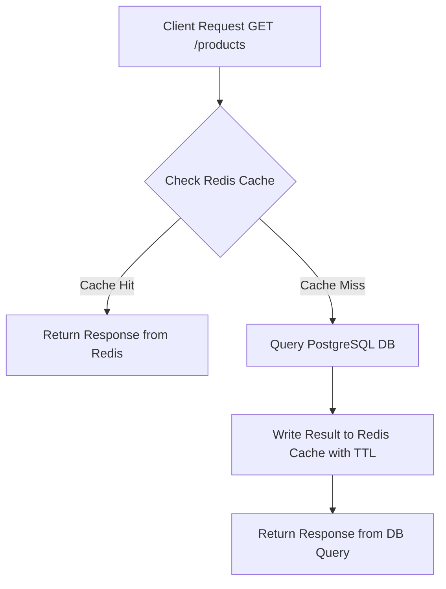

# กลยุทธ์การทำระบบแคช (Cache Strategy Architecture)

**วันที่อัปเดต:** 26 สิงหาคม 2026  
**สถานะ:** Draft Baseline Architecture (Phase 1)  
**ขอบเขตโปรเจกต์:** การจัดการ Redis Cache สำหรับ Read-Heavy Traffic (ขอบเขต Member 2)

---

## 1. เหตุผลการมีอยู่ของ Cache (Why Cache Exists)

ในเทศกาล Flash Sale การเข้าชมรายการสินค้า (`GET /api/v1/products?page=1&limit=10`) มีปริมาณมากกว่าคำสั่งซื้อ (Write Orders) หลายสิบเท่า (ประมาณ Read 1,000 Concurrent Users ต่อ Write 500 Concurrent Requests)

หากคำขออ่านทั้งหมดวิ่งตรงไปยัง PostgreSQL Database จะทำให้เกิดคอขวดด้าน Connection Pool และ CPU Exhaustion ส่งผลกระทบทำให้การประมวลผลการตัดสต็อกของ Worker ช้าลงอย่างมาก ดังนั้นการทำ Cache จึงมีเป้าหมายเพื่อ:
1. ป้องกัน PostgreSQL จาก Read Traffic ปริมาณมหาศาล
2. ลด Latency การดึงข้อมูลรายการสินค้าให้อยู่ในระดับต่ำกว่า 5 ms
3. รองรับการยิงอ่านพร้อมกัน (High Concurrent Read Load)

---

## 2. ข้อมูลที่อนุญาตและห้ามอยู่ใน Cache (Cache Data Boundaries)

### 2.1 ข้อมูลที่อนุญาตให้เก็บใน Cache (What Is Cached)
- รายการสินค้าสำหรับหน้าแรกและ Pagination (`products:page=X:limit=Y`)
- ข้อมูลรายละเอียดสินค้าทั่วไป (ราคา, ชื่อ, คำอธิบาย, รูปภาพ)
- ข้อมูลสต็อกประมาณการณ์สำหรับแสดงผลลัพธ์หน้าบ้าน (Stock Read Projection)

### 2.2 ข้อมูลที่ห้ามใช้ Cache เป็นความจริงสัมบูรณ์ (What Must NOT Be Authoritative Cache Data)
- **ห้ามใช้ Redis Cache เป็นคำตอบสุดท้ายของการตัดสต็อก (Remaining Stock Truth)**
- **ห้ามใช้ Redis Cache ตัดสินผลการสั่งซื้อสำเร็จหรือล้มเหลว**

---

## 3. รูปแบบการทำงาน Cache-Aside Pattern

ระบบเลือกใช้ **Cache-Aside (Lazy Loading) Pattern** เป็นโครงสร้าง Baseline หลัก:



---

## 4. หลักการออกแบบ Cache Key และ Pagination Impact

- **รูปแบบโครงสร้าง Key หลัก:**
  `products:page={page}:limit={limit}`
- **ตัวอย่าง:**
  `products:page=1:limit=10`
  `products:page=2:limit=10`
- **การผลกระทบจาก Pagination:**
  เนื่องจาก Parameter `page` และ `limit` ทำให้เกิด Cache Keys ได้หลายรูปแบบ การล้างแคชจำเป็นต้องใช้กลยุทธ์ Pattern Matching (`DEL products:*`) หรือการทำ Versioning Key เพื่อให้ครอบคลุมทุกหน้า pagination

---

## 5. กลยุทธ์การล้างแคชเมื่อมีการเปลี่ยนแปลงข้อมูล (Cache Invalidation Strategy)

เพื่อรักษาความถูกต้องของข้อมูลสินค้าและสต็อกที่แสดงผล:

1. **Trigger Event:** เกิดขึ้นเมื่อ BullMQ Worker ทำการลดสต็อกสินค้าลง PostgreSQL และสั่ง **`COMMIT` Transaction สำเร็จเรียบร้อยแล้วเท่านั้น**
2. **Invalidation Action:** Worker ส่งคำสั่งลบแคช (Delete Key/Pattern) ไปยัง Redis Cache
3. **Re-population:** เมื่อคำขอ `GET /products` ถัดไปเข้ามา จะเกิด Cache Miss และทำการอ่านข้อมูลสต็อกล่าสุดจาก PostgreSQL ไปสร้าง Cache ใหม่โดยอัตโนมัติ

```text
Worker Commit DB Success ──> Send Invalidation Signal ──> DEL products:* in Redis ──> Next GET causes Cache Miss ──> Re-populates Fresh Data
```

---

## 6. การป้องกันปัญหาสภาพแวดล้อมแคช (Cache Challenges & Mitigations)

### 6.1 Cache Stampede (Dog-piling Effect)
- **ปัญหา:** เมื่อ Cache Key สำหรับสินค้ายอดนิยมหมดอายุพร้อมกัน คำขออ่านนับพันจะทะลักไปที่ PostgreSQL พร้อมกัน
- **Baseline Mitigation:** 
  - กำหนด **TTL แบบ Jitter (Randomized TTL):** เพิ่มค่าสุ่มให้กับ TTL (เช่น 60s ± 5s) เพื่อไม่ให้ Keys หมดอายุพร้อมกัน
  - **Fallback Read Protection:** กำหนด Rate Limit เบื้องต้นที่ API หาก DB Connection มีภาระสูง

### 6.2 TTL Strategy (Time-To-Live)
- รายการสินค้าทั่วไป: TTL 60 - 300 วินาที
- รายการสินค้า Flash Sale ยอดนิยม (`p-1001`): TTL 5 - 10 วินาที (เพื่อให้หน้าบ้านเห็นข้อมูลสต็อกใกล้เคียงความจริงที่สุด แม้ไม่มี Invalidation Signal)

---

## 7. พฤติกรรมเมื่อ Redis Cache ขัดข้อง (Failure Behavior)

หาก Redis Cache เกิดเหตุขัดข้อง (Crash / Network Timeout / Down):
1. NestJS API ต้องทำการ Catch Exception จาก Redis Client ทันที
2. ระบบต้อง **Fallback ไปอ่านข้อมูลจาก PostgreSQL โดยตรง**
3. ระบบจะยังคงรักษา **Data Correctness** และป้องกัน Negative Stock ได้ 100% (แต่อาจมี Latency เพิ่มขึ้นในฝั่ง Read)

---

## 8. ตัวเลือกปรับแต่งประสิทธิภาพขั้นสูง (Candidate Optimizations - Optional)

> [!NOTE]
> รายการต่อไปนี้เป็นทางเลือกที่สามารถนำมาทดสอบใน Phase Benchmark (ยังไม่ใช่ Baseline):

1. **Versioned Cache Key (`products:v{version}:page=1:limit=10`):** เปลี่ยนจากการสั่ง `DEL` Pattern มาเป็นการเพิ่มค่า Version Number ใน Redis เมื่อ Worker Commit สำเร็จ เพื่อลด Overhead การใช้คำสั่ง `KEYS` / `SCAN`
2. **L1 In-Memory API Cache:** เก็บข้อมูลสินค้า static (เช่น ชื่อ, รูปภาพ, รายละเอียด) ไว้ใน memory ของ NestJS API แต่ละ Container และใช้ Redis สำหรับสต็อกเท่านั้น
3. **Request Coalescing (Single-Flight Pattern):** ยุบคำขอ `GET /products` ที่เข้ามาพร้อมกันหลายร้อยคำขอในช่วง Cache Miss ให้เหลือ DB Query เดียว
