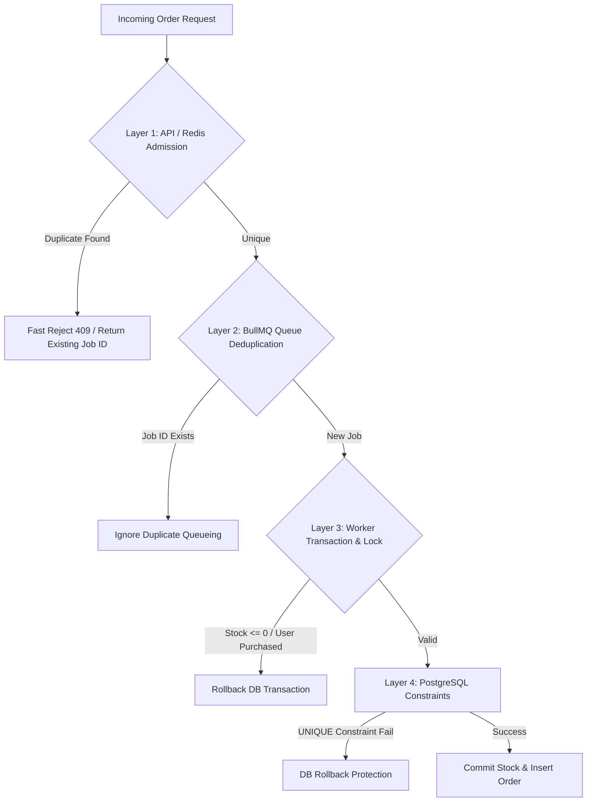

# การจัดการคำขอพร้อมกันและการป้องกันคำสั่งซื้อซ้ำ (Concurrency Control & Idempotency Architecture)

**วันที่อัปเดต:** 26 สิงหาคม 2026  
**สถานะ:** FROZEN WINNING FASTEST-SAFE Architecture (Phase 1)
**ขอบเขตโปรเจกต์:** การรักษา Data Integrity และความถูกต้องของสต็อก (ขอบเขต Member 3 ร่วมกับ Member 1 และ 2)

---

## 1. แบบจำลองภัยคุกคามทางสถาปัตยกรรม (Threat Model)

ในระบบ Flash Sale เกิดสถานการณ์เสี่ยงที่อาจทำให้ข้อมูลผิดพลาด 5 รูปแบบหลัก:

1. **Scenario 1 (Mass Competition / Overselling Threat):** ผู้ใช้ 500 คนยิงสั่งซื้อสินค้า `p-1001` พร้อมกันที่มีสต็อกเพียง 50 ชิ้น หากไม่มีการล็อกสต็อกที่ถูกต้อง จะเกิดกรณีขายเกิน (Overselling / Stock < 0)
2. **Scenario 2 (Concurrent Duplicate Requests):** ผู้ใช้คนเดียวกันเปิด 3 หน้าต่าง หรือใช้ Script ยิงกดสั่งซื้อ `p-1001` พร้อมกัน 3 Requests ในเวลา millisecond เดียวกัน
3. **Scenario 3 (Worker Concurrency Race Condition):** มี BullMQ Worker รันคู่กัน 3-5 Processes ดึง Job สินค้าเดียวกันมาประมวลผลพร้อมกันในฝั่ง Database
4. **Scenario 4 (Worker Network / Timeout Retry):** Worker ประมวลผลตัดสต็อกลง DB สำเร็จแล้ว แต่เกิด Network Glitch ตอนแจ้ง Queue ทำให้ Queue ส่ง Job เดิมมาให้ Worker ทำซ้ำ
5. **Scenario 5 (API Client Retry):** Client ยิง HTTP POST แล้วเกิด Timeout จึงยิงคำขอเดิมซ้ำเข้ามายัง API

---

## 2. โครงสร้างการป้องกันแบบหลายชั้น (Multi-Layer Defense Architecture)

ระบบออกแบบการป้องกันเป็น 4 ชั้น (Defense-in-Depth Strategy) เพื่อรับประกันว่าจะไม่มีทางหลุดเกิดข้อมูลผิดพลาด:



### รายละเอียดของแต่ละชั้นการป้องกัน:

#### Layer 1: API / Redis Admission Level
- **กลไก:** เมื่อ API รับคำขอ จะคำนวณ Deterministic Identifier จากคู่ `userId + productId`
- **วิธีการ:** ใช้ `SET claim-key randomToken NX EX 60` ตาม Requirement อาจารย์ แล้วใช้ `ord-<SHA256(userId|productId)>` เป็น BullMQ Job ID ชั้นที่สอง; หาก Enqueue ล้มเหลวให้ Lua compare-and-delete Claim ตาม Token
- **ผลลัพธ์:** กันคำขอซ้ำจากผู้ใช้เดียวกันตั้งแต่ระดับ API ก่อนจะสร้าง Overhead ให้ระบบลึกเข้าไป

#### Layer 2: Queue Deduplication Level
- **กลไก:** กำหนด `jobId = "ord-" + sha256(userId + "|" + productId)` ซึ่งไม่มี `:` และเก็บ Completed Jobs แบบจำกัด
- **ผลลัพธ์:** หากมีคำขอซ้ำหลุดมายัง BullMQ ด้วย Job ID เดิม BullMQ จะไม่สร้าง Job ใหม่ใน Queue

#### Layer 3: Worker Micro-batch Transaction & Pessimistic Row Lock Level
- **กลไก:** Worker รวม 10–32 Jobs หรือรอสูงสุด 1 ms แล้วเรียก `place_order_batch(jsonb)` จากนั้นตรวจ `order_results.job_id` และล็อกสินค้าเพียงครั้งเดียว:
  ```sql
  SELECT remaining_stock, is_flash_sale_active 
  FROM products 
  WHERE product_id = $1 FOR UPDATE;
  ```
- **ผลลัพธ์:** PostgreSQL Serialize การแก้ Stock ของ Product เดียวกัน แต่หนึ่ง Lock สามารถตัดสินหลาย Jobs จึงลด Lock/Network Round-trip เมื่อเทียบกับ Transaction ทีละ Job

#### Layer 4: PostgreSQL Database Final Guard Level
- **ตาราง `orders`:** สร้าง Unique Constraint สัมบูรณ์:
  ```sql
  ALTER TABLE orders ADD CONSTRAINT unique_user_product UNIQUE (user_id, product_id);
  ```
- **ตาราง `products`:** กำหนด Check Constraint ป้องกันสต็อกติดลบในระดับ Engine:
  ```sql
  ALTER TABLE products ADD CONSTRAINT check_stock_non_negative CHECK (remaining_stock >= 0);
  ```
- **ผลลัพธ์:** หากกลไกใน Layer 1-3 ล้มเหลวทั้งหมด PostgreSQL Database Engine จะทำการปฏิเสธคำสั่ง SQL และสั่ง Rollback ทันทีด้วย ACID Guarantee
- **Idempotency Ledger:** `order_results(job_id PRIMARY KEY)` บันทึกทั้ง SUCCESS และ Business Rejection ทำให้ Retry คืนผลเดิมโดยไม่ทำธุรกรรมซ้ำ
- **Recovery:** `transactional_outbox` อยู่ Transaction เดียวกับ Stock/Order เพื่อ Retry Cache Epoch หลัง Commit

---

## 3. ตัวอย่างลำดับเหตุการณ์การเกิด Race Condition และวิธีแก้ไข

### กรณีตัวอย่างการเกิด Race Condition (ถ้าไม่มี Row Locking):
```text
Time    Worker A                        Worker B                        Database Stock
t1      Read stock (stock=1)            -                               1
t2      -                               Read stock (stock=1)            1
t3      Update stock = stock - 1 (0)    -                               0
t4      -                               Update stock = stock - 1 (-1)  -1  <-- OVERSELL!
```

### กรณีตัวอย่างการป้องกันด้วย Pessimistic Locking (`FOR UPDATE`):
```text
Time    Worker A                        Worker B                        Database Stock
t1      BEGIN & SELECT FOR UPDATE       -                               1 (Locked by A)
t2      -                               BEGIN & SELECT FOR UPDATE       1 (Blocked & Waiting...)
t3      Update stock = 0 & COMMIT       -                               0 (Lock Released)
t4      -                               Acquires Lock & Reads stock     0 (Reads latest stock)
t5      -                               Stock is 0 -> ROLLBACK & FAIL   0 (SAFE!)
```

---

## 4. กลยุทธ์การล็อกและความเหมาะสม (Locking Strategy Comparison)

| กลยุทธ์การล็อก | ข้อดี | ข้อเสีย / จุดคอขวด | ความเห็นทางสถาปัตยกรรม |
| --- | --- | --- | --- |
| **Naive Update** (ไม่มี lock) | รวดเร็วที่สุด | เกิด Overselling สต็อกติดลบแน่นอน | **ห้ามใช้โดยเด็ดขาด** |
| **Optimistic Locking** (`WHERE version = v`) | ไม่มี DB Row Lock Waiting Overhead | หากมี High Contention (500 คนยิงชิ้นเดียว) จะเกิด Retry Storm มหาศาล | ไม่เหมาะกับ Hot Product ชิ้นเดียว |
| **Pessimistic Locking** (`FOR UPDATE`) | การันตี Correctness และเหมาะกับ Hot Product | Transaction ทีละ Job มี DB Round-trip สูง | Required Safety Primitive |
| **Batch Stored Procedure** (`place_order_batch`) | ตัดสิน 10–32 Jobs ด้วย Lock/DB Call เดียว | ต้อง Mapping ผลกลับแต่ละ BullMQ Job ให้ครบ | **Winning Default** |

---

## 5. ความสอดคล้องด้านความถูกต้อง (Correctness Invariants)

ไม่ว่าจะเกิดกรณีระบบล่ม, Network Timeout หรือ Worker Retries สถาปัตยกรรมต้องรักษา **Invariants** ต่อไปนี้ให้เป็นจริงเสมอ:

1. **Non-Negative Stock:**
   $$\text{remainingStock} \ge 0$$
2. **Limit 1 per User per Product:**
   $$\text{Successful Orders for } (userId, productId) \le 1$$
3. **Total Successful Orders Cap:**
   $$\text{Total Successful Orders for } productId \le \text{Initial Stock}$$
   *(กรณี $p-1001$ ที่มีสต็อกเริ่มต้น 50: ผลรวม Order ที่สำเร็จทั้งหมดต้องไม่เกิน 50 รายการเท่านั้น)*
