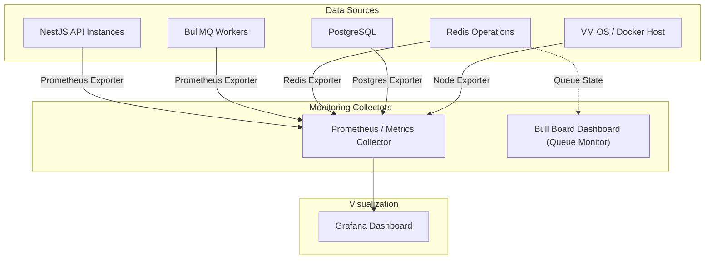

# ระบบการติดตามและการวัดผลระบบ (Observability & Monitoring Architecture)

**วันที่อัปเดต:** 26 สิงหาคม 2026  
**สถานะ:** Draft Baseline Architecture (Phase 1)  
**ขอบเขตโปรเจกต์:** การวัดผล ติดตาม และรวบรวมหลักฐานความถูกต้องของระบบ (ทุกสมาชิกในทีม)

---

## 1. เป้าหมายของระบบ Observability (Observability Goals)

ระบบ Observability ถูกออกแบบมาเพื่อตอบสนอง 4 เป้าหมายหลัก:

1. **การค้นหาและแก้ไขปัญหา (Debugging & Diagnostics):** ติดตามเส้นทางของ Request ตั้งแต่ Nginx เข้ามาจนถึงการประมวลผลใน Worker และ Database
2. **หลักฐานพิสูจน์ความถูกต้องของข้อมูล (Data Integrity Proof):** แสดงหลักฐานเชิงประจักษ์ว่าไม่มีสต็อกติดลบ และไม่มีคำสั่งซื้อซ้ำ
3. **การประเมินและเปรียบเทียบประสิทธิภาพ (Performance Benchmark & Competition):** วัดค่า RPS, Latency (p50, p95, p99) และจุดคอขวด (Bottleneck) เพื่อปรับแต่งระบบในการแข่งขัน
4. **การจัดทำรายงานสรุปผล (Assignment Report Evidence):** รวบรวม Dashboard Screenshots และ Metrics Log สำหรับส่งมอบงาน

---

## 2. โครงสร้างการบันทึก Log (Structured Logging & Request Correlation)

ทุกบริการในระบบ (API, Queue, Worker) ต้องบันทึก Log ในรูปแบบ **JSON Structured Format** เพื่อให้สามารถใช้เครื่องมือค้นหาและวิเคราะห์ได้ง่าย

### 2.1 ฟิลด์มาตรฐานใน Log (Log Schema Fields):
- `timestamp`: เวลาในรูปแบบ ISO-8601
- `service`: ชื่อบริการ (เช่น `api-service`, `worker-service`)
- `requestId`: UUID สุ่มที่สร้างตั้งแต่ Nginx หรือ API Admission
- `jobId`: Deterministic ID หรือ BullMQ Job ID
- `userId`: รหัสผู้ใช้ (Masked หรือ ไม่เป็นความลับในระบบปิด)
- `productId`: รหัสสินค้า
- `outcome`: ผลลัพธ์ (เช่น `ADMITTED`, `SUCCESS`, `REJECTED_SOLD_OUT`, `REJECTED_DUPLICATE`, `ERROR`)
- `latencyMs`: เวลาที่ใช้ประมวลผล (มิลลิวินาที)
- `error`: ข้อความและ Stack trace (กรณีเกิดข้อผิดพลาด)

### 2.2 การส่งต่อตัวระบุร่องรอย (Request Correlation Flow):
```text
[ Client Request ]
       │
       ▼
 [ Nginx Proxy ] ──────> Generate X-Request-ID Header
       │
       ▼
 [ NestJS API ] ───────> Log with requestId ──> Attach requestId to BullMQ Job Payload
       │
       ▼
 [ BullMQ Queue ] ─────> Job carries { requestId, jobId, userId, productId }
       │
       ▼
[ BullMQ Worker ] ─────> Log with requestId & jobId ──> Execute DB Transaction & Log Result
```

---

## 3. ตัวชี้วัดประสิทธิภาพที่ต้องจัดเก็บ (Key System Metrics)

### 3.1 HTTP & API Metrics (Nginx & NestJS API)
- **Requests Per Second (RPS / Throughput):** แยกตาม Endpoint (`GET /products`, `POST /orders`, `POST /auth/token`)
- **Latency Distribution:** p50 (Median), p95, และ p99 Latency
- **Error Rate:** อัตราส่วน HTTP Status Codes 4xx และ 5xxเทียบกับคำขอทั้งหมด

### 3.2 Cache Metrics (Redis Cache)
- **Cache Hits Count:** จำนวนครั้งที่อ่านสินค้าเจอใน Redis
- **Cache Misses Count:** จำนวนครั้งที่อ่านสินค้าไม่เจอและต้องไปอ่าน DB
- **Cache Hit Ratio (%):**
  $$\text{Cache Hit Ratio} = \left( \frac{\text{Hits}}{\text{Hits} + \text{Misses}} \right) \times 100\%$$

### 3.3 Queue Metrics (BullMQ Operations)
- **Waiting Jobs:** จำนวนงานที่รอคิวใน Queue
- **Active Jobs:** จำนวนงานที่กำลังถูก Worker ประมวลผล
- **Completed Jobs:** จำนวนงานที่ประมวลผลเสร็จสิ้น
- **Failed / Retried Jobs:** จำนวนงานที่ล้มเหลวหรือถูกส่งทำซ้ำ
- **Queue Drain Time:** เวลาทั้งหมดที่ใช้ในการเคลียร์ Queue จนหมด

### 3.4 Worker & Database Metrics
- **Worker Jobs Processing Rate (Jobs/sec):** ความเร็ว Worker ในการเคลียร์คำสั่งซื้อ
- **DB Connection Pool Active / Idle Connections:** จำนวน Connection ที่ถูกใช้งาน
- **DB Transaction Latency & Lock Wait Time:** เวลาที่ Worker รอ Lock สินค้าและเวลาประมวลผล DB

### 3.5 Infrastructure & Container Metrics
- **CPU Usage (%):** การใช้งาน CPU แยกตาม Container และภาพรวม VM (4 vCPU Limit)
- **RAM Usage (MB / GB):** การใช้งานหน่วยความจำ (6 GB RAM Limit)
- **Container Restarts / OOM Kills:** ตรวจจับกรณี Container ล่มหรือเกิด Out-Of-Memory

---

## 4. สถาปัตยกรรมกระดานวัดผล (Dashboard Architecture)



### องค์ประกอบส่วนแสดงผล:
1. **Bull Board:** เป็น UI ติดตั้งแยกสำหรับติดตามสถานะของ BullMQ Queue โดยตรง (ดู Job Waiting, Active, Failed)
2. **Prometheus & Grafana (หรือ Lightweight Dashboard):** แสดงภาพรวมกราฟ RPS, Latency (p95), Cache Hit Ratio และ CPU/RAM

---

## 5. หลักฐานการทดสอบสำหรับการแข่งขันและรายงาน (Benchmark & Report Evidence)

การทดสอบโหลดในแต่ละรอบและแต่ละ Configuration ต้องบันทึกหลักฐาน 4 ส่วนเพื่อป้องกันการ Cherry-Pick ผลการทดสอบ:

1. **k6 Summary Report JSON / Text Artifact:** ผลสรุป Throughput, p95 Latency และ HTTP Error Rate จากเครื่อง k6 ภายนอก
2. **Dashboard Overview Screenshots:** ภาพถ่ายกระดานวัดผลแสดงยอด Peak RPS, Queue Drain Time และ Resource Usage
3. **Database Integrity Verification Query Results:** ผลลัพธ์จาก SQL Queries ตรวจสอบความถูกต้อง:
   ```sql
   -- 1. Check Remaining Stock (Must be >= 0)
   SELECT id, name, remaining_stock FROM products WHERE id = 'p-1001';

   -- 2. Check Successful Orders Count (Must be <= Initial Stock e.g. 50)
   SELECT COUNT(*) FROM orders WHERE product_id = 'p-1001' AND status = 'SUCCESS';

   -- 3. Check Distinct Users Purchased (Must equal Successful Orders Count)
   SELECT COUNT(DISTINCT user_id) FROM orders WHERE product_id = 'p-1001' AND status = 'SUCCESS';
   ```
4. **Configuration Log Entry:** บันทึก Parameter ที่ใช้ในรอบนั้น ๆ (เช่น จำนวน API Containers, Worker Concurrency, DB Pool Size)
