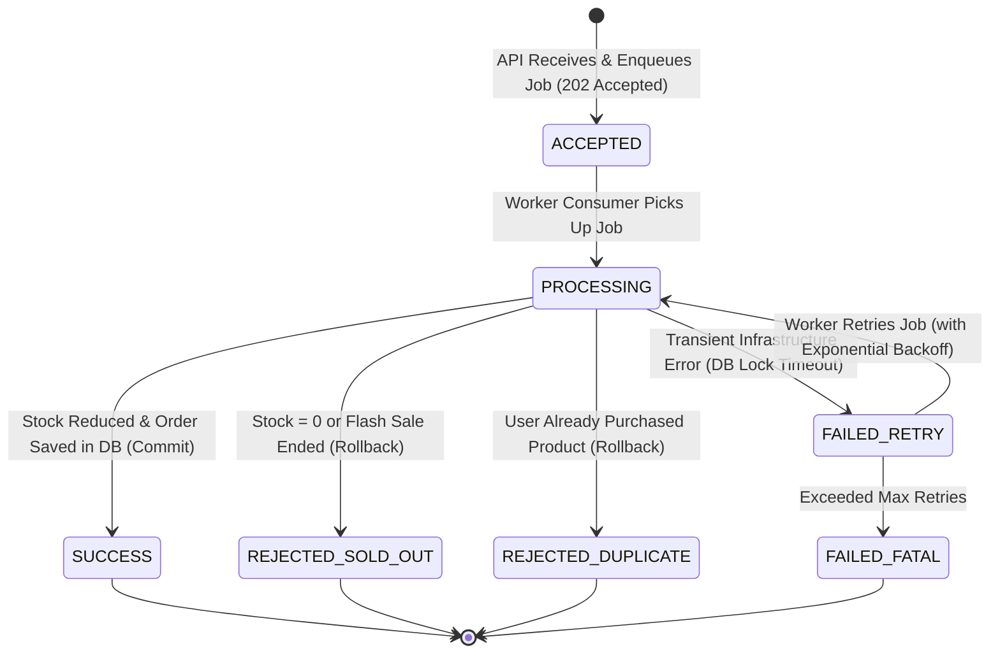

# วงจรชีวิตของคำสั่งซื้อและการประมวลผลสต็อก (Order Lifecycle & Processing Architecture)

**วันที่อัปเดต:** 26 สิงหาคม 2026  
**สถานะ:** FROZEN WINNING FASTEST-SAFE Architecture (Phase 1)
**ขอบเขตโปรเจกต์:** การเชื่อมต่อระหว่าง Member 1 (API), Member 2 (Queue/Redis) และ Member 3 (Worker/DB)

---

## 1. การแบ่งแยกขั้นตอนคำสั่งซื้อ (Separation of Concerns)

กระบวนการจัดการคำสั่งซื้อในระบบ Flash Sale ถูกแบ่งออกเป็น **2 ช่วงหลักที่แยกจากกันโดยเด็ดขาด (Decoupled Phases)** เพื่อรองรับการทำงานแบบ High Throughput และไม่เกิดการ Blocking:

```text
[ Phase A: API Admission ]       ──(Asynchronous Queue)──>       [ Phase B: Worker Processing ]
- รับ HTTP Request                                                - ดึง Job จาก BullMQ Queue
- ตรวจสอบ Authentication (JWT)                                    - เปิด PostgreSQL Transaction
- ทำ SET NX Claim + deterministic Job ID                          - รวม Micro-batch แล้วตรวจ Durable Result
- Enqueue Job เข้า BullMQ                                        - ตรวจสอบสต็อก & Duplicate Order
- ตอบกลับ Client: 202 Accepted                                    - ตัดสต็อก & บันทึก Order
                                                                  - Commit Result + Outbox & เปลี่ยน Cache Epoch
```

---

## 2. วงจรชีวิตเต็มของคำสั่งซื้อ (End-to-End Order Lifecycle)

```mermaid
sequenceDiagram
    autonumber
    actor Client as External Client
    participant Nginx as Nginx Proxy
    participant API as NestJS API Instance
    participant RedisOps as Redis Operations / BullMQ
    participant Worker as BullMQ Worker
    participant DB as PostgreSQL Database
    participant Cache as Redis Cache

    rect rgb(240, 248, 255)
        Note over Client, RedisOps: Phase A: API Admission (Synchronous Non-Blocking)
        Client->>Nginx: POST /api/v1/orders {productId: "p-1001"}
        Nginx->>API: Proxy Request (with X-Request-ID)
        API->>RedisOps: SET Claim Token NX EX 60
        API->>RedisOps: queue.add with ord-SHA256 Job ID
        RedisOps-->>API: Job Enqueued (Job ID Generated)
        API-->>Nginx: 202 Accepted (Job ID, Status: ACCEPTED)
        Nginx-->>Client: 202 Accepted Response
    end

    rect rgb(255, 250, 240)
        Note over RedisOps, Cache: Phase B: Worker Processing (Asynchronous Heavy Transaction)
        Worker->>RedisOps: Consume and group 10-32 Jobs (max wait 1 ms)
        Worker->>DB: place_order_batch(jsonb) / BEGIN
        Worker->>DB: Read order_results + SELECT product FOR UPDATE
        
        alt Stock Available & No Duplicate in DB
            Worker->>DB: Bulk INSERT winners; decrement by inserted count
            Worker->>DB: INSERT order_results + transactional_outbox
            Worker->>DB: COMMIT TRANSACTION
            Worker->>Cache: INCR fs:cache:products:epoch
            Worker->>RedisOps: Mark Job Complete (Result: SUCCESS)
        else Sold Out (remaining_stock <= 0) หรือ Flash Sale Inactive
            Worker->>DB: Persist REJECTED result and COMMIT
            Worker->>RedisOps: Mark Job Completed (Result: REJECTED_SOLD_OUT)
        else Duplicate User Order Found in DB
            Worker->>DB: Persist REJECTED result and COMMIT
            Worker->>RedisOps: Mark Job Completed (Result: REJECTED_DUPLICATE)
        end
    end
```

---

## 3. รายละเอียดขั้นตอนการประมวลผล (Step-by-Step Processing Details)

### 3.1 API Admission (การรับคำขอหน้าบ้าน)
1. **JWT Verification:** ดึง `userId` จาก JWT Access Token ที่ผ่านการตรวจสอบสิทธิ์แล้ว
2. **Input Sanitation:** บังคับให้ `productId` มีอยู่จริง และกำหนด `quantity = 1`
3. **Atomic Admission Guard:** ป้องกันผู้ใช้ส่งคำขอซ้ำในระดับ API ก่อนลงคิว

### 3.2 Queueing (การเข้าคิวรอประมวลผล)
1. งานถูกจัดเก็บไว้ใน BullMQ Queue บน Redis Operations
2. Payload ประกอบด้วย: `jobId`, `userId`, `productId`, `requestId`, `createdAt`

### 3.3 Worker Processing & Database Transaction Boundary
1. Worker รวม 10–32 Jobs หรือรอสูงสุด 1 ms แล้วส่งเข้า `place_order_batch(jsonb)` ภายใต้ **PostgreSQL Transaction เดียว (ACID Scope)**
2. ตรวจ `order_results.job_id` ก่อนเพื่อคืนผลเดิมให้ Job ที่ Retry
3. **Pessimistic Row Locking:** สั่ง `SELECT remaining_stock, is_flash_sale_active FROM products WHERE product_id = $1 FOR UPDATE` เพื่อล็อกสินค้าเพียงครั้งเดียวต่อ Batch
4. **Stock & Flash Sale Validation:**
   - ตรวจสอบว่า `is_flash_sale_active == true` หรือไม่
   - ตรวจสอบว่า `remaining_stock > 0` หรือไม่
5. **Duplicate Validation (Database Level):**
   - ตรวจสอบประวัติในตาราง `orders` ว่าเคยมีคู่ `(user_id, product_id)` นี้สำเร็จแล้วหรือไม่
   - เสริมด้วย Database `UNIQUE(user_id, product_id)` Constraint เพื่อให้ DB ปรับ Rollback อัตโนมัติหากหลุดเข้ามา

### 3.4 Execution Outcomes (ผลลัพธ์การประมวลผล)
- **Successful Order:** Bulk Insert ผู้ชนะไม่เกิน Stock, ลด `remaining_stock` ตามจำนวน Row ที่ Insert สำเร็จ, บันทึก `SUCCESS` Result และ Outbox แล้ว Commit
- **Sold Out / Inactive / Duplicate:** ไม่สร้าง Order แต่บันทึก Business Result ลง `order_results` แล้ว Commit เพื่อให้ Retry คืนผลเดิม

### 3.5 Post-Commit Actions & Cache Invalidation
- หลัง `COMMIT` สำเร็จ Worker ส่ง `INCR fs:cache:products:epoch` ทันที ส่วน Outbox Relay Retry เหตุการณ์ที่ส่งไม่สำเร็จ
- **ห้ามล้างแคชก่อน DB Commit** เพื่อป้องกันปัญหา Race Condition ที่ API ไปอ่าน DB ในช่วงที่ Transaction ยังไม่เสร็จสิ้น

---

## 4. สถานะของคำสั่งซื้อ (Proposed Order State Model)



---

## 5. การตัดสินผลลัพธ์ถาวร (Final Result Ownership)

> [!IMPORTANT]
> **PostgreSQL เป็นผู้ถือสิทธิ์เด็ดขาดในการตัดสินผลถาวร (Persistent Source of Truth)**  
> Redis Operations / BullMQ หรือ Redis Cache ทำหน้าที่เป็นเพียงตัวช่วยเร่งความเร็วในการรับคำขอและแคชอ่านเท่านั้น ห้ามใช้สถานะชั่วคราวใน Redis มาทดแทนการยืนยันบันทึกผลสำเร็จจาก PostgreSQL
