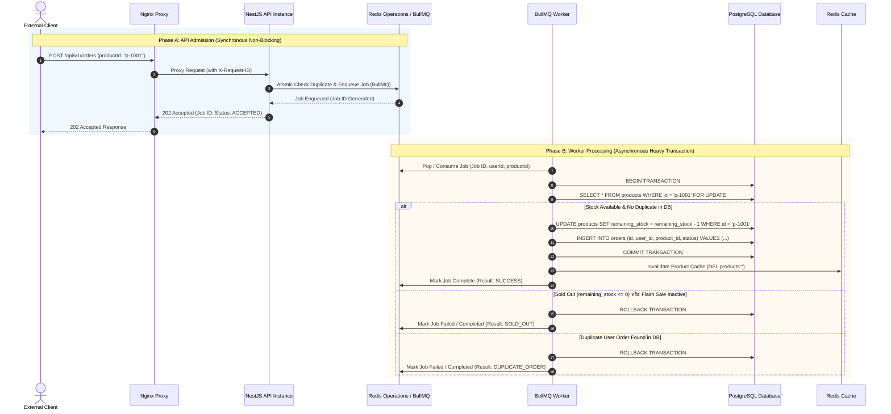
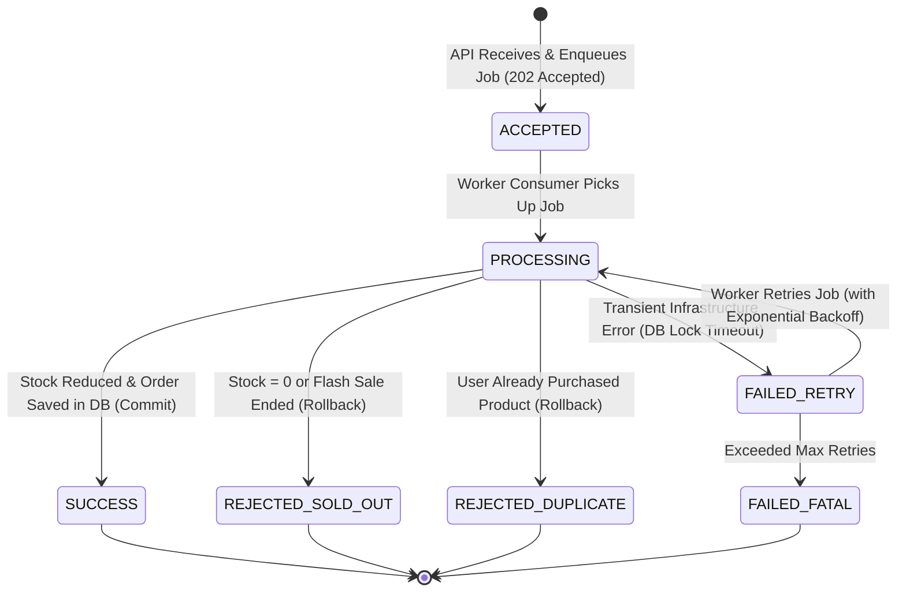

# วงจรชีวิตของคำสั่งซื้อและการประมวลผลสต็อก (Order Lifecycle & Processing Architecture)

**วันที่อัปเดต:** 26 สิงหาคม 2026  
**สถานะ:** Draft Baseline Architecture (Phase 1)  
**ขอบเขตโปรเจกต์:** การเชื่อมต่อระหว่าง Member 1 (API), Member 2 (Queue/Redis) และ Member 3 (Worker/DB)

---

## 1. การแบ่งแยกขั้นตอนคำสั่งซื้อ (Separation of Concerns)

กระบวนการจัดการคำสั่งซื้อในระบบ Flash Sale ถูกแบ่งออกเป็น **2 ช่วงหลักที่แยกจากกันโดยเด็ดขาด (Decoupled Phases)** เพื่อรองรับการทำงานแบบ High Throughput และไม่เกิดการ Blocking:

```text
[ Phase A: API Admission ]       ──(Asynchronous Queue)──>       [ Phase B: Worker Processing ]
- รับ HTTP Request                                                - ดึง Job จาก BullMQ Queue
- ตรวจสอบ Authentication (JWT)                                    - เปิด PostgreSQL Transaction
- ทำ Atomic Duplicate Protection                                  - ล็อกแถวสินค้า (SELECT FOR UPDATE)
- Enqueue Job เข้า BullMQ                                        - ตรวจสอบสต็อก & Duplicate Order
- ตอบกลับ Client: 202 Accepted                                    - ตัดสต็อก & บันทึก Order
                                                                  - Commit Transaction & ล้าง Cache
```

---

## 2. วงจรชีวิตเต็มของคำสั่งซื้อ (End-to-End Order Lifecycle)



---

## 3. รายละเอียดขั้นตอนการประมวลผล (Step-by-Step Processing Details)

### 3.1 API Admission (การรับคำขอหน้าบ้าน)
1. **JWT Verification:** ดึง `userId` จาก JWT Access Token ที่ผ่านการตรวจสอบสิทธิ์แล้ว
2. **Input Sanitation:** บังคับให้ `productId` มีอยู่จริง และกำหนด `quantity = 1`
3. **Atomic Admission Guard:** ป้องกันผู้ใช้ส่งคำขอซ้ำในระดับ API ก่อนลงคิว

### 3.2 Queueing (การเข้าคิวรอประมวลผล)
1. งานถูกจัดเก็บไว้ใน BullMQ Queue บน Redis Operations
2. Payload ประกอบด้วย: `jobId`, `userId`, `productId`, `requestId`, `timestamp`

### 3.3 Worker Processing & Database Transaction Boundary
1. Worker ดึง Job จาก Queue มาประมวลผลภายใต้ **PostgreSQL Transaction เดียว (ACID Scope)**
2. **Pessimistic Row Locking:** สั่ง execute `SELECT remaining_stock, is_flash_sale_active FROM products WHERE id = $1 FOR UPDATE` เพื่อล็อก row ของสินค้านั้น ป้องกัน Worker ตัวอื่นอ่านสต็อกซ้ำในเวลาเดียวกัน
3. **Stock & Flash Sale Validation:** 
   - ตรวจสอบว่า `is_flash_sale_active == true` หรือไม่
   - ตรวจสอบว่า `remaining_stock > 0` หรือไม่
4. **Duplicate Validation (Database Level):**
   - ตรวจสอบประวัติในตาราง `orders` ว่าเคยมีคู่ `(user_id, product_id)` นี้สำเร็จแล้วหรือไม่
   - เสริมด้วย Database `UNIQUE(user_id, product_id)` Constraint เพื่อให้ DB ปรับ Rollback อัตโนมัติหากหลุดเข้ามา

### 3.4 Execution Outcomes (ผลลัพธ์การประมวลผล)
- **Successful Order:** ลดสต็อก (`remaining_stock = remaining_stock - 1`), บันทึกตาราง `orders` ด้วยสถานะ `SUCCESS` แล้วสั่ง `COMMIT`
- **Sold Out:** หากสต็อกเหลือ 0 สั่ง `ROLLBACK` Transaction บันทึก Log สถานะ `SOLD_OUT`
- **Duplicate Order:** หากพบว่าเคยซื้อแล้ว สั่ง `ROLLBACK` บันทึก Log สถานะ `DUPLICATE_REJECTED`

### 3.5 Post-Commit Actions & Cache Invalidation
- หลังสั่ง `COMMIT` สำเร็จเรียบร้อยแล้วเท่านั้น Worker จึงจะส่งคำสั่งลบหรือล้างแคช (`DEL products:*`) ไปยัง Redis Cache
- **ห้ามล้างแคชก่อน DB Commit** เพื่อป้องกันปัญหา Race Condition ที่ API ไปอ่าน DB ในช่วงที่ Transaction ยังไม่เสร็จสิ้น

---

## 4. สถานะของคำสั่งซื้อ (Proposed Order State Model)



---

## 5. การตัดสินผลลัพธ์ถาวร (Final Result Ownership)

> [!IMPORTANT]
> **PostgreSQL เป็นผู้ถือสิทธิ์เด็ดขาดในการตัดสินผลถาวร (Persistent Source of Truth)**  
> Redis Operations / BullMQ หรือ Redis Cache ทำหน้าที่เป็นเพียงตัวช่วยเร่งความเร็วในการรับคำขอและแคชอ่านเท่านั้น ห้ามใช้สถานะชั่วคราวใน Redis มาทดแทนการยืนยันบันทึกผลสำเร็จจาก PostgreSQL
