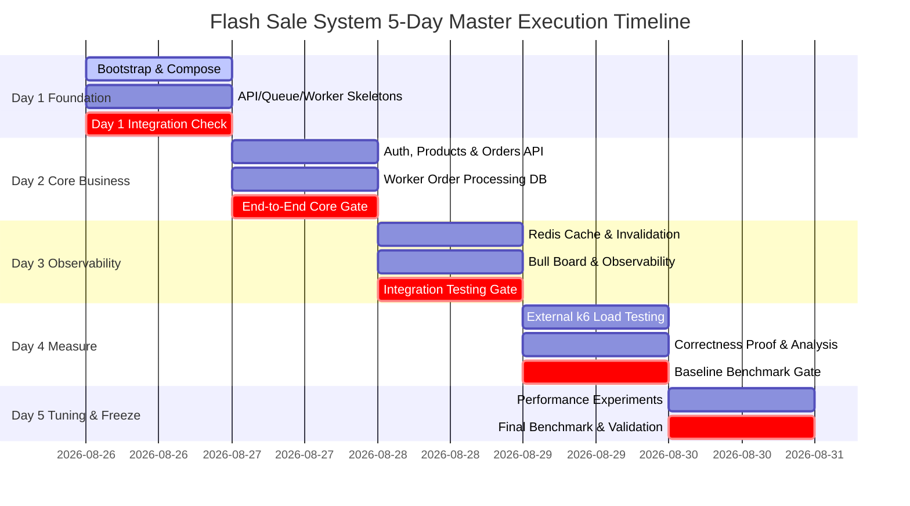

# แผนงานหลักของโปรเจกต์ (Flash Sale System — Master Plan)

**วันที่อัปเดต:** 26 สิงหาคม 2026  
**สถานะ:** FROZEN PLANNING SOURCE OF TRUTH (Phase 5)  
**ขอบเขตเวลา:** 26 – 31 สิงหาคม 2026 (5 วันพัฒนา)  
**ทีมพัฒนา:** 3 คน (Member 1, Member 2, Member 3)

---

## 1. วัตถุประสงค์ของโปรเจกต์ (Project Objective)

สร้างระบบ Backend สำหรับ Flash Sale Mobile Application ที่มีประสิทธิภาพสูง (High Throughput & Low Latency) สามารถรองรับปริมาณการยิงซื้อพร้อมกันจำนวนมาก (High Concurrency Traffic) มีระบบติดตามและวัดผลที่ชัดเจน (Observability) โดยคงความถูกต้องของข้อมูล (Data Integrity, Zero Overselling, Zero Duplicate Order) ไว้อย่างครบถ้วน 100% ภายในระยะเวลาพัฒนา 5 วัน

---

## 2. ข้อจำกัดและทรัพยากรของโปรเจกต์ (Project Constraints)

- **ทรัพยากรเครื่อง:** Virtual Machine (VM) 1 เครื่องต่อทีม (4 vCPU, RAM 6 GB, Disk 50 GB)
- **การติดตั้งระบบ:** บริการทั้งหมดต้องรันผ่าน **Docker Compose** ภายใน VM เครื่องเดียวกัน
- **เครื่องมือยิงทดสอบโหลด (Load Generator):** k6 ต้องยิงจาก **เครื่องภายนอก VM** เพื่อไม่ให้แย่ง CPU/RAM ของระบบ Backend
- **ทีมพัฒนา:** 3 คน แบ่งขอบเขตความรับผิดชอบชัดเจน (API/Nginx, Queue/Redis, Worker/DB)
- **กำหนดส่งมอบ (Deadline):** 31 สิงหาคม 2026

---

## 3. เกณฑ์ความสำเร็จของโปรเจกต์ (Project Success Criteria)

1. **Functional Success:** พัฒนา Required APIs ครบ 3 Endpoints (`POST /auth/token`, `GET /products`, `POST /orders`)
2. **Architecture Success:** ติดตั้งองค์ประกอบระบบครบตามข้อกำหนด (Nginx, API x3, JWT, Redis Cache, BullMQ, Worker, PostgreSQL, Bull Board)
3. **Correctness Success:** ผ่าน Data Integrity Gate (สต็อกไม่ติดลบ `remainingStock >= 0`, ผู้ใช้ซื้อสำเร็จไม่เกิน 1 ชิ้นต่อสินค้า, สำหรับ `p-1001` สต็อก 50 ได้ Order สำเร็จ 50 รายการพอดี)
4. **Observability Success:** แสดงผลสถิติ RPS, Latency p95, Cache Hit Ratio, Queue Backlog และ CPU/RAM ได้
5. **Performance Competition Success:** สามารถรัน Baseline & Final Benchmark และทำ Performance Tuning ได้ผลดีที่สุดบนทรัพยากร 4 vCPU
6. **Delivery Success:** ระบบรันได้ผ่านคำสั่งเดียว `docker compose up --build` และมีเอกสารหลักฐานครบถ้วน

---

## 4. หลักการวางแผนพัฒนา (Planning Principles)

การดำเนินงานยึดถือลำดับความสำคัญ (Core Priority Sequence) ต่อไปนี้อย่างเคร่งครัด:

> **Correctness → Mandatory Requirements → Integration → Observability → Baseline Benchmark → Bottleneck Analysis → Performance Tuning → Final Benchmark → Evidence / Report**

> [!WARNING]
> **ห้ามข้ามขั้นตอนไปทำ Performance Optimization** ก่อนที่ระบบ Baseline และ Core Business Flow จะพัฒนาเสร็จสมบูรณ์และผ่านการทดสอบความถูกต้องเรียบร้อยแล้ว

---

## 5. แผนงานหลักรายวัน (Five-Day Milestone Plan)



---

## 6. ประตูตรวจสอบการรวมระบบรายวัน (Daily Integration Gates)

- **Day 1 Gate:** `docker compose up` รันได้ทุก Container, Nginx กระจายเข้า API 3 ตัวได้, PostgreSQL มีข้อมูล Seed `p-1001` (สต็อก 50)
- **Day 2 Gate:** สั่งซื้อ End-to-End สำเร็จ (Auth -> Products -> Orders API 202 -> BullMQ -> Worker ตัดสต็อกลง DB -> สต็อกไม่ติดลบ)
- **Day 3 Gate:** Cache Hit/Miss ทำงานถูกต้อง, Cache Invalidation ล้างแคชหลัง DB Commit, Bull Board แสดงสถานะคิว, Integration Tests ผ่าน 100%
- **Day 4 Gate:** ยิง k6 ภายนอก ได้รับ Baseline Metrics (RPS, p95), SQL Proof ผ่าน 5 Invariants, มีตาราง Candidate Optimizations
- **Day 5 Gate:** Final Benchmark ได้ Optimal Config, Final Validation Checklist ผ่าน 100%, เอกสารหลักฐานพร้อมส่งมอบ

---

## 7. เส้นทางวิกฤต (Critical Path Analysis)

| ลำดับ Step | ชื่องาน (Task Name) | พึ่งพางาน (Depends On) | ผู้รับผิดชอบ (Owner) | ผลกระทบหากล่าช้า (Blocking Impact) |
| --- | --- | --- | --- | --- |
| **CP-1** | [project-bootstrap.md](file:///home/netiwut/Documents/shareproject/FlashSaleSystem/doc/task/day1/project-bootstrap.md) | None | Integration Captain | **Hard Block:** ไม่สามารถวางโค้ดใน `apps/` หรือ `packages/` ได้ |
| **CP-2** | [docker-compose.md](file:///home/netiwut/Documents/shareproject/FlashSaleSystem/doc/task/day1/docker-compose.md) | CP-1 | Integration Captain | **Hard Block:** ไม่สามารถทดสอบรันระบบรวมและ Integration Gate ได้ |
| **CP-3** | [orders-api.md](file:///home/netiwut/Documents/shareproject/FlashSaleSystem/doc/task/day2/orders-api.md) | CP-1, Auth | Member 1 | **Hard Block:** ไม่สามารถส่ง Job คำสั่งซื้อเข้า Queue ได้ |
| **CP-4** | [order-processing.md](file:///home/netiwut/Documents/shareproject/FlashSaleSystem/doc/task/day2/order-processing.md) | CP-2, CP-3 | Member 3 | **Hard Block:** สต็อกไม่ถูกตัด ขาดกระบวนการพิสูจน์ Correctness |
| **CP-5** | [integration-testing.md](file:///home/netiwut/Documents/shareproject/FlashSaleSystem/doc/task/day3/integration-testing.md)| CP-4, Cache | Test Captain | **Hard Block:** ห้ามเริ่มยิง Load Test ใน Day 4 หากไม่ผ่าน |
| **CP-6** | [k6-load-test.md](file:///home/netiwut/Documents/shareproject/FlashSaleSystem/doc/task/day4/k6-load-test.md) | CP-5 | Member 1 | **Hard Block:** ไม่มีข้อมูล Baseline Metrics สำหรับวิเคราะห์ Bottleneck |
| **CP-7** | [final-validation.md](file:///home/netiwut/Documents/shareproject/FlashSaleSystem/doc/task/day5/final-validation.md) | CP-6, Tuning | Integration Captain | **Hard Block:** ไม่สามารถตรวจรับและส่งมอบโปรเจกต์ได้ |

---

## 8. สายงานที่ทำขนานกันได้ (Parallel Workstreams)

```text
[ Workstream A: Edge / API ] ─────────> Member 1 (apps/api/**, infra/nginx/**, k6/**)
[ Workstream B: Queue / Cache / Obs ] ──> Member 2 (packages/queue/**, packages/cache/**, observability/**)
[ Workstream C: Worker / Database ] ───> Member 3 (apps/worker/**, database/**)
```

สมาชิกทั้ง 3 คนสามารถเขียนโค้ดขนานกันได้โดยอาศัย **Frozen Shared Contracts (`doc/contracts/`)** เป็นขอบเคลื่อนเชื่อมต่อ โดยไม่ต้องรอการเขียนโค้ดจริงของสมาชิกคนอื่น

---

## 9. เมทริกซ์การพึ่งพากันของฟีเจอร์ (Feature Dependency Matrix)

| ฟีเจอร์ (Feature) | งานที่ต้องรอ (Hard Dependency) | การพัฒนาขนานโดยใช้ Mock/Fixture (Soft Dependency) |
| --- | --- | --- |
| **API Orders Admission** | `queue-contract.md` frozen | ใช้ Queue Producer Mock ในการรัน Unit Test |
| **BullMQ Queue Package** | `queue-contract.md` frozen | ใช้ Redis Local/Container เปล่า |
| **Worker Order Processing** | `queue-contract.md`, `database-contract.md` | ใช้ Job Payload Fixture ป้อนให้ Worker ตรงๆ |
| **Product Redis Cache** | `redis-contract.md`, `api-contract.md` | ใช้ Redis Client Connection Mock |
| **Final Benchmark** | Full System Integration & Observability | **ทำขนานไม่ได้** (ต้องรอระบบรวมเสร็จครบใน Day 4-5) |

---

## 10. กลยุทธ์การรวมระบบ (Integration Strategy & Daily Rounds)

ยึดถือกลยุทธ์การรวมระบบตามที่ตกลงใน [CONTRIBUTING.md](file:///home/netiwut/Documents/shareproject/FlashSaleSystem/CONTRIBUTING.md):
- **รอบเช้า:** เปิด/อัปเดต PR เวลา **11:30 น.** -> Integration Captain รวมงานและ Smoke Test เวลา **12:00 น.**
- **รอบเย็น:** เปิด/อัปเดต PR เวลา **17:30 น.** -> Integration Captain รวมงานและรัน Integration Gate เวลา **18:00 น.**
- **Teach-back:** สมาชิกระบุผลการเปลี่ยนแปลงและ Failure cases สำคัญคนละไม่เกิน 5 นาทีหลังรวมงาน

---

## 11. นโยบายการจัดการอุปสรรค (Blocker Management Policy)

- **P0 Blocker (Critical System Block):** เช่น Contract ขัดกัน, DB Migration ล้มเหลว, Compose ไม่ขึ้น -> **ต้องแก้ไขทันที โดย Integration Captain เข้าช่วยร่วมกับ Owner**
- **P1 Blocker (Feature Block):** กระทบฟีเจอร์ย่อยแต่ไม่กระทบ Critical Path -> ใช้ Mock/Stub แล้วทำต่อ จากนั้นแก้ Blocker ในรอบรวมงานถัดไป
- **P2 Issue (Minor Bug):** มีวิธีแก้ชั่วคราว (Workaround) -> บันทึก Issue แล้วแก้ไขช่วงท้ายวัน

---

## 12. นโยบายการควบคุมขอบเขตงาน (Scope Control & Feature Freeze)

- **Must Have:** Required APIs 3 ตัว, JWT, Redis Cache, BullMQ Worker, PostgreSQL, Nginx Load Balancer, Correctness Verification, k6 Load Test
- **Explicitly Out of Scope:** Kubernetes, Kafka, Service Mesh, Database Clustering, Microservices จำนวนมาก
- **Feature Freeze Policy:** 
  - สิ้นสุด Day 3: **ห้ามเพิ่ม Feature ใหม่ทุกกรณี**
  - Day 4: มุ่งเน้นการวัดผล Baseline และแก้ไข Bug
  - Day 5: มุ่งเน้นการ Tuning ตัวแปรและการยิง Final Benchmark เท่านั้น

---

## 13. สถานะโปรเจกต์ปัจจุบัน (Current Project Status)

```text
Project Phase: Phase 5 (Planning Documentation Complete)
Repository State: เอกสารสถาปัตยกรรม (doc/architecture/), สัญญาเชื่อมต่อ (doc/contracts/), แผนงานย่อย (doc/task/) และกรอบการวัดผล (doc/performance/) ถูก Freeze ครบถ้วน พร้อมสำหรับการเริ่ม Implementation ใน Day 1
```
